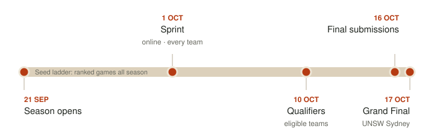

# Introducing The Loong Game

Hi all! The Loong Game is a little open source series running alongside UNSW Battlecode 2026. I'll be building tools for `unswbc`, trying out odd bot ideas and writing up what I learn along the way. This first post covers who I am, why I'm doing it, a quick look at the tournament, and what the official tools give you.

## Who I am

<!-- namecard -->

I'm Kieran Hannigan, and I run [over|yonder](https://over-yonder.tech), a performance engineering practice. Before that I spent about ten years as a professional electrical engineer, working on critical power and integrated control systems, and finished up leading a national renewable energy team as a Principal Engineer. These days I make software faster for a living.

## What to expect

- **Weird bot ideas.** Some will work. Most won't. I'll post both! One I'm keen on is testing ~~my-name-is~~-jev to see how smart this highly hyped 'System 1' model is.
- **Beginner tips.** Getting a first bot running, reading the 7×7 window properly, and sprinting into our own tails as a rite of passage.
- **Tools for unswbc.** Round-robin harnesses, offline Elo ladders, replay analysis and whatever else I end up wanting at 2am.
- **WASM deep dives.** What our C actually compiles to under the judge's toolchain: SIMD, instruction counts, where the cycles go, and how to fit more search into the same budget.

Will this win me the tournament? Probably not. The top teams will turn up with advanced strategies and plenty of tooling behind them, and most beginner and intermediate teams won't have either. The point of this series is to raise the tide a little: share the tools, techniques and mistakes so more teams can give the top of the ladder a proper game. Everything's open source, and each post links to the code and results behind it.

And if I lose, will I retire as a performance engineer? No. I've got a get out of jail free card: the online judge only accepts C, C++ and Python source, so nobody gets to submit micro-optimised WASM kernels. We'll still dig into that in a later post :)

## The tournament

UNSW Battlecode is a bot programming competition. You write one program, every dragon on your team runs its own copy, and each dragon sees only the 7×7 square around its head. Dragons eat pearls, split, and talk only through sonar. The [official site](https://battlecode.au) and [game docs](https://game.battlecode.au/docs/) have the full, current rules.

The ladder runs all season and sets the tournament seeding. The Sprint is open to every team. The Qualifiers and the in-person Grand Final are only for eligible teams: everyone on the team has to study in the Asia-Pacific, or be an Asia-Pacific citizen studying overseas. A few things the organisers have said on Discord are worth knowing early:

- **Tournament maps are unseen**, so don't tune your bot to the ladder's maps.
- **Each new submission resets your rating's K factor**, so a fresh upload swings your rating harder.
- **You need a resume on your profile to be eligible**, and it's due before the Qualifiers on 10 October.

The organisers' `unswbc` toolkit covers the basics. It makes starter bots, runs a match in the judge's sandbox, builds C and C++ with the judge's own clang, and submits your bot. The website adds the docs, a replay visualiser, a map editor, the leaderboard and public replays of every battle.

## Missing pieces

The toolkit gets you as far as playing a game and watching it. It won't tell you whether your latest change made the bot any better, what a dragon could see when it died, or where its CPU budget went. Filling those gaps is the tools strand of this series, running alongside the bot ideas, beginner tips and WASM deep dives. The [next post](01-the-wishlist.md) works out which tools we need.

Questions, heckling and "have you tried X" are all welcome 😄
