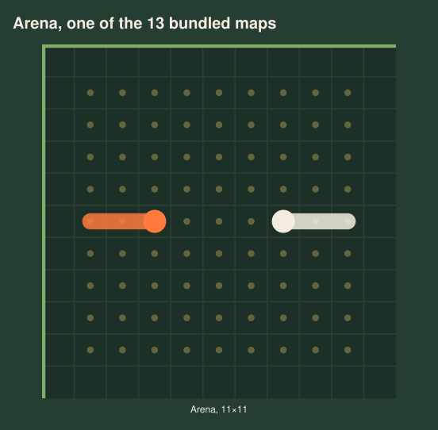
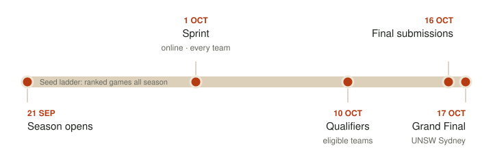
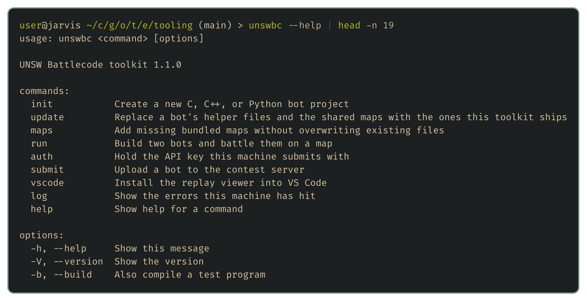

# Introducing The Loong Game

> **Editor's note, 28 September 2026.** I've edited this post to be shorter.

Hi all! The Loong Game is a little open source series running alongside UNSW Battlecode 2026. I'll be building tools for `unswbc`, trying out odd bot ideas and writing up what I learn along the way.

## Who I am

<!-- namecard -->

I'm Kieran Hannigan, and I run [over|yonder](https://over-yonder.tech), a performance engineering practice. Before that I spent about ten years as an electrical engineer, working on critical power and integrated control systems, and finished up leading a national renewable energy team as a Principal Engineer.

## What to expect

- **Weird bot ideas.** Some will work. Most won't. I'll post both! One I'm keen on is testing ~~my-name-is~~-jev to see how smart this highly hyped 'System 1' model is.
- **Beginner tips.** Getting a first bot running, reading the 7×7 window properly, and sprinting into our own tails as a rite of passage.
- **Tools for unswbc.** Round-robin harnesses, offline Elo ladders, replay analysis and whatever else I end up wanting at 2am.
- **WASM deep dives.** What our code compiles to under the judge's toolchain: SIMD, instruction counts, where the points go, and how to fit more search into the same budget.

Will this win you the tournament? Probably not on its own. The top teams will turn up with advanced strategies and plenty of tooling, and most teams won't have either. The point is to raise the tide a little: share the tools, techniques and mistakes so more teams can give the top of the ladder a proper game. Everything's open source, and each post links to the code and results behind it.

And if I lose, will I retire as a performance engineer? No. I've got a get out of jail free card: the online judge only accepts C, C++ and Python source, so nobody gets to submit micro-optimised WASM kernels. We'll still dig into that later :)

## The tournament

UNSW Battlecode is a bot programming competition. You write one program, every dragon on your team runs its own copy, and each dragon sees only the 7×7 square around its head. Dragons eat pearls, split, and talk only through sonar. The [official site](https://battlecode.au) and [game docs](https://game.battlecode.au/docs/) have the full rules.

The ladder runs all season and sets the seeding. The Sprint is open to every team, and the Qualifiers and in-person Grand Final are for teams whose members all study in the Asia-Pacific or are Asia-Pacific citizens studying overseas. Two things the organisers have said on Discord are worth knowing early: **tournament maps are unseen**, so don't tune your bot to the ladder's maps, and **each new submission resets your rating's K factor**, so a fresh upload swings your rating harder.

The organisers' `unswbc` toolkit covers the basics well. It gives you a starter bot and runs matches in the same sandbox the judge uses, compiled with the judge's own clang, so a game on your machine plays out as it would on the ladder. The website adds the documentation, a replay visualiser and the public replays of every ladder battle.

## Missing pieces

The toolkit gets you as far as playing a game and watching it. It won't tell you whether a change is actually helping, and that's essential if we want to improve a bot. We'll also want to know why our dragons die and what they could see at the time, and where the CPU budget goes.

Building those tools is the next stage of the series, and the [next post](01-the-wishlist.md) works out which ones we need. After that the series turns to strategy, and eventually to squeezing more out of that CPU budget.
