# The wishlist

Most of us start the same way: we run `unswbc init`, get a starter bot going, and immediately have a list of ideas for making it better. Before trying any of them, though, we need a way to tell whether a change actually helped. Otherwise we're just guessing, and a guess that feels like progress is worse than no change at all.

So this post tries to answer that one question using only the official toolkit and its starter bots. Every time we get stuck, we'll write down the tool that would have got us unstuck. By the end, that list is the wishlist, and building it is the next stage of the series.

## Two starter bots and one game

`unswbc init` makes a starter bot in C, C++ or Python. To have something to compare, we'll make one in C and one in Python and play them against each other in the judge's sandbox:

That's one game, and it tells us who won it. It also saves a replay we can watch in the [visualiser](https://game.battlecode.au/visualiser), and it prints how many CPU points each team spent, which we'll come back to at the end. What it can't tell us is whether `alpha` is the better bot. One game obviously isn't statistically significant, and working out how many games it does take is part of what this post is about.

We can get more games, though. Each run picks a random seed, which decides where pearls appear and what both bots' random numbers come out as. So running the same match again gives a genuinely different game, and passing a seed back with `--seed` replays one exactly, which will be handy for debugging:

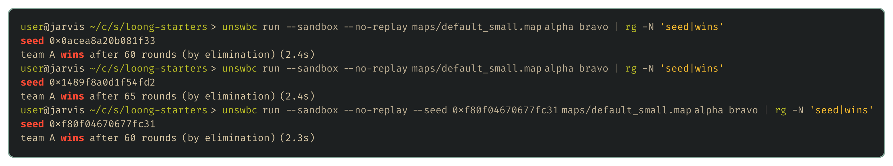

## Every map, both sides

If one game isn't enough, the natural thing is to play lots. Maps matter too, since a bot can be strong on one layout and hopeless on another, and so does which side you start on. So the obvious next move is a loop that plays every one of the 13 bundled maps, with each bot taking each side:

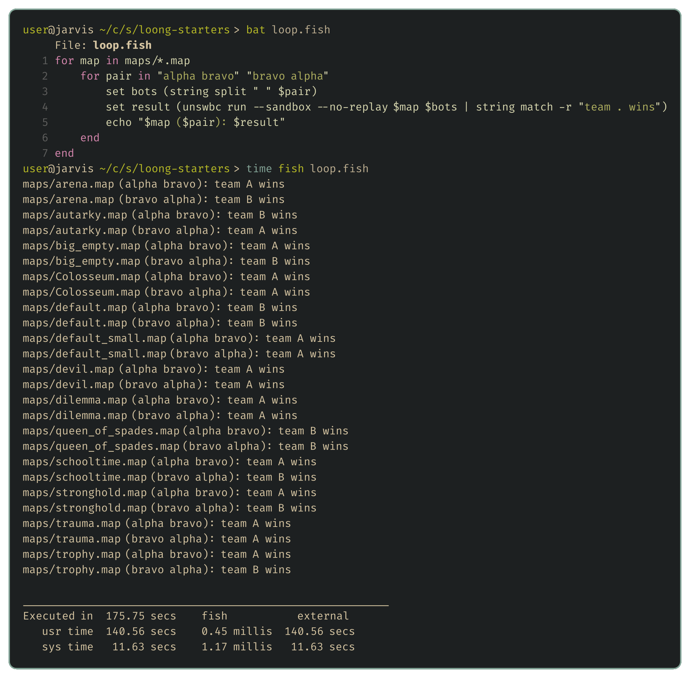

Those 26 games took nearly three minutes, and the starter bots barely think. A bot that searches takes far longer per game. In one of my own test runs, 600 games between stronger bots added up to 14 hours when played one after another.

We're going to be improving our bot for weeks, and every change needs this kind of test, so running a loop by hand and reading the output isn't going to last. We'll want to pit a whole pool of bots against each other and keep a tidy record of every result. And since the games don't depend on each other, we can play them side by side on every core instead of one at a time. Doing that well brings the usual chores along with it: capping how many games run at once, giving up on a game that hangs, cleaning up after crashes, and not mistaking a crash for a loss.

That's the first item on the wishlist, an **evaluation harness**.

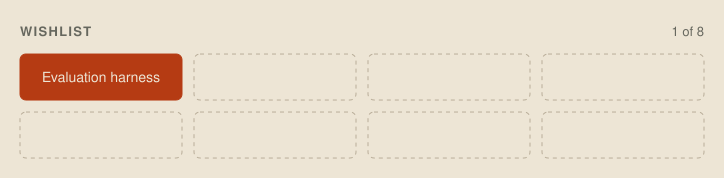

## Seventeen wins out of twenty-six

Back to the results. `alpha` won 17 of the 26 games, which looks like a clear lead. It isn't one. Both starters do exactly the same thing each turn, stepping in a random direction that isn't blocked, so neither can really be better. Two equally good bots will still produce a split at least that lopsided about 8% of the time, so a 17–9 result isn't enough to tell skill from luck.

This is the trap every bot developer falls into sooner or later: a handful of wins feels like proof. It takes far more games than intuition suggests. To reliably tell a bot that wins 60% of its games from an even match takes about 150 games, and a smaller improvement needs far more:

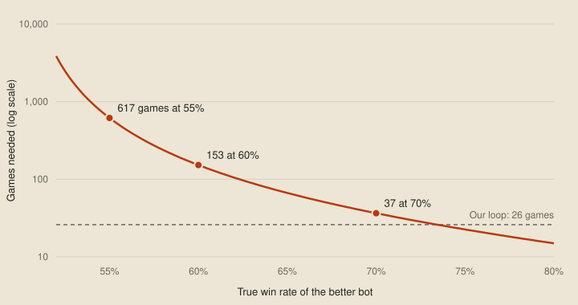

So "did my change help?" is really a statistics question. We want a tool that looks at a pile of results and gives a straight answer, better, worse or not sure yet, and tells us how many more games we'd need when it isn't sure.

The second item is **statistics**.

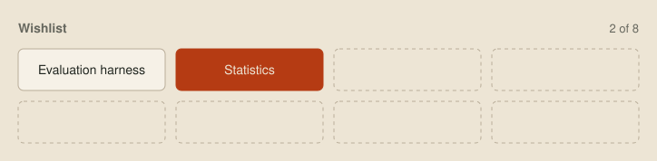

## A ladder of our own

At this point you might wonder why we don't just upload each version and let the online ladder play the games for us. It plays plenty of them, after all. The trouble is that it's slow, noisy, and answers a different question from ours.

It's slow because battles are only drawn every two hours, five games at a time, and uploads are limited to 12 an hour. We saw above that telling a modest improvement from luck takes hundreds of games, so waiting on the ladder for each one would mean days per idea.

It's noisy because each new submission resets your rating's K factor to 96, which makes the rating swing hardest in exactly the games right after an upload, when we're trying to read what the change did.

And even a settled rating measures something else. It compares you with whoever happens to be on the ladder this week, and they're changing their bots too, so a rating can rise or fall without our bot getting any better or worse.

What we actually want to know is whether this version beats the last one. A ladder we run ourselves can answer that. We keep frozen copies of our older versions and rate the current bot against them, so a new version only counts as progress if it beats the ones before it.

The third item is an **offline Elo ladder**.

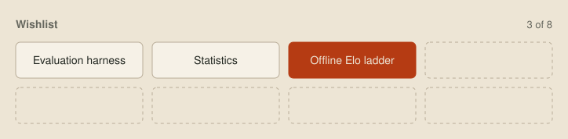

## Maps nobody has seen

Everything so far has used the 13 bundled maps, but those aren't the maps that matter. The organisers have said every Sprint, Qualifier and Grand Final map will be new. A bot that has only ever been tested on the bundled maps can be quietly relying on something about them.

That's already caught me out once. The docs say maps are at least 10 tiles on a side, so my bot refused to play on anything smaller. Then the ladder served a 16×8 map called Small, and every one of my dragons died in round 0. We can't tune for maps we haven't seen, but we can make lots of plausible ones and test on those.

The fourth item is a **map generator**.

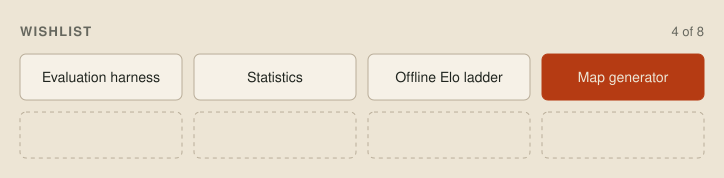

## Everyone else's games

So far every test has been our bot against our own bots. But the real opponents are the other teams, and every ladder battle is public. Game IDs on the site are already past 88,000. That's a huge record of what the best bots actually do, and learning from it is how we'll spot ideas worth borrowing and weaknesses worth exploiting. Nobody can watch that many games, so we need a tool that downloads a useful sample, and does it slowly enough not to load the organisers' server.

The fifth item is a **replay sampler**.

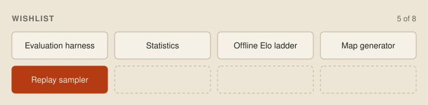

## Reading a replay

Once we have the replays, we hit the next wall. A replay file is packed binary. Opening one in a hex viewer shows the bot names and scraps of the map text, and nothing else we can read:

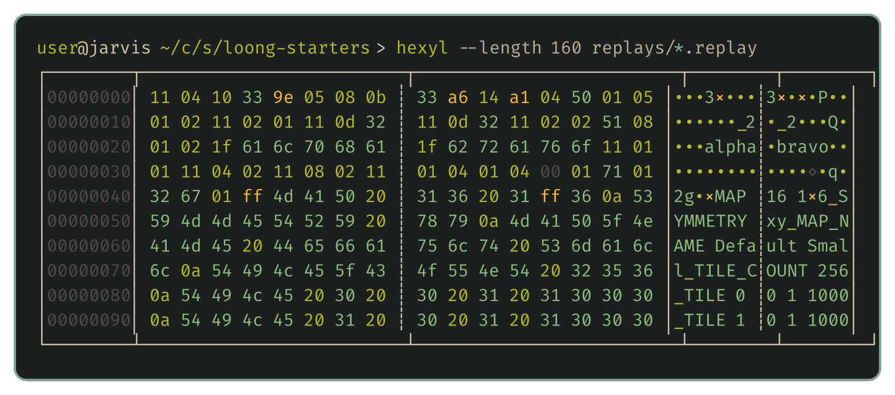

To ask questions of thousands of games, like how often top bots split early, we first need to decode the format and rebuild each game turn by turn.

The sixth item is a **replay decoder**.

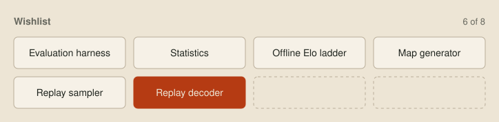

## Through one dragon's eyes

Decoding replays also helps with our own bot. When one of our dragons does something stupid, the visualiser shows us the whole board. But the dragon never saw the whole board. It only saw the 7×7 square around its head, plus whatever it chose to remember:

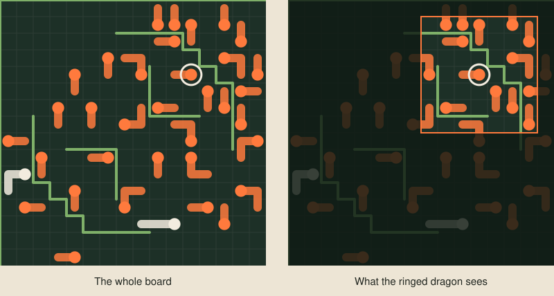

So the question when debugging is never "what was on the board?" but "what did this dragon think was on the board?" A bot can write notes into the replay, which helps, but we'd still be squinting at the full board and imagining the window. It would be much easier with a viewer that shows exactly what one dragon saw and remembered, and what it decided, turn by turn.

I'm writing that viewer in Odin, and the next post explains why.

The seventh item is a **debug viewer**.

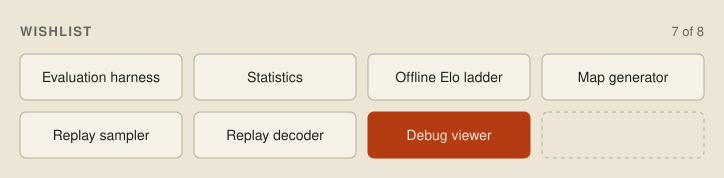

## Where the points go

Last, back to that first game's CPU points. Each dragon gets a budget of 100 million points per turn, and a smart bot will want to spend as much of it as possible thinking. The summary tells us how much was spent, but not what it was spent on.

The C starter spends 3.0 million points a turn just walking randomly, which seemed like a lot. My first guess was the log line it writes every turn, so I deleted it. That saved about 0.1 million. It turns out most of the rest is the single write to stdout that every turn needs to send its move, which costs 2.5 million on its own. That's a useful thing to know, but it took a guess and an experiment to find out. Once our bot is running a real search, every wasted point is search depth it doesn't get, and we'll want a profiler to show us where the points go directly.

The last item is **profiling**.

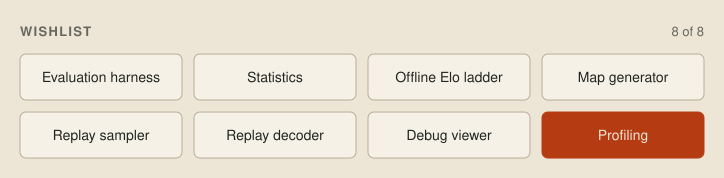

## The full wishlist

Here's how the eight tools connect:

| Tool | What it gives us |
| --- | --- |
| **Evaluation harness** | Games across every map and both sides, in parallel in the judge's sandbox, with errors kept apart from losses. |
| **Statistics** | A yes-or-no verdict on whether a change helped, and the number of games that takes. |
| **Offline Elo ladder** | Ratings against our own older versions and fixed baselines. |
| **Map generator** | Plausible maps modelled on the ladder's, for testing on maps we haven't seen. |
| **Replay sampler** | A slow, rating-ordered sample of public ladder replays. |
| **Replay decoder** | Game state rebuilt turn by turn, including what each dragon could see. |
| **Debug viewer** | The board through one dragon's eyes, with its memory and decisions. |
| **Profiling** | CPU cost from wall time down to individual instructions, native and WASM. |

I already have most of these working in some form, so the tools posts will walk through real, working code. Everything after that leans on them. Whenever a later post tries a strategic idea, the Jev test from the [intro](00-the-loong-game.md) included, these tools are how we'll know whether it worked.

## Next up

[Choosing a language](02-the-choice.md), which settles how much of the CPU budget is left for thinking.
