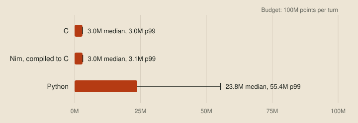

# The choice

<!-- draft: 5c1e0a7d93, stage: Preparation -->

Before writing any strategy, every team has to pick a language, and it's the hardest decision to undo later. The online judge accepts Python, C and C++. It runs all three inside WebAssembly and charges each dragon in CPU points, with a budget of 100 million per turn. The language decides how much of that budget is left for thinking.

## One strategy, two languages

To see how much it matters, I wrote the same small strategy in Python and in C. The idea behind it is that a dragon usually dies by running out of room, so each turn it looks for the move that leaves it the most space. For every move, and every follow-up move after that, it flood-fills the visible 7×7 window from where it would end up and counts how many tiles it could still reach. That's up to 16 flood fills a turn, which is enough work to measure. Here's the flood fill in Python:

```python
def reachable(window, start, first):
    visited = {HEAD, first, start}
    queue = [start]
    for index in queue:
        for side in range(4):
            nxt = step(window, index, side)
            if nxt >= 0 and nxt not in visited:
                visited.add(nxt)
                queue.append(nxt)
    return len(queue)
```

And in C:

```c
static int CountReachableTiles(LocalWindow const* window, int start, int first_step)
{
    bool visited[UNSWBC_VISION_TILES] = { false };
    int  queue[UNSWBC_VISION_TILES];
    int  queue_length = 0;
    visited[HEAD_INDEX] = visited[first_step] = visited[start] = true;
    queue[queue_length++] = start;
    for (int cursor = 0; cursor < queue_length; cursor++)
    {
        for (int side = 0; side < 4; side++)
        {
            int const next = StepWithinWindow(window, queue[cursor], side);
            if (next >= 0 && !visited[next])
            {
                visited[next]         = true;
                queue[queue_length++] = next;
            }
        }
    }
    return queue_length;
}
```

The two bots make exactly the same move on every turn. I checked by playing each against itself with the same seeds and comparing every move. Then I played each against itself on all 13 bundled maps and recorded the points spent on every turn, about 18,000 turns per bot. `unswbc run -v` prints each dragon's points after every turn, which is all the measuring this needs. The bots and the script are in [examples/the-choice](../examples/the-choice/README.md).



The Python bot's median turn costs 23.8 million points, and its slowest 1% cost more than 55 million. The C bot's median turn costs 3.0 million, and most of that isn't the strategy. A C bot that only repeats its last move costs 2.9 million a turn, almost all of it the write to stdout that sends each move. Taking each language's idle cost away, the strategy itself costs about 43,000 points in C and 19.7 million in Python, roughly 450 times as much.

This is a small search, and a stronger bot will want to look much further ahead. That's where the gap starts to bite. At 450 times the cost, a search that takes C 220,000 points a turn, a tiny fraction of its budget, would use up Python's entire 100 million. C++ goes through the same clang to the same WebAssembly, so it lands where C does.

So the choice looks simple. Python is quick to write and slow to run. C and C++ are fast, but verbose and unforgiving while you're still trying ideas.

## Two languages the judge doesn't take

This series will do a fair amount of its work in two languages the judge has never heard of.

### Nim for strategies

Nim reads a lot like Python, with indentation for blocks, inferred types and short loops. It also compiles to C, and C is one of several backends you can choose. With the right settings, `nim c` stops once it has written the C files, and the judge accepts C source. Here's the same flood fill, written the way a Python programmer would write it:

```nim
proc reachable(w: Window, start, first: int): int =
  var visited: set[0 .. 48] = {Head, first, start}
  var queue = @[start]
  var cursor = 0
  while cursor < queue.len:
    for side in 0 .. 3:
      let next = w.step(queue[cursor], side)
      if next >= 0 and next notin visited:
        visited.incl next
        queue.add next
    inc cursor
  queue.len
```

The rest of the bot is just as short. It calls the starter's C helper directly through Nim's foreign function interface, and a three-line `main.c` starts Nim's runtime. The settings live in `nim.cfg`, so the build is one command:


The Nim bot makes exactly the same moves as the C and Python bots. Its strategy costs about 69,000 points a turn, 1.6 times the C version and about 280 times cheaper than Python. The difference from C is the growable list: Nim allocates it on the heap for every flood fill, where the C uses a fixed array. Switching the Nim version to a fixed array brings it level with the C, to within a few hundred points. The whole bot is about 72 KB of C, well inside the 4 MB upload limit, and it contains none of the build-time date or time macros the judge rejects.

Nim doesn't replace hand-written C. The generated C is correct and fast, but nobody has tuned it. The hottest parts of a serious bot, like the inner loop of its search, still need hand-optimised C, and hand-written WebAssembly would go further if the judge accepted it. Nim is for writing and changing strategies quickly, and C is for the parts where every point counts.

### Odin for tools

Tools that never go near the judge can use anything. The debug viewer from the [wishlist](01-the-wishlist.md) is written in Odin, partly because it's good to try new things, and partly because Odin is very good for graphics programming. It ships first-party vendor bindings for libraries like raylib, calling into C is easy, and memory management is granular, with the allocator chosen through an implicit context. If those terms are unfamiliar, don't worry, we'll get to them in the series.

## Next up

That's the end of the preparation stage. The next stage builds the tools on the wishlist, starting with the evaluation harness.

Questions, heckling and "have you tried X" are all welcome 😄
