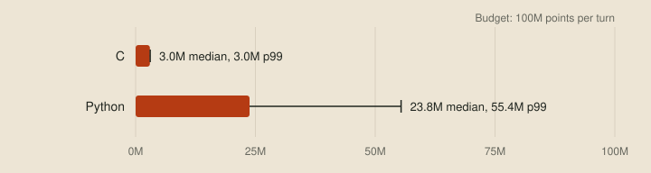

# The choice

Before writing any strategy, every team has to pick a language, and it's the hardest decision to undo later, since every line of the bot is written in it. The online judge accepts Python, C and C++, and runs all three inside WebAssembly. It charges each dragon for the work it does in CPU points, with a budget of 100 million per turn, and the language we pick decides how much of that budget is left over for actually thinking about the next move.

## One strategy, two languages

To see how much it matters, I wrote the same small strategy in Python and in C. The idea behind it is that a dragon usually dies by running out of room, so each turn it looks for the move that leaves it the most space. For every move, and every follow-up move after that, it flood-fills the visible 7×7 window from where it would end up and counts how many tiles it could still reach. That's up to 16 flood fills a turn, which is enough work to measure. Here's the flood fill in Python:

```python
def reachable(window, start, first):
    visited = {HEAD, first, start}
    queue = [start]
    for index in queue:
        for side in range(4):
            nxt = step(window, index, side)
            if nxt >= 0 and nxt not in visited:
                visited.add(nxt)
                queue.append(nxt)
    return len(queue)
```

And in C:

```c
static int CountReachableTiles(LocalWindow const* window, int start, int first_step)
{
    bool visited[UNSWBC_VISION_TILES] = { false };
    int  queue[UNSWBC_VISION_TILES];
    int  queue_length = 0;
    visited[HEAD_INDEX] = visited[first_step] = visited[start] = true;
    queue[queue_length++] = start;
    for (int cursor = 0; cursor < queue_length; cursor++)
    {
        for (int side = 0; side < 4; side++)
        {
            int const next = StepWithinWindow(window, queue[cursor], side);
            if (next >= 0 && !visited[next])
            {
                visited[next]         = true;
                queue[queue_length++] = next;
            }
        }
    }
    return queue_length;
}
```

The two bots make exactly the same move on every turn. I checked by playing each against itself with the same seeds and comparing every move. Then I played each against itself on all 13 bundled maps and recorded the points spent on every turn, about 18,000 turns per bot. `unswbc run -v` prints each dragon's points after every turn, which is all the measuring this needs. The bots and the script are in [examples/the-choice](../examples/the-choice/README.md).



The Python bot's median turn costs 23.8 million points, and its slowest 1% cost more than 55 million. The C bot's median turn costs 3.0 million, and most of that isn't the strategy. A C bot that only repeats its last move costs 2.9 million a turn, almost all of it the write to stdout that sends each move. Taking each language's idle cost away, the strategy itself costs about 43,000 points in C and 19.7 million in Python, roughly 450 times as much.

This is a small search, and a stronger bot will want to look much further ahead. That's where the gap starts to bite. At 450 times the cost, a search that takes C 220,000 points a turn, a tiny fraction of its budget, would use up Python's entire 100 million. C++ goes through the same clang to the same WebAssembly, so it lands where C does.

So the choice looks simple. Python is quick to write and slow to run. C and C++ are fast, but verbose and unforgiving while you're still trying ideas.

## Two less familiar languages

This series will do a fair amount of its work in two languages a lot of folks have never heard of.

### Nim for strategies

[Nim](https://nim-lang.org) reads a lot like Python, with indentation for blocks, inferred types and short loops. It also compiles to C, and C is one of several backends you can choose. With the right settings, `nim c` stops once it has written the C files, and the judge accepts C source. Here's the same flood fill, written the way a Python programmer would write it:

```nim
proc reachable(w: Window, start, first: int): int =
  var visited: set[0 .. 48] = {Head, first, start}
  var queue = @[start]
  var cursor = 0
  while cursor < queue.len:
    for side in 0 .. 3:
      let next = w.step(queue[cursor], side)
      if next >= 0 and next notin visited:
        visited.incl next
        queue.add next
    inc cursor
  queue.len
```

The rest of the bot is just as short. It calls the starter's C helper directly through Nim's foreign function interface, and a three-line `main.c` starts Nim's runtime. The settings live in `nim.cfg`, so the build is one command:


The Nim bot makes exactly the same moves as the C and Python bots, so it slots straight into the same measurement. Here's the chart again with Nim added:


So Nim written the way you'd write Python lands almost exactly where C does. Its strategy costs about 69,000 points a turn, which is 1.6 times the C version but about 280 times cheaper than Python.

That remaining gap to C comes from the growable list. Nim allocates it on the heap for every flood fill, where the C uses a fixed array on the stack. Switching the Nim version to a fixed array brings it level with the C, to within a few hundred points.

How Nim manages that memory is configurable too. The `mm` setting picks the strategy:

```ini nim.cfg
mm = arc    # reference counting: memory is freed as soon as its last reference goes
# mm = orc  # the Nim 2 default: ARC plus a collector for data that points back at itself
```

ARC counts references and frees each object the moment nothing refers to it any more, so there's no garbage collector pausing to scan memory in the middle of a turn. ORC adds a collector for reference cycles, such as two objects that point at each other. Our bot never builds cycles, so plain ARC does the job without the collector's overhead.

The whole bot is about 72 KB of C, well inside the 4 MB upload limit, and it contains none of the build-time date or time macros the judge rejects.

Nim doesn't replace hand-written C. The generated C is correct and fast, but nobody has tuned it. The hottest parts of a serious bot, like the inner loop of its search, still need hand-optimised C, and hand-written WebAssembly would go further if the judge accepted it. Nim is for writing and changing strategies quickly, and C is for the parts where every point counts.

### The examples and the competition bot

The examples in this series keep that Nim strategy and C helper arrangement.
The private competition runtime also developed a separate, hand-written C
policy. Its strategy and results aren't interchangeable with these examples.
The measurements here compare the supplied example programs; they don't show
that a whole strategy needs to be rewritten in C.

### Odin for tools

Tools that never go near the judge can be written in anything, and the debug viewer from the [wishlist](01-the-wishlist.md) is written in [Odin](https://odin-lang.org). Partly that's because it's good to try new things. Mostly it's because Odin is *very* good at graphics programming, for three reasons that matter to a tool like this.

The first is memory. Graphics tools allocate a lot of short-lived data, and freeing it all correctly is a common source of bugs and slowdowns. Odin passes an implicit `context` into every procedure, and the context carries the allocator. Set it once, and everything called after that, including library code, allocates from wherever you chose:

```odin
arena: virtual.Arena
_ = virtual.arena_init_growing(&arena)
context.allocator = virtual.arena_allocator(&arena)

frames := make([dynamic]Frame)   // allocated from the arena, through the context
tiles := make([]Tile, 64 * 64)   // this too, and anything the procedures we call allocate

virtual.arena_destroy(&arena)    // one call frees the lot
```

The viewer loads each game into an arena like this and throws the whole arena away when you open the next one. The same pattern would suit a high-performance harness too: give each game its own arena, and use the context's temporary allocator for scratch work that only lasts a turn.

The second is libraries. Odin ships a `vendor` collection of bindings that the Odin team maintains alongside the compiler. It covers most of what graphics work needs: windowing and input through SDL and GLFW, the OpenGL, Vulkan, DirectX and WebGPU graphics APIs, raylib for quick 2D and 3D drawing, stb for images and fonts, and miniaudio for sound. The viewer uses raylib, and it's one `import "vendor:raylib"` away with no package manager involved.

The third is proof that it holds up in real products. [JangaFX](https://jangafx.com) builds its real-time simulation tools in Odin, including EmberGen for volumetric fire and smoke and LiquiGen for liquids. Both are featured on Odin's own [showcase](https://odin-lang.org/showcase/). Those are demanding, commercial graphics applications.

If some of those terms are unfamiliar, don't worry. We'll get to them properly later in the series.

## Next up

That's the end of the first stage, understanding the problem. The next stage builds the tools on the wishlist, starting with [the evaluation harness](03-the-evaluation-harness.md).
