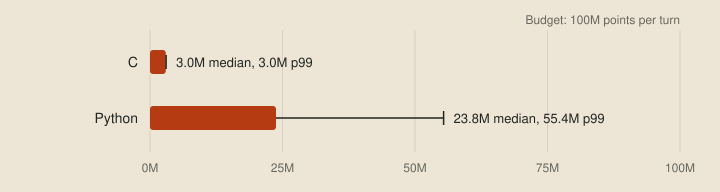
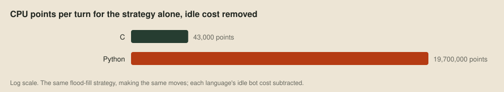
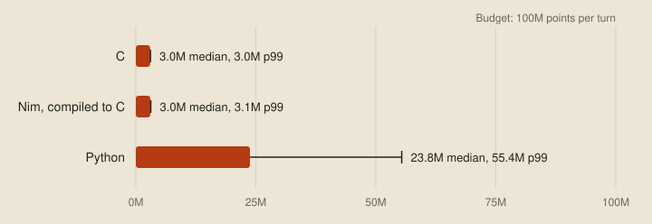
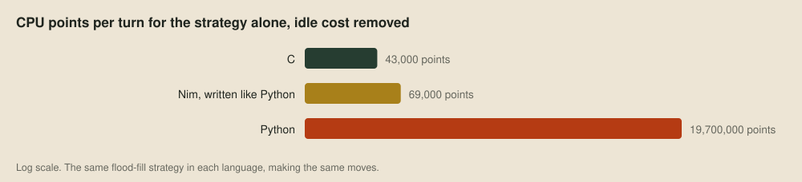

# The choice

> **Editor's note, 28 September 2026.** I've edited this post to be shorter, to say how our competition bot uses these languages now, and to add Zig, the language of the judge we later wrote, and Rake, the language we write vector kernels in.

Before writing any strategy, every team has to pick a language, and it's the hardest decision to undo later, since every line of the bot is written in it. The online judge accepts Python, C and C++, and runs all three inside WebAssembly. It charges each dragon for the work it does in CPU points, with a budget of 100 million per turn, and the language we pick decides how much of that budget is left over for actually thinking about the next move.

## The cost of a language

To see how much it matters, I wrote the same small strategy in Python and in C. The idea behind it is that a dragon usually dies by running out of room, so each turn it looks for the move that leaves it the most space. For every move, and every follow-up move after that, it flood-fills the visible 7×7 window from where it would end up and counts how many tiles it could still reach. That's up to 16 flood fills a turn, which is enough work to measure. Here's the flood fill in Python:

```python
def reachable(window, start, first):
    visited = {HEAD, first, start}
    queue = [start]
    for index in queue:
        for side in range(4):
            nxt = step(window, index, side)
            if nxt >= 0 and nxt not in visited:
                visited.add(nxt)
                queue.append(nxt)
    return len(queue)
```

And in C:

```c
static int CountReachableTiles(LocalWindow const* window, int start, int first_step)
{
    bool visited[UNSWBC_VISION_TILES] = { false };
    int  queue[UNSWBC_VISION_TILES];
    int  queue_length = 0;
    visited[HEAD_INDEX] = visited[first_step] = visited[start] = true;
    queue[queue_length++] = start;
    for (int cursor = 0; cursor < queue_length; cursor++)
    {
        for (int side = 0; side < 4; side++)
        {
            int const next = StepWithinWindow(window, queue[cursor], side);
            if (next >= 0 && !visited[next])
            {
                visited[next]         = true;
                queue[queue_length++] = next;
            }
        }
    }
    return queue_length;
}
```

The two bots make exactly the same move on every turn. I checked by playing each against itself with the same seeds and comparing every move. Then I played each against itself on all 13 bundled maps and recorded the points spent on every turn, about 18,000 turns per bot. `unswbc run -v` prints each dragon's points after every turn, which is all the measuring this needs. The bots and the script are in [examples/the-choice](../examples/the-choice/README.md).



Python costs far more per turn, and most of what C spends isn't the strategy at all. A C bot that only repeats its last move costs almost as much, because nearly all of it is the single write to stdout that sends each move. Taking each language's idle bot away leaves just the strategy, and that's where the difference really shows:



This is a small search, and a stronger bot will want to look much further ahead. That's where the gap starts to bite. At 450 times the cost, a search that takes C 220,000 points a turn, a tiny fraction of its budget, would use up Python's entire 100 million. C++ goes through the same clang to the same WebAssembly, so it lands where C does.

So the choice looks simple. Python is quick to write and slow to run. C and C++ are fast, but verbose and unforgiving while you're still trying ideas.


## Four less familiar languages

This series will do a fair amount of its work in four languages a lot of folks have never heard of.

### Nim for strategies

[Nim](https://nim-lang.org) reads a lot like Python, with indentation for blocks, inferred types and short loops. It also compiles to C, and C is one of several backends you can choose. With the right settings, `nim c` stops once it has written the C files, and the judge accepts C source. Here's the same flood fill, written the way a Python programmer would write it:

```nim
proc reachable(w: Window, start, first: int): int =
  var visited: set[0 .. 48] = {Head, first, start}
  var queue = @[start]
  var cursor = 0
  while cursor < queue.len:
    for side in 0 .. 3:
      let next = w.step(queue[cursor], side)
      if next >= 0 and next notin visited:
        visited.incl next
        queue.add next
    inc cursor
  queue.len
```

The rest of the bot is just as short. It calls the starter's C helper directly through Nim's foreign function interface, and a three-line `main.c` starts Nim's runtime. The settings live in `nim.cfg`, so the build is one command:


The Nim bot makes exactly the same moves as the C and Python bots, so it slots straight into the same measurement. Here's the chart again with Nim added:



Nim written the way you'd write Python lands almost exactly where C does, and taking the idle cost away again shows how close the strategies are:



The remaining gap to C is the growable list, which Nim allocates on the heap for every flood fill where the C uses a fixed array on the stack, and a fixed array in Nim brings it level with C. How Nim manages memory is configurable too:

```nim nim.cfg
mm = arc    # reference counting: memory is freed as soon as its last reference goes
# mm = orc  # the Nim 2 default: ARC plus a collector for data that points back at itself
```

ARC frees each object the moment nothing refers to it, so no garbage collector pauses to scan memory mid-turn. ORC adds a collector for reference cycles, which our bots never build.

Nim's [standard library](https://nim-lang.org/docs/lib.html) is another reason it suits competitions. It has the collections and algorithms you'd otherwise spend precious time writing, from hash tables and priority queues to sorting and binary search, and [ARC](https://nim-lang.org/docs/mm.html) lets us use them without a tracing garbage collector. The whole bot is about 72 KB of C, well inside the 4 MB upload limit, with none of the build-time date or time macros the judge rejects.

Nim doesn't replace hand-written C. The generated C is correct and fast, but nobody tuned it, and the hottest parts of a serious bot, like the inner loop of a search, still want hand-optimised C. So the split is Nim for strategy, which we write and change constantly, and C for the kernels where every point counts. Our competition bot is built exactly this way.


### Odin for tools

Tools that never go near the judge can be written in anything, and the debug viewer from the [wishlist](01-the-wishlist.md) is written in [Odin](https://odin-lang.org), which is *very* good at graphics programming. The first reason is memory. Graphics tools allocate a lot of short-lived data, and freeing it all correctly is a common source of bugs. Odin passes an implicit `context` into every procedure, carrying the allocator, so setting it once makes everything called afterwards, library code included, allocate from wherever you chose:

```odin
arena: virtual.Arena
_ = virtual.arena_init_growing(&arena)
context.allocator = virtual.arena_allocator(&arena)

frames := make([dynamic]Frame)   // allocated from the arena, through the context
tiles := make([]Tile, 64 * 64)   // this too, and anything the procedures we call allocate

virtual.arena_destroy(&arena)    // one call frees the lot
```

The viewer loads each game into an arena like this and throws the whole arena away when you open the next one.

The second reason is libraries. Odin's `vendor` collection, maintained alongside the compiler, covers windowing, the major graphics APIs, raylib, stb and miniaudio, so the viewer's raylib is one `import "vendor:raylib"` away with no package manager. The third is that it holds up in demanding products: [JangaFX](https://jangafx.com) builds EmberGen and LiquiGen, its real-time fire and fluid simulators, in Odin.

### Zig for the judge

The third language came later, when we wrote [our own judge](16-the-machine-inside-the-judge.md) to play the toolkit's games faster. A judge is glue between C APIs: it hosts the organisers' engine and every dragon's bot inside wasmtime, a WebAssembly runtime whose API is C. [Zig](https://ziglang.org) is very good at exactly that kind of program.

The first reason is that Zig reads C headers directly. There's no binding generator and no wrapper library to keep in step with wasmtime's releases. The judge imports the whole C API in three lines, and every wasmtime function and type is then available as if it were written in Zig:

```zig
pub const c = @cImport({
    @cInclude("wasmtime.h");
});
```

The second is that Zig has no runtime and no hidden allocations. Every function that allocates takes an allocator explicitly, much like Odin's context but passed by hand, so it's always visible where a turn's memory comes from and when it's freed. For a host that feeds every turn of every dragon through wasmtime, that makes the cost of each turn easy to see.

The third is the build. Zig's build system is written in Zig, and the judge's `build.zig` links wasmtime statically in a few lines, so the result is one binary with nothing to install beside it. The whole host comes to about 2,100 lines.


### Rake for vector kernels

The fourth language is my own. [Rake](https://rake-lang.org) is a language for writing vector kernels, the small hot loops that do the same arithmetic to many values at once with SIMD instructions.

I'm building it because the usual ways of getting SIMD code leave you checking it by hand. You can write a plain loop and hope the compiler vectorises it, but nothing promises it will, or that it still will after the next edit. You can write intrinsics, one function call per machine instruction, but then the code is tied to one vector width, and the compiler can still quietly spill vectors to memory or call a helper. Either way, the only way to know is to read the assembly.

Rake makes vector code a condition of compiling. A kernel works on racks, where a rack is one vector register holding a lane per element, and every live rack has to stay in its register. If an operation would need a scalar fallback, a helper call or a spill, the program doesn't build, and the error says which operation broke which rule. The syntax is built to show those facts. Here's a kernel from later in the series that turns sixteen tiles into a bitmask of the ones holding a dragon:

```rake
crunch occupied_bits(tiles: u8s) -> u32:
  return bitmask(tiles != <0>)
```

A `crunch` does the same thing to every lane. `u8s` is a rack of bytes, sixteen of them in the 128-bit registers WebAssembly has, and `u8` without the `s` would be one byte. Angle brackets mark a value that's the same in every lane, so `<0>` is zero broadcast across the rack, and every broadcast is visible in the source. Longer kernels name their intermediate values in a fused chain:

```rake
crunch advance(positions: f32s, velocities: f32s) -> f32s:
  | scaled: f32s <| velocities * <0.5>
  | result: f32s <| positions + scaled
  return result
```

Each `| name <| expression` line reads right to left, with the value flowing into its name, and a run of them has to compile to one unbroken stretch of vector instructions with no calls or memory traffic. Here that stretch becomes a single fused multiply-add.

This is why the room count is a good fit. It does the same few operations to every tile in the window, and the judge's WebAssembly has 128-bit SIMD. Rake is still an alpha, and its production targets are x86 AVX2 and Arm NEON, so [counting room faster](15-counting-room-faster.md) adds a WebAssembly profile that emits C the judge accepts, and writes the room count's masks in Rake.

## Next up

That's the end of the first stage, understanding the problem. The next stage builds the tools on the wishlist, starting with [the evaluation harness](03-the-evaluation-harness.md).
