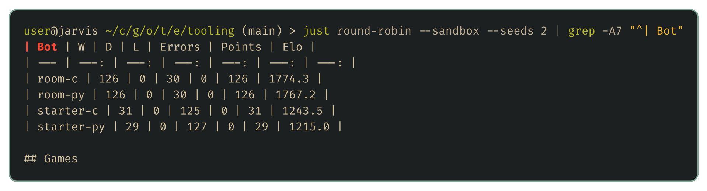

# The evaluation harness

> **Editor's note, 28 September 2026.** This post has been rewritten to be shorter and to describe the harness as it's now released: a frozen copy of the round robin runner we use for our own bots, in place of the simpler one this post first described.

The [wishlist](01-the-wishlist.md) ended with eight tools, and most of them lean on the first: the statistics need results to judge, the map generator needs something playing on its maps, and the ladder rates versions from games they've already played. So we start with the tool that produces games.

In the wishlist post a short fish loop played every bundled map from both sides. That works once. But every idea we try for weeks needs testing against a whole pool of bots, including our own older versions, and we want to hand over a list of bots, walk away, and come back to a complete record we can trust. That's the harness: `just round-robin`, with the runner in [harness/tournament.py](../harness/tournament.py). Every game still runs through the official `unswbc run`, so each result is exactly what the organisers' tools would report.

## Every pairing, both sides, the same seeds

Give the harness bots, maps and a number of seeds, and it plays every pair of bots on every map, from both sides, once per seed. Both sides matter because dragons move one at a time in ID order, so one team always moves first even on a symmetric map.

Each seed decides where pearls appear and how both bots' random choices fall. The harness derives them from the map's name and an index, so every pairing and both side orders meet the same pearls, and running the schedule again replays exactly the same games:

```python
schedule = [
    (map_path, team_a, team_b, seed)
    for map_path in maps
    for seed in (
        [
            zlib.crc32(f"{map_path.name}:{i}".encode())
            for i in range(args.seed_start, args.seed_start + args.seeds)
        ]
        or [None]
    )
    for team_a, team_b in (
        [(selected[0], selected[0])]
        if self_play
        else [
            pair
            for left, right in itertools.combinations(bots, 2)
            for pair in ((left, right), (right, left))
        ]
    )
]
```

With no seeds asked for, games run unseeded and outside the judge's sandbox, which is quick for a smoke test. `--sandbox` plays them in the judge's sandbox, priced in CPU points, and a seeded sandbox game always plays out the same way. So the harness caches each one, keyed by the content of both bots, the map, the seed and the toolkit version, and reuses the result until one of them changes.

## Games side by side

A game takes anywhere from a second to several minutes, but games don't depend on each other, so the harness plays as many at once as you have cores. Each bot is compiled once before the games start. The one real risk is a game that hangs, and `unswbc run` starts a separate process for every dragon, so stopping only the main process would leave its dragons running. Each game starts in its own process group, and the whole group is killed when it finishes or runs out of time:

```python
process = subprocess.Popen(sys.argv[3:], stdout=output, stderr=subprocess.STDOUT,
                           env={**os.environ, "NO_COLOR": "1"}, start_new_session=True)
timed_out = False
try:
    code = process.wait(timeout=timeout)
except subprocess.TimeoutExpired:
    code, timed_out = -1, True
finally:
    try:
        os.killpg(process.pid, signal.SIGKILL)
    except ProcessLookupError:
        pass
    process.wait()
```

Games run through a small wrapper around the toolkit that closes a race in its sandbox, one that can kill a freshly split dragon on its first turn. [The machine inside the judge](16-the-machine-inside-the-judge.md) explains it.

## Errors aren't losses

A game that goes wrong mustn't count as a loss. If a change made our bot crash on one map in ten and crashes counted as losses, its win rate would dip slightly and we'd shrug at a slightly bad idea, when it's really a fixable bug. So the harness reads each game's result from its log, and anything that isn't a clean win, loss or draw goes in a separate errors column, checked in order of how badly the game went wrong:

```python
if timed_out:
    error = "Match exceeded the harness timeout"
elif returncode:
    error = f"Battlecode exited with code {returncode}"
elif failure:
    error = f"Bot execution failure: {failure.group(0)}"
elif outcome is None:
    error = "No engine result found"
```

A bot failure is a dragon that ran out of time, exited, hit a fuel, trap or memory limit, or died with no valid action. A game that finished without writing its replay is an error too. Every game keeps its full log and replay, so an error leads straight to the game that caused it.

## A first run

We'll use the four bots we already have: the C and Python starters, and the flood-fill bot from [The choice](02-the-choice.md) in C and in Python. From `examples/tooling`, two seeds on each of the 13 bundled maps in the sandbox come to 312 games:



The run took just under five minutes on 16 cores, for games that add up to half an hour of CPU time played one after another. Both flood-fill bots beat both starters comfortably, and no game ended in an error.

The two flood-fill bots make exactly the same move in every position, and because every pairing meets the same seeds, they finish with exactly the same record: 126 wins and 30 losses each, and 26 wins each in their games against each other. Their Elo still differs by 7 points. That column is a running rating, updated one game at a time in the order the games were played, so the order alone moved it. A single table can't say whether a gap like that means anything, and that's the job of the next tool.

The run writes `results.json` and a `summary.md` linking every game's log and replay into a folder under `results/round-robin/`.

## Next up

[Better, worse or undecided](04-better-worse-or-undecided.md): turning a pile of wins and losses into a clear answer on whether a change made the bot better.
