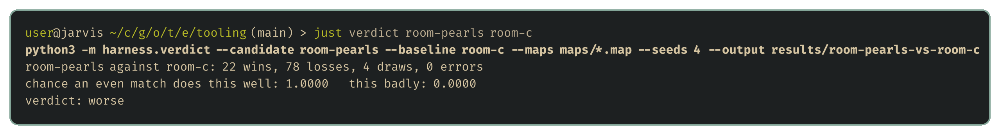

# Better, worse or undecided

<!-- draft: 7f0371a745, stage: Building our tooling -->

The [evaluation harness](03-the-evaluation-harness.md) plays lots of games, but a results table doesn't say whether a change helped. This post builds the second wishlist item, a verdict: [harness/verdict.py](../harness/verdict.py) plays a candidate bot against a baseline and answers better, worse or undecided.

## Counting decisive games

The verdict plays the candidate against the baseline on every map, from both sides, a few times each. Draws and errored games are set aside, which leaves the decisive games: the candidate either won them or lost them.

If the two bots were exactly as good as each other, each decisive game would be a coin flip, and the candidate's wins would follow a binomial distribution with a 50% chance per game. That makes it easy to ask how surprising a result is. Out of 100 decisive games, an even match wins 60 or more about 3% of the time, so 60 wins is strong evidence. Winning 55 happens by luck about 18% of the time, which isn't.

This is called an exact sign test, and the code is short:

```python
def probability_of_at_least(wins: int, games: int) -> float:
    """P(X >= wins) for X ~ Binomial(games, 1/2): the chance an even match does this well."""
    return sum(math.comb(games, k) for k in range(wins, games + 1)) / 2**games
```

The candidate is "better" when an even match would do this well less than 5% of the time, and "worse" when an even match would do this badly less than 5% of the time. Anything in between is "undecided", and the tool estimates how many decisive games the observed win rate would need to settle it.

## Three verdicts

Each run below plays 104 games: the 13 bundled maps, both sides, four seeds each. A new tool needs checking before it's trusted, so the first two runs have answers we already know.

The flood-fill bot against the C starter should be clearly better, and it is: 101 wins, 3 losses, and a verdict of better.

The C and Python flood-fill bots make exactly the same moves, so neither can be better. They split 51 wins each with 2 draws, and the verdict is undecided. A tool that called a winner here would be finding patterns in noise.

The third run is a real question. The flood-fill bot only cares about room to move. An obvious improvement is to also head for pearls, since eating makes a dragon longer and length decides the game at round 500. The candidate, `room-pearls`, keeps the flood fill, and when several moves leave enough room, it takes the one nearest a visible pearl:



The pearl-seeking version lost 78 of its 100 decisive games. It's clearly worse. If I'd tried it in one or two games, I might well have kept it, because chasing food sounds like progress. Working out why it loses needs a closer look at the games, which is a job for the debug viewer later in the series.

## Freezing versions

When a candidate comes out better, it becomes the new baseline, and a copy of the old one is kept. The next candidate has to beat the new baseline, and the frozen copies record every step that counted as progress. For now that's a `cp -r` into a folder of frozen versions. The offline Elo ladder on the wishlist will rate all of them against each other when it arrives.

## Next up

Maps nobody has seen: generating plausible new maps, and what the flood-fill bot does on them.

Questions, heckling and "have you tried X" are all welcome 😄
