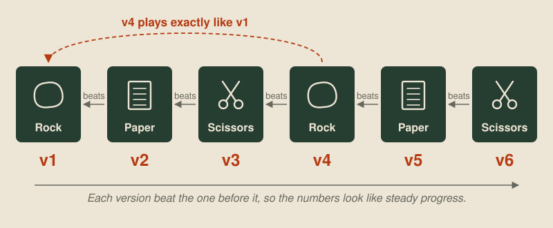

# Better, worse or undecided

<!-- draft: 7f0371a745, stage: Building our tooling -->

With the [evaluation harness](03-the-evaluation-harness.md) we can play as many games as we like. But at the end of the last post we had two bots that make identical moves finishing four wins apart. A results table on its own will always tempt us to read meaning into gaps like that. This post builds the second tool on the wishlist, which answers the question we actually care about: did this change make the bot better?

The tool is [harness/verdict.py](../harness/verdict.py). You give it a candidate bot and the baseline it's meant to improve on, and it comes back with one of three answers: better, worse, or undecided.

## Judging a result against luck

The idea behind it is simple, and worth understanding, because it's the same reasoning you'd use to judge any result by eye.

Suppose the candidate and the baseline were exactly as good as each other. Then every game between them would be a coin flip, and over many games the candidate would win about half. It wouldn't win exactly half, though. Flip a coin a hundred times and you'll often get 55 heads, and now and then 60. So the right question isn't "did the candidate win more than half?" It's "how often would a coin flip do at least this well?" If the answer is "almost never", the candidate is probably genuinely better. If it's "fairly often", we can't tell yet.

The numbers make this concrete. Out of 100 games, two equally good bots will see one of them win 60 or more only about 3% of the time, so a 60–40 result is strong evidence of a real difference. But one of them will win 55 or more about 18% of the time, so a 55–45 result could easily be luck.

Draws don't tell us which bot is better, so the verdict leaves them out and only counts decisive games. Errored games are left out too, for the reason from the last post: a crash is a bug to fix, not a result.

The calculation itself is short. Statisticians call it an exact sign test:

```python
def probability_of_at_least(wins: int, games: int) -> float:
    """P(X >= wins) for X ~ Binomial(games, 1/2): the chance an even match does this well."""
    return sum(math.comb(games, k) for k in range(wins, games + 1)) / 2**games
```

It adds up the chances of every result at least as good as the one we got, if each game were a fair coin flip. The verdict then applies the usual cut-off. If an even match would do this well less than 5% of the time, the candidate is better. If an even match would do this badly less than 5% of the time, it's worse. Anything in between is undecided, and for that case the tool also estimates how many decisive games it would take to settle the question at the win rate we're seeing.

To get the games it needs, the verdict simply hands the two bots to the harness from the last post, which plays them against each other on every map and from both sides, repeating the whole set with a few different seeds so that one lucky pearl layout can't decide the answer.

## Checking the tool on questions we can answer

Before trusting a new tool with a real question, it's worth giving it a couple of questions where we already know the answer, because if it gets those wrong, nothing else it says can be trusted. For each of the runs below, the two bots meet on all 13 bundled maps, from both sides, with four different seeds, which comes to 104 games per run.

The first check should be easy. The flood-fill bot from [The choice](02-the-choice.md) plays against the C starter bot, which just wanders about at random, so the flood-fill bot ought to come out clearly better. It does, winning 101 games and losing 3.

The second check is the more important one. The C and Python versions of the flood-fill bot make exactly the same move in every position, so neither can be better than the other, and a trustworthy tool has to say so. They won 51 games each with 2 draws, and the verdict was undecided. That's reassuring. A tool that declared a winner here would be finding patterns in pure noise, and we'd have no business believing anything else it told us.

## A real question

Now for something we don't know the answer to. The flood-fill bot only cares about keeping room to move, and it ignores food completely. That seems like an obvious thing to fix. Eating pearls makes a dragon longer, and the longest dragon decides the game at round 500, so a bot that heads for food ought to do better.

The candidate, `room-pearls`, keeps the flood fill, and adds one rule. When several moves all leave plenty of room, it picks the one nearest to a visible pearl:


It lost 78 of its 100 decisive games, so it's clearly worse, and not by a small margin. This is exactly the kind of result the tool exists for. If I'd tried the change in a game or two, I might well have kept it, because chasing food sounds like progress and the reasoning behind it sounds solid. Working out why it actually loses needs a closer look at the games themselves, which is a job for the debug viewer later in this stage.

## Keeping the versions that win

When a candidate comes out better, it becomes the new baseline, and the next idea has to beat it. We also save a numbered snapshot of it, which for now is just a copy of the bot's folder, and keep the last few snapshots around so that every new candidate has to beat them as well as the current baseline.

The reason for keeping older versions is that beating the previous version isn't the same thing as getting better. Strategies in a game like this can go round in circles, the way rock, paper and scissors do. Suppose our first bot plays rock. Paper beats it, passes the verdict and becomes version 2. Scissors beats paper and becomes version 3. Then rock beats scissors and becomes version 4, even though it's exactly the bot we started with:



Every step in that sequence passed a fair test, and the version numbers suggest six rounds of progress, but the bot has only gone round in a circle. Real bots can do the same thing in subtler ways. A change that makes our dragons better at dodging the last version's kamikazes might also make them worse against a bot that simply forages, and if we only ever tested against the previous version, we'd never find out. Running the verdict against the last few snapshots as well catches this, because a version that has quietly gone back round the circle will lose to one of its own ancestors.

We keep only the last few snapshots in testing rather than all of them, because much older versions are usually easy wins, and playing them spends games without telling us anything new. The offline Elo ladder, which comes later in this stage, will rate every snapshot against every other, so the whole history can be seen at once.

## Next up

Maps nobody has seen: generating plausible new maps, and what the flood-fill bot does on them.
