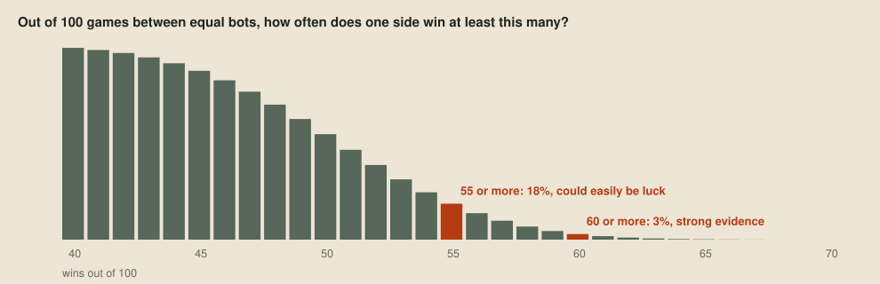
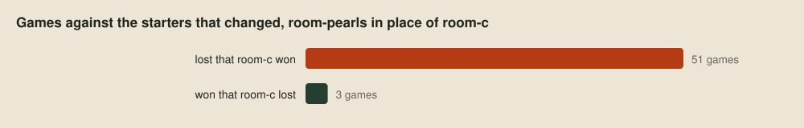
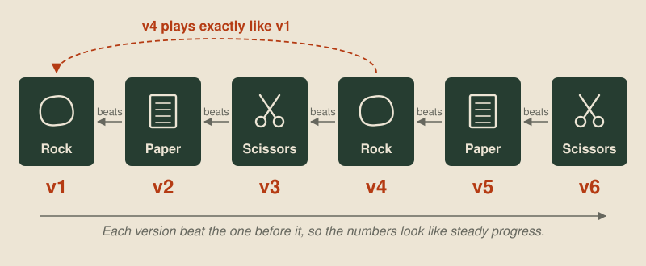

# Better, worse or undecided

> **Editor's note, 28 September 2026.** I've rewritten this post to be shorter and to use the released verdict, which now plays its games through the released round robin runner. I reran the checks and the pearl-chasing experiment with it, so the numbers below are new.

With the [harness](03-the-evaluation-harness.md) we can play as many games as we like, but a results table on its own will always tempt us to read meaning into small gaps. This post builds the tool that answers the question we actually care about: did this change make the bot better? The command is `just verdict`, with the statistics in [harness/verdict.py](../harness/verdict.py). You give it a candidate bot and the baseline it changes, and it comes back with one of three answers: better, worse, or undecided.

## Judging a result against luck

The idea underneath is the reasoning you'd use to judge any result by eye. Suppose a change made no difference at all. Then every game it won or lost could just as easily have gone the other way, like a coin flip. So the right question isn't "did the candidate win more?" but "how often would coin flips do at least this well?" If the answer is "almost never", the change is probably real. If it's "fairly often", we can't tell yet.

The numbers make this concrete. Out of 100 games, an even match sees one side win 60 or more only about 3% of the time, so a 60–40 result is strong evidence. But one side wins 55 or more about 18% of the time, so 55–45 could easily be luck. The verdict uses the usual cut-off: if coin flips would do this well less than 5% of the time, the candidate is better, and if they'd do this badly less than 5% of the time, it's worse.



The hard part is deciding which games to count, and that's where most of the tool's design goes.

## Comparing like with like

A game depends on two things besides the bots: the map, and the seed that decides where pearls appear and how each bot's random choices fall. So the verdict plays every game twice. The candidate plays an opponent on a map, side and seed, and then the baseline plays that same map, side and seed against the same opponent, sitting in the candidate's seat.

Seeded games are deterministic. If the candidate's change never comes into play in a game, both versions make exactly the same moves, the two games are identical, and they cancel out. Only the games whose result changed are left:


This matters more than it looks, because most changes to a bot only fire in some situations: a rule for portals, a tactic for narrow corridors. If a change never fires on nine maps in ten and wins the tenth outright, counting every game buries that win under nine maps' worth of games that couldn't have gone any other way. Pairing throws those out, so a change is judged on the games it could actually affect.

## Weighing each game by how much the change ran

Pairing still treats every changed game the same, whether the new behaviour ran for most of the game or for two turns near the end, and the first kind says much more about it. So each bot names its behaviours. On every turn it writes the one that chose its move as its indicator, the short text the viewer shows beside a dragon, and if you tell the verdict which behaviour changed, it weights each changed game by the share of the candidate's turns that behaviour was active.

With weights, counting wins isn't enough any more, so the test becomes a sign flip: add up the weighted changes, then ask how often random signs on the same changes would add up to at least as much.

```python
def sign_flip_p_values(changes: list[float], trials: int = 200_000) -> tuple[float, float]:
    """P(a random sign on each change sums to at least, and at most, the observed total)."""
    changes = [change for change in changes if change]
    if not changes:
        return 1.0, 1.0
    observed = sum(changes)
    magnitudes = [abs(change) for change in changes]
    generator = random.Random(0)
    at_least = at_most = 0
    for _ in range(trials):
        total = sum(magnitude if generator.random() < 0.5 else -magnitude for magnitude in magnitudes)
        at_least += total >= observed - 1e-12
        at_most += total <= observed + 1e-12
    return at_least / trials, at_most / trials
```

It's the coin-flip question again, asked of the changes themselves. With every weight equal to one, it gives the same answer as counting wins against losses.

## Games we should never lose

Testing a change against the bot it came from has a blind spot: it never shows how the bot does against bots unlike itself. So the candidate and the baseline both also play the two starter bots, on the same maps, sides and seeds, and those games are paired too.


The standard here is different. A decent bot should beat a bot that walks at random every single time, so a loss to one can't be put down to bad luck. It should be about as likely as a mouse beating a lion. A candidate that loses more of these games than the baseline did is never called better, and the verdict lists every game the candidate lost to a weak bot that the baseline won, because each one is a bug to find whatever the verdict says.

It also compares game length, pair by pair. A win in 40 rounds and a win in 400 aren't the same result, so it reports the median rounds to win for each version and flags any win much shorter than the rest, since a very short game is sometimes a fluke worth looking at before trusting it.

## Checking the tool on questions we can answer

Before trusting a new tool with a real question, it's worth giving it some questions where we already know the answer. Each run below plays the 13 bundled maps from both sides on four seeds.

The first check should be easy: the flood-fill bot from [The choice](02-the-choice.md) in place of the C starter, which just wanders about at random. The flood-fill bot ought to come out clearly better, and it does. Of 104 paired games, 46 came out the same, and of the rest it gained 56 and dropped 2. Even so, it lost 2 games to the Python starter that the C starter had won, which is a reminder that a bot that only counts room can still walk into trouble. One pair also had an error, a Python starter that failed to launch on a busy machine, so it doesn't count either way:

```text
$ just verdict --candidate room-c --baseline starter-c
room-c in place of starter-c: 104 paired games, 56 gained, 2 dropped, 46 unchanged
chance random signs do this well: 0.0000   this badly: 1.0000
weak bots (starter-py): 2 games lost that starter-c won, 35 won that it lost (chance this badly: 1.0000)
  lost: room-c vs starter-py on autarky seed 722775847
  lost: starter-py vs room-c on Colosseum seed 4061594858
rounds to win: room-c 191, starter-c 143.0; paired wins 25 faster, 35 slower
1 pairs had an error and don't count
verdict: better
```

The second check is the more important one. The C and Python versions of the flood-fill bot make exactly the same move in every position, so neither can be better than the other, and a trustworthy tool has to say so. With pairing, the answer is exact rather than statistical: all 104 paired games were identical, against the weak bots too, and the verdict was undecided. A tool that found a difference here would be finding it in pure noise.

```text
$ just verdict --candidate room-py --baseline room-c
room-py in place of room-c: 104 paired games, 0 gained, 0 dropped, 104 unchanged
chance random signs do this well: 1.0000   this badly: 1.0000
weak bots (starter-c, starter-py): 0 games lost that room-c won, 0 won that it lost (chance this badly: 1.0000)
rounds to win: room-py 203, room-c 203; paired wins 0 faster, 0 slower
verdict: undecided
```

## A real question

Now for something we don't know the answer to. The flood-fill bot only cares about keeping room to move, and it ignores food completely. That seems like an obvious thing to fix. Eating pearls makes a dragon longer, and the longest dragon decides the game at round 500, so a bot that heads for food ought to do better.

The candidate, `room-pearls`, keeps the flood fill and adds one rule: when several moves all leave plenty of room, it picks the one nearest a visible pearl. On the turns where that rule changes the move, it writes `Pearl` as its indicator, so the verdict can weigh each game by it:


Head to head, the pearl chaser comes out worse. Of the 104 paired games, 50 came out the same, and of the rest it won 18 that the flood-fill bot lost and lost 36 that the flood-fill bot won. Weighted by how much the pearl rule ran, random signs would do that badly only 2.3% of the time.

The weak bots make it much starker. Against the two starters, the pearl chaser lost 51 games that the flood-fill bot won and won back only 3. Chasing food makes the bot beatable by bots that don't try at all, which is exactly the kind of failure a head-to-head test between two versions of the same bot can miss.

 It does win faster when it wins, a median of 163 rounds against 203, which fits: a bot that eats more grows faster. Working out why it keeps dying is a job for the debug viewer later in this stage.

## Keeping the versions that win

When a candidate comes out better, it becomes the new baseline, and the next idea has to beat it. We also save a numbered snapshot of it, and keep the last few around so every new candidate has to beat them as well.

The reason is that beating the previous version isn't the same thing as getting better. Strategies can go round in circles, the way rock, paper and scissors do. Suppose our first bot plays rock. Paper beats it and becomes version 2, scissors beats paper and becomes version 3, and then rock beats scissors and becomes version 4, even though it's exactly the bot we started with:



Every step in that sequence passed a fair test, and the bot has only gone round in a circle. Real bots do the same in subtler ways. A change that makes our dragons better at dodging the last version's attacks might also make them worse against a bot that simply forages, and testing against the last few snapshots catches that, because a version that has gone back round the circle loses to one of its own ancestors. The [ladder](06-a-ladder-of-our-own.md), later in this stage, rates every snapshot against every other so the whole history can be seen at once.

## Next up

[Maps nobody has seen](05-maps-nobody-has-seen.md): generating plausible new maps, and what the flood-fill bot does on them.
