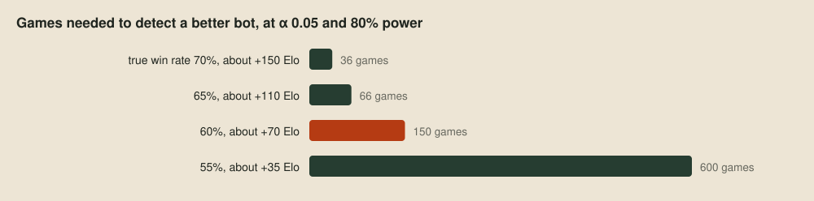
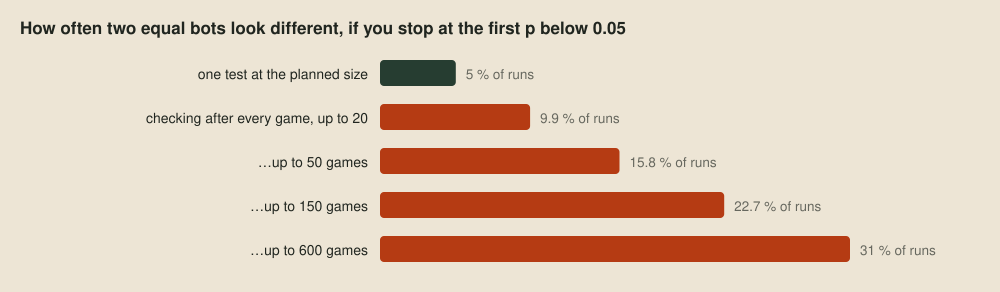
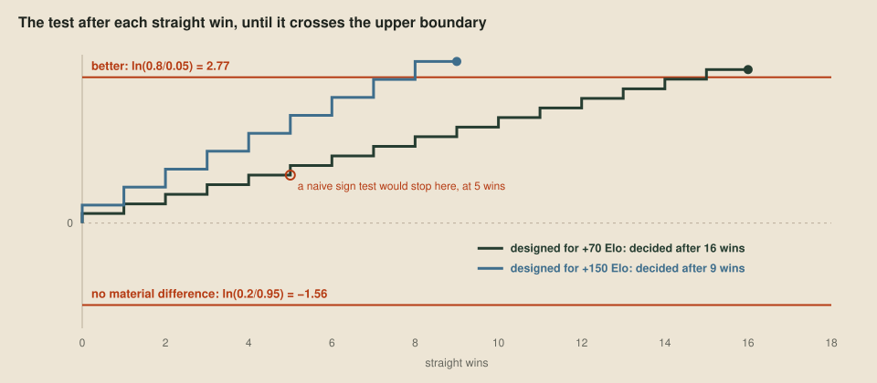
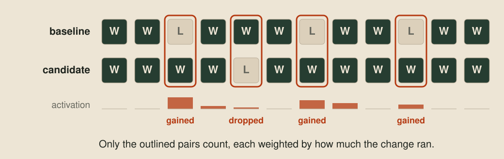

# Better, worse or undecided

> **Editor's note, 28 September 2026.** The verdict is now sequential: it checks after every game and stops as soon as the answer is safe, instead of judging a fixed number of games.

With the [harness](04-the-evaluation-harness.md) we can play as many games as we like, and that's exactly the problem: a pile of results always tempts us to read meaning into small gaps. Playing a bot against a pool of opponents is how we find out what's wrong with it, and the useful output of those games is the faults, the games it should have won and didn't, each one something to watch in a viewer and fix. But the games also produce a score, and sooner or later we want to know what that score means. This post builds the tool for that, from first principles, and explains why it plays as few games as it does. The commands are `just batch` to play and `just verdict` to read, with the statistics in [harness/report/verdict.nim](../harness/report/verdict.nim).

## The question

A verdict compares a candidate bot with the opponents it plays, or with a baseline version it was changed from. The question it answers is narrow: is the difference we're seeing real, and how big is it? Stated precisely, if the candidate played those opponents forever, would it score more than half its games?

What goes into our bot is decided separately. A behaviour goes in because there's a sound reason it helps at least some of the time, and a bad first result usually says more about its parameters than about the idea. The verdict tells us how far to trust a difference, so we don't talk ourselves into a gain that isn't there or explain away a loss that is.

We can never play forever, so every answer is a bet, and there are two ways to lose it. We can call a difference real when it's luck, or miss one that really is there. Statisticians call the chance of the first mistake α, and one minus the chance of the second the test's power. The usual choice, and ours, is α of 5% and power of 80%.

## Sample size

The third ingredient is the size of the difference we care about. A change that makes the bot win 70% of its games against the baseline is easy to spot. One that wins 51% is real but almost invisible, and chasing it would cost thousands of games. So before playing anything, we decide on the smallest improvement worth detecting, and that sets how many games the test needs:



We size our verdicts for +70 Elo, which means winning about 60% of games against the baseline. Smaller gains are real, but a test that could see them would cost four times as many games, and on unseen tournament maps a change that small might not survive anyway. For comparison, the verdict we used before this redesign played a fixed schedule of about 3,700 games per candidate, whatever the question.

## Checking after every game

A fixed-size test has an obvious waste. If a candidate wins its first 20 games in a row, the answer is already clear, and playing the other 130 feels silly. The tempting fix is to check the result after every game and stop as soon as it looks significant.

That breaks the test. The 5% false-positive rate of a significance test assumes you look once, at the planned size. Every extra look is another chance for luck to cross the line, and luck gets a lot of chances. Here's how often two exactly equal bots would be declared different if we stopped at the first p-value below 0.05:



By 150 games, peeking has turned a 5% error rate into nearly 23%. We'd be believing a difference that isn't there one time in four or five.

## A test built for checking every game

The sequential probability ratio test, which Abraham Wald worked out in the 1940s ([Sequential Tests of Statistical Hypotheses](https://doi.org/10.1214/aoms/1177731118), 1945), is built for exactly this. It keeps one running number: how much more likely the results so far are if the candidate is really better, meaning it wins 60% of games, than if it's no better, meaning it wins 50%. That number is a log-likelihood ratio, and it's simple to update. Each win makes "better" more likely by a factor of 0.6 / 0.5, so it adds ln(0.6 / 0.5), about +0.18. Each loss makes it less likely by 0.4 / 0.5, adding ln(0.4 / 0.5), about −0.22, and a draw counts as half of each, about −0.02.

Wald showed where the stopping lines have to go to keep the error rates we chose, however often we look. The upper line is ln(0.8 / 0.05), about 2.77: cross it and the candidate is better. The lower line is ln(0.2 / 0.95), about −1.56: cross it and the candidate is not better, meaning the evidence says the change isn't worth +70 Elo. The test only asks whether the candidate is better, so this is "not better" rather than "worse", and the score it prints shows which way it leaned. The run stops at whichever it reaches first.

## Straight wins

The case that makes this concrete is a candidate that wins every game. Each win adds 0.18, so it takes 16 straight wins to pass 2.77. A test designed to detect a bigger improvement, +150 Elo, adds more per win and decides after 9:



A naive sign test would call it after only 5 straight wins, since five heads in a row happen by chance about 3% of the time. That's fine if you only ever look at game 5. Checked after every game, it's the peeking problem from the chart above, and it would pass far too many lucky runs.

The verdict also caps every test at the size a fixed test would have needed, 155 games at +70 Elo. Across the range of true improvements, this is how often each outcome happens, and how many games it takes on average:

| True improvement | Better | Not better | No material difference at the cap | Average games |
| --- | ---: | ---: | ---: | ---: |
| None | 3.8% | 86.4% | 9.8% | 65 |
| +35 Elo | 24% | 50% | 26% | 91 |
| +70 Elo | 65% | 17% | 18% | 90 |
| +120 Elo | 97.0% | 1.8% | 1.2% | 59 |
| +150 Elo | 99.5% | 0.5% | 0.1% | 46 |

A change that does nothing is almost never called better, and a big improvement is found in well under 50 games. The cap costs some power right at +70 Elo, where a fixed test of 155 games would have reached 80%. On our own bots, the same test has called a candidate better after 139 games, not better after 69, and reached the cap at 155 with no material difference.

## Pairing makes each game count for more

A game depends on more than the two bots: the map, the seed that decides where pearls appear, and which side each bot starts on. Those differences are noise, and noise is what makes a test need more games. So the verdict pairs its games. The candidate and the baseline each play the same opponent, on the same map, seed and side, and each pair is compared directly:



Seeded games are deterministic, so if the change never comes into play, the two games are identical and cancel out. What's left is the effect of the change, with the map and the luck of the seed held fixed.

That's how the verdict compares two close versions of the same bot. Played directly against each other, versions that similar mostly win by which side they start on, so their head-to-head games tell us little. Instead both play the same fixtures against common opponents, and a fixture counts once both games are done: a win for the candidate if it scored more, a loss if the baseline did. Ties, such as both winning, carry no evidence and are just counted. For a candidate that isn't a close relative, the verdict plays it directly against each opponent and scores every game.

## Stopping early only pays if the games are mixed

A sequential test can stop after 16 games, but only if those 16 games are a fair sample. If the schedule played every game on one map first, then the next map, an early stop would judge the candidate on one map. So the verdict rotates the map, the opponent and the side from the very first game.

The other catch is how many games are running at once. Stopping is only a saving if the games still running when the test crosses a line are few. So the verdict keeps roughly as many games in flight as it expects to need, and cancels the rest the moment it decides.

Concretely, the maps are shuffled into a fixed order for each run, and on each map every opponent that still needs games is played from both sides before moving on. Each test reads only the longest unbroken run of finished games in that order, never whichever games happen to finish first, so a slow map can't be skipped. An opponent whose test has decided gets no more games, and the whole run ends as soon as every test has.

One more check runs alongside. Ten games against a bot that moves at random are mixed into the first few maps, and any game the candidate fails to win is flagged as a fault to watch. A decent bot should never lose to one, so those games never enter the statistics. Any fault is a bug to go and find.

## Reaching the cap

Some changes are too small for either line: they help a little, or on some maps and not others. After 155 games without crossing, the verdict stops and reports no material difference. It means the difference is smaller than the test was built to see, and measuring it would take far more games, such as the [ladder](07-a-ladder-of-our-own.md) later in this stage, which plays every pair many times.

## A first verdict

Now for something we don't know the answer to. The flood-fill bot only cares about keeping room to move, and it ignores food completely. That seems like an obvious thing to fix. Eating pearls makes a dragon longer, and the longest dragon decides the game at round 500, so a bot that heads for food ought to do better.

The candidate, `room-pearls`, keeps the flood fill and adds one rule: when several moves all leave plenty of room, it picks the one nearest a visible pearl. It isn't a close relative of anything we'd compare it with in pairs, so it plays the flood-fill bot directly, on the 15 bundled maps and the 20 generated ones. From `examples/tooling`, `just batch` plays the games and `just verdict` reads them:

```sh
just batch --bots room-pearls --output results/verdict-pearls
just verdict --output results/verdict-pearls --candidate room-pearls
```

The verdict writes a `verdict.md` in the same format as the harness's summary, with more columns for the test. Here is its first row, trimmed to the columns this post uses:

| Candidate | Opponent | W–D–L | Elo (95% interval) | Decision | LLR (lower, upper) | Games used |
| --- | --- | --- | --- | --- | --- | --- |
| `room-pearls` | `room-c` | 2–0–9 | −261 (… to −63) | not better | −1.632 (−1.558, +2.773) | 11, decided at 11 (cap 155) |

It took 11 games. The pearl chaser won 2 and lost 9, and after the eleventh the running number fell to −1.632, past the lower line at −1.558, so the answer is not better. The Elo estimate goes further and says worse, with an interval that stops at −63. Heading for food can still be a good idea. This rule, which chases the nearest pearl whenever there's room, is losing games, and the next step is to find out how. By the time it decided, 41 games had been played in all, counting the ten upset games and the games already in flight, which is the price of keeping several running at once.

The upset check found something too. Of its ten games against `starter-c`, the pearl chaser failed to win one, on Colosseum, and the verdict lists it with the `just viewer` command that opens its replay.

The flood-fill bot doesn't lose to a starter, and the pearl chaser did. That game is the most useful result of the run. A decent bot should never lose it, and the verdict gives the command to watch it. Why the pearl chaser's dragons die is a question for the replay tools later in this stage, and the answer is how long its dragons grow.

## Checking the whole line

As the bot grows, we save numbered snapshots of it, and it's tempting to read each version beating the one before as steady progress. Beating the previous version isn't the same as getting better, though, because strategies can go round in circles the way rock, paper and scissors do:


Every step in that sequence would pass a fair test, and the bot has only gone round in a circle. The [ladder](07-a-ladder-of-our-own.md), later in this stage, rates every snapshot against every other, so a version that has gone back round the circle shows up losing to one of its own ancestors.

## Next up

[Maps nobody has seen](06-maps-nobody-has-seen.md): generating plausible new maps, and what the flood-fill bot does on them.
