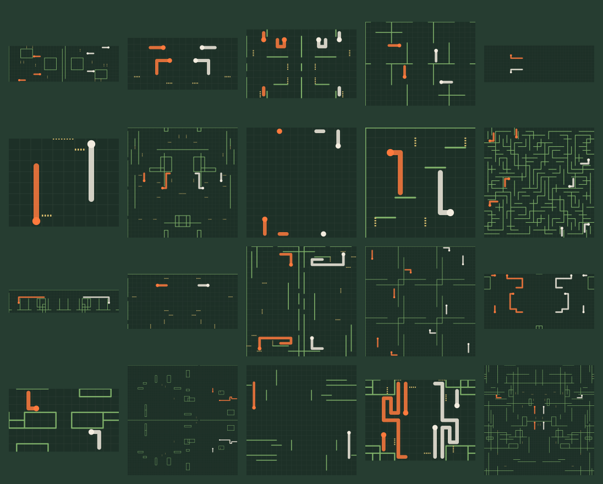
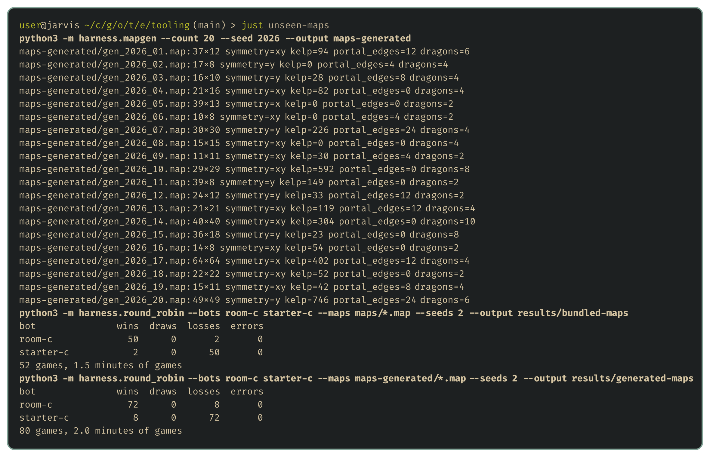

# Maps nobody has seen

<!-- draft: a51bc86640, stage: Building our tooling -->

The organisers have said that every Sprint, Qualifier and Grand Final map will be new. A bot tuned on the 13 bundled maps can look strong right up until the tournament. This post builds the third wishlist item, a map generator, and uses it to find a blind spot in the flood-fill bot that the bundled maps hid.

## What the generator makes

[harness/mapgen.py](../harness/mapgen.py) writes maps in the official format, modelled on the maps the ladder has actually used. Each map picks:

- **A size and shape**, from 8 tiles high up to 64×64, square or wide.
- **A symmetry**, mirrored left to right, top to bottom, or rotated half a turn, as ladder maps are, so neither side starts with an advantage.
- **A kelp layout**, such as scattered segments, rooms, pillars, a maze, a dividing wall or open ground.
- **Portals**, in mirrored pairs.
- **Pearl spawns**, spread out, starved, contested in the middle, or split into a private field for each side.
- **Starting dragons**, placed symmetrically.

Random layouts can easily be unplayable, so the generator throws away any map that wouldn't make a fair game. A map where half the board is walled off, or where the two teams start on top of each other, would tell us nothing about our bot. So it checks that most of the board is connected, that the teams start at least four tiles apart, and that no dragon starts boxed in. A seed makes the output repeatable, so `--seed 2026` always gives the same 20 maps:

## The flood-fill bot on new maps

The same pairing, the flood-fill bot against the C starter, played on the bundled maps and then on the 20 generated ones:

It lost 2 of 52 games on the bundled maps and 8 of 80 on the generated ones, about two and a half times as often. In the games it lost on generated maps, its dragons mostly died by running into their own bodies. That shouldn't happen: the flood fill marks every tile holding a dragon as blocked, including its own.

The logs and replays showed why. In the deaths I traced, the fatal move crossed a portal. The flood fill treats a portal like an open edge, as if the dragon would step onto the tile next door. A portal actually carries the dragon to its partner edge somewhere else on the map, which can be right where its own body is.

Nine of the 13 bundled maps have portals too, but the flood-fill bot rarely lost on them, so testing only on the bundled maps would have hidden the mistake. Fixing it means following portals properly in the flood fill, and it's the first job for the strategy posts.

## Where the tools fit

That's three tools off the wishlist: a harness to play the games, statistics to judge them, and a generator for maps we haven't seen. Here's how they sit around the bot, next to the official toolkit and the rest of the wishlist:

![Our tools around the bot. The current bot sits in the middle, written in Nim with hot paths in C and compiled to WebAssembly, with numbered snapshots of earlier versions saved below it. The official toolkit is on the right: unswbc init, unswbc run --sandbox, --seed, unswbc maps, the visualiser and unswbc submit. Our wishlist tools are on the left with their languages: the evaluation harness, statistics and map generator in Python are built, and the offline Elo ladder, replay sampler, replay decoder, the Odin debug viewer and profiling are still to come. Ideas from the strategic ideas, espionage and advanced tactics stages flow into the bot from the top.](images/pipeline.svg)

The point of all this is to take the drudgery out of improving a bot. Without these tools, every idea means hours of running games by hand and squinting at results that might just be luck. With them, trying an idea is one command, and the answer comes back as better, worse or undecided, tested on maps the bot has never seen. When a version wins, it's frozen and becomes the one to beat.

That frees up our time for the part that actually decides games: the strategy and tactics of the dragons themselves. The rest of the wishlist will fill in the gaps as the strategy posts need it.

## Next up

That's enough tooling to start improving a bot with evidence. The next stage turns to strategic ideas, starting with the portal blind spot this post found.
