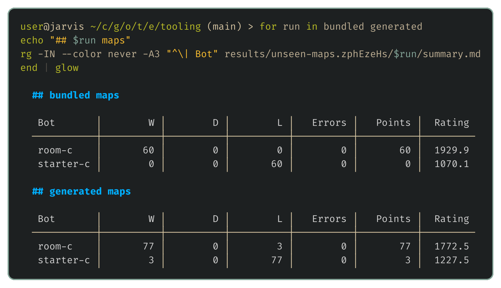

# Maps nobody has seen

> **Editor's note, 28 September 2026.** I've rewritten this post to be shorter and to use the released map generator and round robin runner. I redrew the figures and reran the comparison with them.

The organisers have said that every Sprint, Qualifier and Grand Final map will be brand new. That's a problem for anyone who only tests on the 13 maps bundled with the toolkit, because a bot can quietly come to depend on something those maps happen to have in common, and look strong right up until the tournament puts it on a map without it. We can't test on maps nobody has seen, but we can make lots of new ones that look like the real thing. That's the map generator from the wishlist, and this post builds it and then uses it straight away to find a blind spot the bundled maps had been hiding.

## What a plausible map needs

The generator, `just mapgen`, writes maps in the official format. The hard part is making them plausible: varied enough to find surprises, but still recognisably the same game. So I modelled it on the maps the ladder has actually used, and each choice it makes is one that can trip up a bot.

Size and shape come first. Ladder maps range from cramped boards where dragons are always bumping into each other up to 64 by 64, where they may barely meet, and some are square while others are long and narrow. A bot that only ever plays medium-sized square maps picks up habits that fall apart at either extreme.

Every map is also symmetric, mirrored or rotated so both teams start in equivalent positions, which keeps the games fair. The generator never places anything on its own: every piece of kelp goes in together with its mirror image.

```python
def add_kelp_symmetrically(layout: GeneratedMap, edge: Edge) -> None:
    layout.kelp.add(edge)
    layout.kelp.add(mirror_edge(layout, edge))
```

The kelp is where the variety really comes in, because different layouts demand different skills. Open ground, scattered short walls, closed rooms, pillars, a maze or a single dividing wall each change how a dragon has to move, and the generator mixes one to three of them. It adds portals in pairs, since portals break a bot's assumptions about where a move leads more often than anything else. And it spreads pearls in different ways: everywhere, scarcely, in a contested middle, or in a private field on each side, which tests a bot's sense of when to go looking for food.

Random choices like these can easily produce a useless map, mostly walled off, or with the teams starting on top of each other. So the whole recipe is one retry loop, which throws the map away and starts again whenever too little of the board is reachable or the dragons can't be placed with room around them:

```python
add_portals(
    layout,
    generator,
    min(generator.choice([0, 0, 1, 2, 3, 4, 6]), width * height // 80),
)
playable = largest_component(layout)
if len(playable) < (0.35 if dense else 0.6) * width * height:
    continue
area = width * height
per_team = generator.randint(1, 2 if area < 400 else 4 if area < 1600 else 6)
lengths = starting_lengths(generator, per_team, len(playable) // 2)
if not place_dragons(layout, generator, playable, len(lengths), lengths):
    continue
assign_spawn_ranges(layout, generator, playable, generator.choice(FOOD_LAYOUTS))
return layout
```

The seed makes it reproducible, so `just mapgen --count 20 --seed 2026 --output maps-generated` gives you the same 20 maps I'm using here:


## The flood-fill bot on new maps

To see whether the new maps tell us anything, we'll play the same matchup twice, the flood-fill bot from [The choice](02-the-choice.md) against the C starter, first on the bundled maps and then on the generated ones. If the generated maps were just more of the same, both runs should look alike. `just unseen-maps` generates the maps and plays both, two seeds per map and side, in the sandbox:



The first pair of rows is the bundled maps and the second the generated ones, and they don't look alike. The flood-fill bot won all 52 of its games on the bundled maps, but lost 6 of its 80 on the generated ones. That's already worth knowing, since it means the bundled maps flatter this bot, but the more useful part is what the losses looked like.

Half of those losses came down to a dragon running into its own body, which is strange, because the flood fill is supposed to make that impossible: it never moves onto a tile holding a segment, ours included. The replays showed what was going on. In all three of those deaths, the fatal move went through a portal. The flood fill treats a portal like any other open edge, as if the dragon would just step onto the tile next door, but a portal carries it to its partner edge, which can be anywhere on the map. Sometimes that's right where the dragon's own body is. Nine of the bundled maps have portals too, and the bot rarely lost on them, so we'd never have spotted this without the new maps. Teaching the bot how portals work is the first job for the strategy posts.

## Where the tools fit

That's three of the eight tools. The harness plays the games, the statistics tell us what the results mean, and the generator makes sure the results hold on maps nobody has seen:

![Our tools around the bot. The current bot sits in the middle, written in Nim with hot paths in C and compiled to WebAssembly, with numbered snapshots of earlier versions saved below it. The official toolkit is on the right: unswbc init, unswbc run --sandbox, --seed, unswbc maps, the visualiser and unswbc submit. Our wishlist tools are on the left with their languages: the evaluation harness, statistics and map generator in Python are built, and the offline Elo ladder, replay sampler, replay decoder, the Odin debug viewer, profiling and the Zig judge are still to come. Ideas from the grand strategy, tactical ideas and espionage stages flow into the bot from the top.](images/pipeline.svg)

Those three take the drudgery out of improving a bot. Trying an idea is now one command, and the answer comes back as better, worse or undecided, tested on maps the bot has never seen. The other five tools answer different questions: whether the bot is improving overall, what the other teams are doing, why one of our dragons did what it did, and where its CPU budget went.

## Next up

[A ladder of our own](06-a-ladder-of-our-own.md): rating every saved version against every other, so we can see whether the bot is improving overall.
