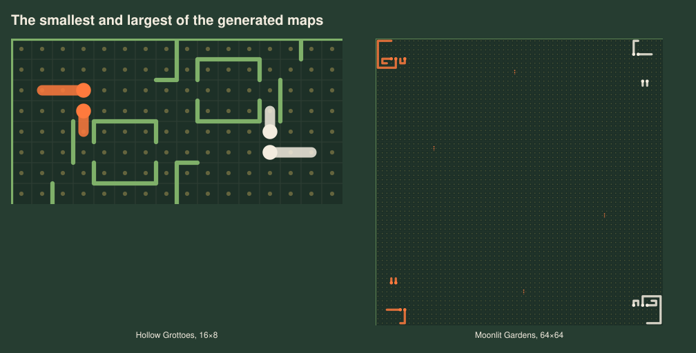
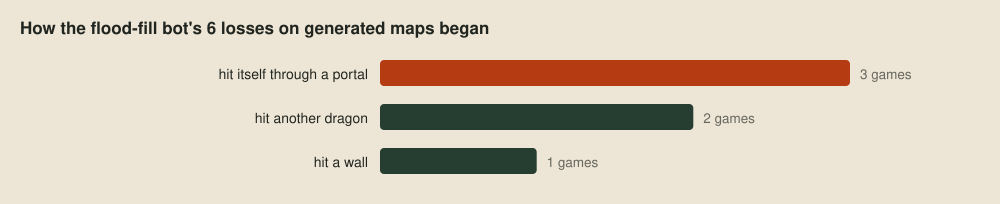

# Maps nobody has seen

> **Editor's note, 28 September 2026.** I've rewritten this post to be shorter and to use the released round robin runner, and replaced my first map generator with xCirno's, bounded by the official maps. I redrew the figures and reran the comparison on the new maps with toolkit 1.2.2 and the released harness.

The organisers have said that every Sprint, Qualifier and Grand Final map will be brand new. That's a problem for anyone who only tests on the maps bundled with the toolkit, because a bot can quietly come to depend on something those maps happen to have in common, and look strong right up until the tournament puts it on a map without it. We can't test on maps nobody has seen, but we can make lots of new ones that look like the real thing. That's the map generator from the wishlist. This post shows how ours works, built on a generator another competitor shared, and then uses it straight away to find a blind spot the bundled maps had been hiding.

## What a plausible map needs

The generator, `just mapgen`, writes maps in the official format. The hard part is making them plausible: varied enough to find surprises, but still recognisably the same game. My first generator mixed a handful of random layouts and threw away the ones that came out unplayable, and it made maps no organiser would ever ship. The one the harness uses now is xCirno's layered world generator, which they shared with everyone in the competition Discord as [a gist](https://gist.github.com/xCirno1/ffdaac4236c1f1085c351af4fdfc1600). It builds each map in stages, and each stage reads what the earlier ones decided:

1. **Canvas.** Size, symmetry and a closed or wrapping border, picked from the shapes the official maps use.
2. **Climate.** Two noise fields, elevation and fertility, made symmetric so both teams get the same world.
3. **Districts.** Camps where the dragons start and a heart on the symmetry axis are placed first, then every other tile joins its nearest seed point, which gives organic regions.
4. **Biomes.** Each district's role and climate pick what it looks like: open sea, meadow, reef, ruins, caves, maze or vault.
5. **Landmark.** One map-sized structure, such as a citadel of concentric walls, a great labyrinth, a walled city, diagonal lanes or a lattice of portals, with gated walls between the districts.
6. **Structures.** A vault at the heart, the nests the first dragons start coiled in, buildings to suit each biome, portal shrines reachable only by portal, wormholes across the axis, and groves of pearls on the fertile ground.
7. **Repair.** Every sealed pocket gets a door into the rest of the map, so no dragon is born into a hole and no pearl is wasted.
8. **Economy.** One small palette of pearl spawn rates per map, like the official maps' few classes, scaled to suit the number of dragons.
9. **Spawns.** Dragons coil out of each camp with their heads towards the enemy, with their exits checked and enemy heads kept apart.
10. **Judge.** Several candidate worlds are scored on contested food, how soon the teams meet, detours, dead ends and portal use, and the best one is written.

Every map is symmetric, mirrored or rotated so both teams start in equivalent positions, which keeps the games fair. The generator guarantees it by never writing one side alone. Every change to the board goes through one setter, which writes the edge and its mirror image together:

```python
def put(self, e, k, force=False):
    me = self.me(e)
    for x in (e,) if me == e else (e, me):  # ordered: a set of str tuples is not
        if self.kind.get(x, 0) == 2:
            continue  # never overwrite a portal
        if not force and self.is_border(x):
            continue  # the border stays shut
        if k:
            self.kind[x] = k
        else:
            self.kind.pop(x, None)
```

We widened it to the official maps' full range of sizes, from 11 by 11 and 16 by 8 up to 64 by 64. Ladder maps run from cramped boards where dragons are always bumping into each other to wide ones where they may barely meet, and a bot that only ever plays medium-sized maps picks up habits that fall apart at either extreme:



We also added open maps with no buildings, like Big Empty and Colosseum, worlds where every tile can spawn pearls, spawn palettes folded to one or two classes, and flagships up to 25 segments long. Then we bounded the whole thing by the official maps. The generator measures every candidate the way it measures the toolkit's own maps, and keeps a candidate only if every measure lies within the range those maps span:

```python
ENVELOPE_MEASURES = (
    "tiles", "aspect", "supply", "kelp", "portal_pairs",
    "per_side", "longest", "force", "dead_ends",
)
```

The measures are the board's size and shape, how many pearls it spawns per tile each round, how much kelp and how many portal pairs it has, the dragons per side, the longest dragon and the total starting length, and how much of the board is dead ends. My first generator had no such bound, and pearl supply is where it strayed furthest. Some of its maps were close to barren, and one spawned pearls more than four times as fast as any official map:


`just mapgen --check` measures a directory of maps against the official ones and names any map outside the range. It reads the official maps from `maps/`, which `just article-bots` installs from the toolkit, so the range and the maps depend on the toolkit version. With toolkit 1.2.2's 15 maps, `just mapgen --count 20 --seed 2026` gives you the same 20 maps I'm using here, and the check passes all of them:


Here they are:


## The flood-fill bot on new maps

To see whether the new maps tell us anything, we'll play the same matchup twice, the flood-fill bot from [The choice](02-the-choice.md) against the C starter, first on the bundled maps and then on the generated ones. If the generated maps were just more of the same, both runs should look alike. `just unseen-maps` generates the maps and plays both, two seeds per map and side, in the sandbox:


They don't look alike. On the bundled maps the flood-fill bot never loses to a bot that moves at random, and on maps it has never seen it does, which already tells us the bundled maps flatter it. The more useful part is how its dragons died in those three games:



A dragon running into its own body is strange, because the flood fill is supposed to make that impossible: it never moves onto a tile holding a segment, ours included. The replays showed what was going on. The flood fill treats a portal like any other open edge, as if the dragon would just step onto the tile next door, but a portal carries it to its partner edge, which can be anywhere on the map. Sometimes that's right where the dragon's own body is. All five self-hits went through a portal. Eleven of the bundled maps have portals too, and the bot never lost on any of them, so we'd never have spotted this without the new maps.

The replays show a second blind spot as well. Each dragon picks its move on its own, and although the flood fill avoids its teammates' bodies, it never considers where they're about to move. So two of the bot's dragons can choose the same empty tile in the same round, and both die. The engine records that as a lost head-to-head. Teaching the bot how portals work, and to keep out of its teammates' way, are the first jobs for the strategy posts.

## Where the tools fit

That's three of the eight tools. The harness plays the games, the statistics tell us what the results mean, and the generator makes sure the results hold on maps nobody has seen:

![Our tools around the bot. The current bot sits in the middle, written in Nim with hot paths in C and compiled to WebAssembly, with numbered snapshots of earlier versions saved below it. The official toolkit is on the right: unswbc init, unswbc run --sandbox, --seed, unswbc maps, the visualiser and unswbc submit. Our wishlist tools are on the left with their languages: the evaluation harness, statistics and map generator in Python are built, and the offline Elo ladder, replay sampler, replay decoder, the Odin debug viewer, profiling and the Zig judge are still to come. Ideas from the grand strategy, tactical ideas and espionage stages flow into the bot from the top.](images/pipeline.svg)

Those three take the drudgery out of improving a bot. Playing it against a pool of opponents is now one command, on maps it has never seen, and the games it loses point straight at what to fix, with the statistics to say how much the results can be trusted. The other five tools answer different questions: whether the bot is improving overall, what the other teams are doing, why one of our dragons did what it did, and where its CPU budget went.

## Next up

[A ladder of our own](06-a-ladder-of-our-own.md): rating every saved version against every other, so we can see whether the bot is improving overall.
