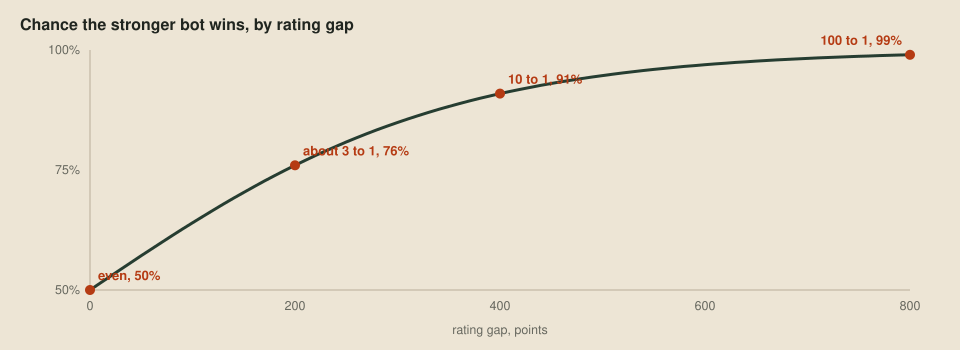

# A ladder of our own

> **Editor's note, 28 September 2026.** I've rewritten this post to be shorter and to describe the released ladder, which now fits its ratings offline with the Bradley–Terry model and plays its games in rounds. The ratings below come from refitting the 990 games this post originally recorded.

The [verdict tool](04-better-worse-or-undecided.md) answers one question at a time: is this candidate better than that baseline? That's the right question when deciding whether to keep a change. But by now we have several bots, and the verdict post explained why beating the version before isn't enough, because a candidate can beat its parent and still lose to an older version, the way paper beats rock and loses to scissors. So we want something that plays every version against every other and gives each one a single number we can compare. That's the offline ladder from the wishlist.

## What a rating means

The online ladder uses Elo ratings, and so will we, because the idea behind them is simple. Each bot gets a rating, and the gap between two ratings predicts how often the stronger bot wins. A gap of 400 points means ten-to-one odds, 200 points about three-to-one, and equal ratings mean an even match. A rating on its own means nothing. It only says something relative to the other bots it was measured against.



## Why we fit ratings offline

The online ladder updates ratings one game at a time. After each game, the winner takes some points from the loser, more if the win was a surprise, with a factor called K deciding how big each step is. That suits a ladder that never stops, where new games keep arriving forever. It has two side effects we'd rather avoid, though. The ratings depend on the order the games happened in, and the most recent games move them the most, which is exactly the noise the [wishlist](01-the-wishlist.md) complained about.

There's a third effect that surprised me more. With a fixed K, every game can only move a rating so far, so a bot with a lopsided record never gets the rating its record implies. On our own private ladders, a bot that scored 98 of 100 against its pool sat at 1916 under game-by-game Elo, and at 2270 when fitted to all its games at once, which is what its odds against that pool imply.

Offline we're in a better position. The harness plays every game first, so we have all the results at once, and instead of replaying them in some order we can find the one set of ratings that explains all of them together. Every game counts equally, and the answer doesn't depend on the order the games finished in. The model is the one Elo already assumes, known to statisticians as Bradley–Terry: each bot has a hidden strength, and the chance that bot A beats bot B is A's strength divided by the two strengths added together.

## Fitting all the games at once

The fit is in [harness/rating.py](../harness/rating.py). It looks for the strengths that make the observed results most likely, and because that likelihood is a smooth hill with one peak, Newton's method climbs it in a handful of steps. Each step works out which way is uphill for every bot at once, and how sharply the hill curves, then jumps towards the top:

```python
for i in range(size):
    expected = 1 / (1 + math.exp(-theta[i]))
    gradient[i] -= expected
    hessian[i][i] += expected * (1 - expected)
    for j in range(size):
        if played[i][j]:
            expected = 1 / (1 + math.exp(theta[j] - theta[i]))
            gradient[i] -= played[i][j] * expected
            curvature = played[i][j] * expected * (1 - expected)
            hessian[i][i] += curvature
            hessian[i][j] -= curvature
step = solve(hessian, gradient)
```

Here `theta` is each bot's strength on a log scale, `played[i][j]` counts the games between two bots, and the gradient starts from the points each bot actually scored. The first three lines inside the loop add one imaginary draw against an average bot to every bot's record. Without it, a bot that won every game would have no finite rating, because no strength would ever be high enough. A draw counts as half a win for each side, and games that ended in an error are left out entirely. At the end, each strength becomes a rating of 1500 plus 400 times its base-10 logarithm, shifted so the pool averages 1500, which is what makes 400 points mean ten-to-one odds.

An older, simpler way to fit the same model nudges one bot's strength at a time towards the value that would match its score, and it gets to the same answer. It just takes far longer: on a 12-bot ladder of ours, Newton's method takes about 3 milliseconds and the nudging about a second.

## Playing a ladder in rounds

The ladder, `just ladder` with its schedule in [harness/ladder.py](../harness/ladder.py), plays its games in rounds, and refits the ratings after each one. In a round every bot plays at most one game, with one bot sitting out in turn when the pool is odd. Sides reverse each time the opponents come round again, and the map changes after every full two-sided cycle, so over enough rounds every pair meets on every map from both sides. Seeds come from the map and the round, so a ladder can be stopped and resumed with `--resume` and still play exactly the same games, and the bots and maps it started with are kept as frozen copies and checked by hash when it resumes.

A ladder writes three things: `results.json` with every game and every refit, `ratings.csv` with each bot's rating round by round, and a `summary.md` with the ratings, each bot's record, and a head-to-head table.

## The first ladder

At this point in the series we have six bots: the two starters, the flood-fill bot from [The choice](02-the-choice.md) in C, Python and Nim, and the pearl-chasing version the verdict rejected. Every pair on the 13 bundled maps and the 20 generated ones, from both sides, comes to 990 games. Here are the fitted ratings, with each bot's points against each other bot, out of the 66 games between them:

| Bot | Rating | Won | Drawn | Lost | vs room-c | vs room-nim | vs room-py | vs room-pearls | vs starter-py | vs starter-c |
| --- | ---: | ---: | ---: | ---: | ---: | ---: | ---: | ---: | ---: | ---: |
| room-c | 1645 | 223 | 15 | 92 | | 33 | 33 | 44.5 | 59 | 61 |
| room-nim | 1641 | 223 | 12 | 95 | 33 | | 33 | 46.5 | 55.5 | 61 |
| room-py | 1628 | 218 | 10 | 102 | 33 | 33 | | 42 | 55.5 | 59.5 |
| room-pearls | 1504 | 159 | 11 | 160 | 21.5 | 19.5 | 24 | | 48.5 | 51 |
| starter-py | 1307 | 76 | 3 | 251 | 7 | 10.5 | 10.5 | 17.5 | | 32 |
| starter-c | 1275 | 65 | 1 | 264 | 5 | 5 | 6.5 | 15 | 34 | |

The three flood-fill bots finish almost level, and their games against each other split exactly evenly. That's what it should look like, because they make the same move in every position. The small gaps between them come from their games against the other three bots, which the harness of the time seeded separately for each pairing, so they fell slightly differently. A gap that small is noise, and the head-to-head columns show it.

The pearl-chasing bot sits about 140 points below them, which predicts that it wins roughly three games in ten against them, and it did. The verdict already rejected it with a single comparison, and the ladder agrees with a much broader one. The two starters trail everything and are nearly level with each other.

## Looking for circles

The head-to-head columns are there for a reason besides checking the ratings. A single number per bot assumes the pool is ordered, so that if A beats B and B beats C, then A beats C. When a rock-paper-scissors circle breaks that, the table shows it plainly: a lower-rated bot has a winning record against one above it, and the ratings get squeezed together to average over the circle.

There's no circle here. The only upset is between the two starters, where starter-c beat starter-py 34–32 despite rating 32 points lower, and a two-game margin between two random walkers is a coin toss. Every other bot has a winning record against every bot rated below it. That's reassuring, but it's also a small pool of simple bots. The check matters more as the pool fills with versions of our own bot that differ in subtler ways, and from now on every saved version can join the ladder.

## Next up

The ladder measures our bots against each other. The next two tools look outward, at everyone else's games, starting with [a sampler](07-everyone-elses-games.md) that downloads the public ladder's replays without loading the organisers' site.
