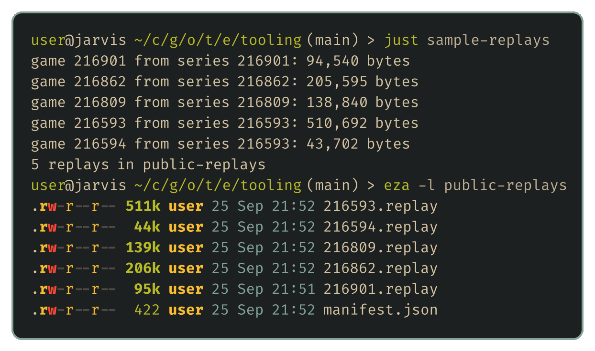

# Everyone else's games

<!-- draft: adfdbf9da4, stage: Building our tooling -->

Every test so far has pitted our bots against our own bots. But the opponents that matter are the other teams, and every game on the public ladder can be downloaded and watched. That makes the ladder's history the best record we have of what strong bots actually do. This post builds the fifth tool on the wishlist, a sampler that downloads a useful sample of those replays, and it's built around one rule above all: the site belongs to the organisers, and fetching from it mustn't add any noticeable load.

## Where the replays live

The toolkit can make replays of our own games, but it can't fetch anyone else's. The documented API only lists your own team's recent battles. The public archive is reachable another way, through the same pages a browser uses.

The [Battles page](https://game.battlecode.au/battles) lists every ladder series, 25 to a page. Adding `?sort=rating` puts the highest-rated series first, rated by the average of both teams' ratings when they played. Each series has its own page listing its games, and each game's replay is one more request: the site's own viewer loads it from `/api/matches/<game>/replay`, which redirects to the file in storage. So getting one replay takes a request for the listing, one for the series page, and one for the file, and the first two are shared by every game in the series.

The sampler starts from the top of the rating-sorted listing, because the best bots are the ones most worth studying, and works down until it has as many replays as we asked for.

## Being a good guest

The part that needs care is how the sampler talks to the site, so all of its requests go through one small class:

```python
def get(self, path: str) -> bytes:
    url = urllib.parse.urljoin(SITE, path)
    if not self.robots.can_fetch(AGENT, url):
        raise SystemExit(f"robots.txt asks us not to fetch {path}")
    while True:
        time.sleep(max(0.0, self.last_request + self.interval - time.monotonic()))
        self.last_request = time.monotonic()
        request = urllib.request.Request(url, headers={"User-Agent": AGENT})
        try:
            with urllib.request.urlopen(request, timeout=60) as response:
                return response.read()
        except urllib.error.HTTPError as error:
            if error.code == 429 or error.code >= 500:
                self.interval = min(60.0, self.interval * 2)
                time.sleep(max(self.interval, float(error.headers.get("Retry-After") or 0)))
                continue
            raise SystemExit(f"{path}: HTTP {error.code}, stopping")
```

It makes one request at a time and waits at least two seconds between them, so it's never busier than a person clicking through the site. Before anything else it reads the site's robots.txt and follows it, including any crawl delay it asks for. If the site answers 429, meaning too many requests, or any 5xx error, the sampler doubles its pause, waits at least as long as the server's `Retry-After` header says, and stays slower for the rest of the run. Any other error stops it outright rather than pressing on. Every request also carries a User-Agent naming the sampler and linking to this series, so if the organisers ever want it to behave differently, they know who to ask.

The sampler also keeps a small manifest of the games it has downloaded. Running it again carries on from where it stopped and never fetches the same replay twice.

## A first sample

The recipe in the [justfile](../examples/tooling/justfile) asks for five replays, which is plenty to try the decoder on in the next post:



Those five took about 15 seconds. Two came from the same series, which is why it took fewer page requests than games. The files vary a lot in size, from 44 KB to half a megabyte, because a replay records every event in the game, and a long game with a hundred dragons records a great many.

At two seconds a request, a sample of a few hundred replays takes a quarter of an hour or so, which is a reasonable thing to leave running in the background. It's also a reason to sample rather than mirror everything. Game numbers on the site are already past 216,000, and the questions we'll ask of them can be answered from a well-chosen few hundred.

## Next up

Downloading a replay is the easy part. The file itself is packed binary, so the next post works out how to read it and rebuild the game turn by turn.
