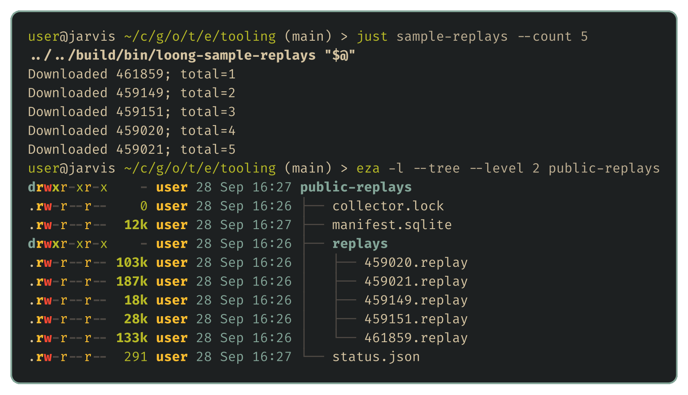

# Everyone else's games

> **Editor's note, 28 September 2026.** I've rewritten this post to be shorter and to show the sampler's current request code.

Every test so far has pitted our bots against our own bots. But the opponents that matter are the other teams, and every game on the public ladder can be downloaded and watched, which makes the ladder's history the best record we have of what strong bots actually do. This post builds the fifth tool on the wishlist, a sampler that downloads a useful slice of those replays, and it's built around one rule above all: the site belongs to the organisers, and fetching from it mustn't add any noticeable load.

## Where the replays live

The toolkit can make replays of our own games, but it can't fetch anyone else's, since the documented API only lists your own team's recent battles. The public archive is reachable another way, through the same pages a browser uses.

The [Battles page](https://game.battlecode.au/battles) lists every ladder series, 25 to a page, and adding `?sort=rating` puts the highest-rated series first. Each series has its own page listing its games, and each game's replay is one more request: the site's own viewer loads it from `/api/matches/<game>/replay`, which redirects to the file in storage. So one replay takes a request for the listing, one for the series page and one for the file, and the first two are shared by every game in the series. The sampler starts from the top of the rating-sorted listing, because the best bots are the ones most worth studying, and works down until it has as many replays as we asked for.


## Being a good guest

The part that needs care is how the sampler talks to the site. Every request goes through one small client in [replays/collection.py](../replays/collection.py). It checks robots.txt first, makes one request at a time, waits at least two seconds between requests by default, and only follows redirects over HTTPS. The interesting part is what happens when the site pushes back. If it answers with a 429, meaning slow down, or a server error, the client doubles its interval up to a minute, honours any `Retry-After` the site sends, and gives up entirely after six rejections in a row:

```python
def slow_down(self, status: int, retry_after: str | None) -> None:
    self.rejections += 1
    if self.rejections > MAX_CONSECUTIVE_REJECTIONS:
        raise RejectedRequest(status, retry_after)
    self.interval = min(MAX_INTERVAL, max(self.interval * 2, 1.0))
    pause = max(self.interval, retry_delay(retry_after))
    print(
        f"HTTP {status}; interval now {self.interval:.2f}s, pausing {pause:.0f}s",
        flush=True,
    )
    time.sleep(pause)
```

It also records every download in a SQLite manifest beside the replays, so a later run carries on where the last one stopped instead of fetching anything twice.

## A first sample

From `examples/tooling`, `just sample-replays --count 5 --output public-replays` asks for five replays, which is plenty to try the decoder on in the next post:



Those five took about 15 seconds. Two came from the same series, which is why it took fewer page requests than games. The files vary a lot in size, from 44 KB to half a megabyte, because a replay records every event in the game, and a long game with a hundred dragons records a great many.

At two seconds a request, a sample of a few hundred replays takes a quarter of an hour or so, which is a reasonable thing to leave running in the background. It's also a good reason to sample rather than mirror everything. Game numbers on the site are already past 216,000, and the questions we'll ask of them can be answered from a well-chosen few hundred.

## Next up

Downloading a replay is the easy part. The file itself is packed binary, so [the next post](08-reading-a-replay.md) works out how to read it and rebuild the game turn by turn.
