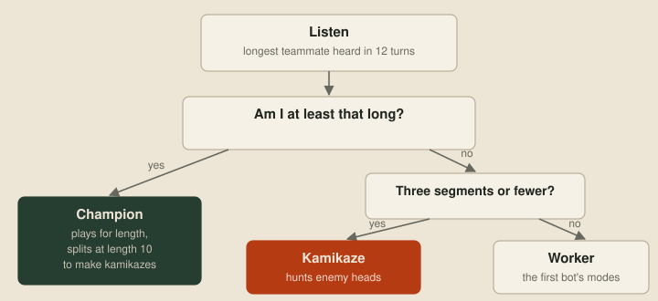
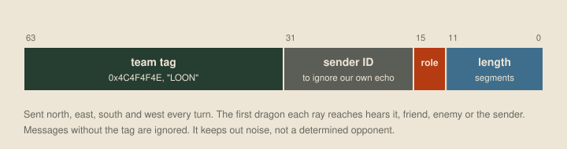
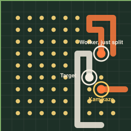
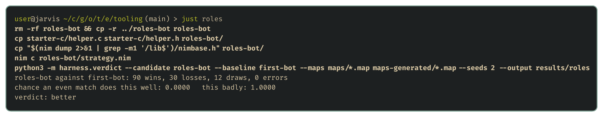

# Roles

<!-- draft: 504c335716, stage: Strategic ideas -->

The [first strategy bot](06-the-shape-of-the-problem.md) treats every dragon the same. But dragons on the same team aren't in the same position. One is long and carries the team's chance of winning at round 500. Another is two segments long and not worth much alive. This post uses the architecture from last time to give dragons different roles, so the same program behaves differently depending on who's running it, and uses sonar to let each dragon work out its role.

## Why dragons need different jobs

Two rules make roles worth having.

- **Round 500 is decided by the longest dragon.** If no team is wiped out, the team with the longest living dragon wins. That dragon should play for length and stay out of trouble.
- **A head-on collision kills both dragons.** A two- or three-segment dragon that drives into an enemy head trades itself for that dragon, however long it was. For a short dragon, that's the best deal on the board.

So the plan is three roles:

- The **champion** is the team's longest dragon. It plays for length.
- A **kamikaze** is a short dragon, three segments or fewer, with a longer teammate to protect. It hunts enemy heads.
- A **worker** is everyone else. It plays exactly like the first bot.

## One program, three roles

Every dragon runs the same program, and each one is a separate process with its own memory. Nothing tells a dragon it's the champion. It has to work that out from what it knows, and the only way to learn about teammates out of sight is sonar.

Each turn, every dragon announces its length in all four directions. Each dragon remembers the longest teammate it has heard from in the last 12 turns, and picks its role from that:

```nim
proc chooseRole(length: int): Role =
  if length >= longestTeammateHeard: Champion
  elif length <= 3: Kamikaze
  else: Worker
```



The role doesn't replace the architecture. It slots in above it and decides which modes a dragon may use. The champion and workers roam and evade like the first bot, and a kamikaze roams until it sees an enemy head, then hunts it. The safety layer stays in charge of every role, with one exception: a hunting kamikaze may step next to an enemy head, because that's the point.


## Talking by sonar

A sonar message is a single 64-bit number. A ray travels in a straight line until it hits kelp or a dragon segment, and whoever it hits gets the number. It doesn't say who sent it, or which team they're on. Enemies hear our messages too.

So every message starts with a team tag, and messages without it are ignored:



The tag stops a dragon from mistaking random enemy traffic for a teammate. It won't stop an opponent who decodes our messages and copies the tag, but that's a problem for the espionage stage.

## The first try was worse

The first version played the champion more cautiously, keeping three tiles from enemy heads instead of two. Against the first bot, on the bundled and generated maps, it lost:


The verdict tool turns "that didn't work" into a series of questions with answers. Removing the kamikazes didn't help, so they weren't the problem. A control that removed them and gave the champion the first bot's two-tile berth came out dead even, 58–58, which showed the sonar messages themselves cost nothing. That left the champion's berth. Keeping three tiles from enemy heads made it too timid to hold its ground, and narrowing it brought the roles bot level with the first bot.

A level result isn't an improvement, and counting role labels in the replays showed why. Each dragon shows its role as an indicator, and across the games, only 1.7% of dragon-turns were kamikaze turns. Short dragons with a longer teammate nearby were rare, so the role hardly ever came into play.

## Making kamikazes

The fix is to make them. A champion that reaches 10 segments splits off its last three:


The child is a new dragon running a fresh copy of the same program, with no memory. Nothing tells it to be a kamikaze. It hears the champion announce length 10, sees that it's only three segments long, and picks the role itself.

With splitting, the roles bot beat the first bot 91–29. To check where that came from, one version split the same way but made its children workers. It still beat the first bot, 86–31, so splitting helps on its own. Played directly against that version, the one with kamikazes won 84–38. So the splitting and the kamikaze role each add something on their own.

## A bug in the replay

Here's one of those kamikazes at work, on Arena, the turn before it drives into an enemy head and takes it down:



The dragon at the top is the one that just split off that kamikaze. It should be the champion, but its indicator says Worker. A sonar ray stops at the first dragon segment it reaches, and that includes the sender's own body. Rays also wrap around the board, and on an 11×11 map like Arena a ray can come back round and hit the dragon that sent it. So a dragon can hear its own message. After splitting from 13 segments to 10, this one heard its own old length of 13, decided a longer teammate existed somewhere, and demoted itself for 12 turns.

The fix is to put the sender's ID in each message and ignore our own. The fixed version beat the one before it 80–38, and it's the version in [examples/roles-bot](../examples/roles-bot/strategy.nim):



## Friendly fire

The replays showed one more problem. Head-on collisions kill teammates too, and the safety layer only keeps clear of enemy heads. With splitting filling the board with our own dragons, most head-on deaths in the version that split at length 10 were between two of our own: 382 such collisions against 78 with the enemy. The obvious fix, giving friendly heads the same berth, came out undecided against that version, 55–66, so it isn't clearly an improvement yet. Finding out why needs a closer look at the games.

## Next up

The roles give the bot a way to act differently in different situations, and sonar gives it a way to share what it knows. Next is feeding: when it's safe to go for a pearl, and which role should.
