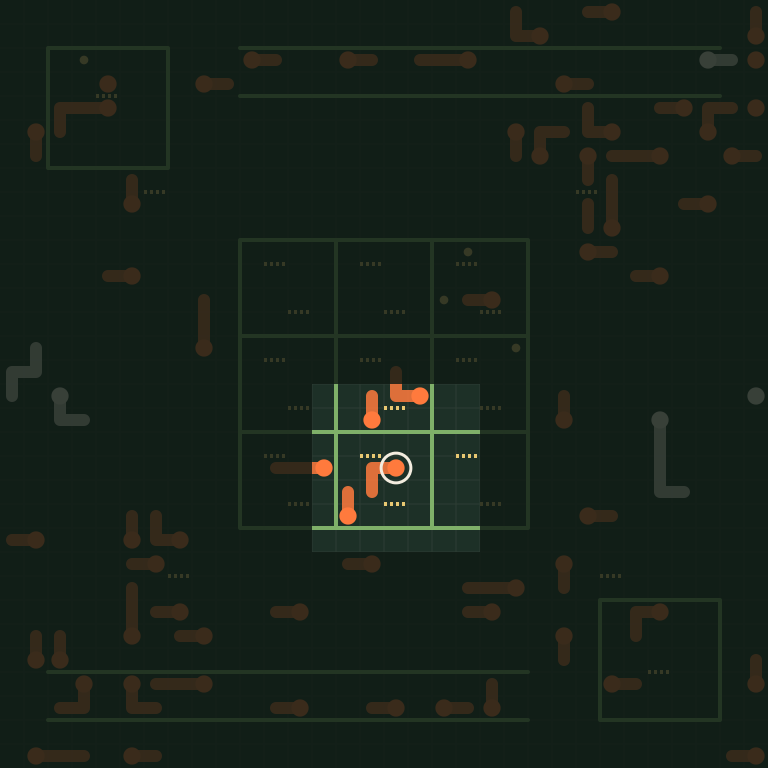

# Reading a replay

In the [wishlist](01-the-wishlist.md) we opened a replay in a hex viewer and could read the bot names, some scraps of the map, and nothing else. Now that the [sampler](07-everyone-elses-games.md) can fetch other teams' games, that's the next thing to fix. This post builds the sixth tool, a decoder: it reads the file, rebuilds the game one event at a time, and works out what any dragon could see at any moment. That last part is the one the debug viewer in the next post depends on.

## What the bytes are

A replay is a [Cap'n Proto](https://capnproto.org/encoding.html) message. Cap'n Proto lays data out the way a C program would hold it in memory: every struct is a block of 8-byte words, with its plain values, like numbers and flags, at fixed byte offsets, followed by pointers to anything of variable size, like strings, lists and other structs. That makes it fast to read, but it leaves a lot of zero bytes, so the file is *packed*. Each 8-byte word becomes a tag byte, whose bits say which of the eight bytes are non-zero, followed by just those bytes.

Here are the first bytes of one of our own replays, unpacked by hand:

| Packed bytes | Tag in binary | Unpacked word | What it is |
| --- | --- | --- | --- |
| `11 03 d3` | `00010001` | `03 00 00 00 d3 00 00 00` | The message has four segments, and the first is 211 words long |
| `33 48 07 48 0b` | `00110011` | `48 07 00 00 48 0b 00 00` | The next two segments are 1,864 and 2,888 words long |
| `03 28 04` | `00000011` | `28 04 00 00 00 00 00 00` | The last is 1,064 words long |
| `50 02 05` | `01010000` | `00 00 00 00 02 00 05 00` | The root struct: two words of plain values, then five pointers |

Those five pointers are the map text, the two bot names, the list of events and the result. The bot names and the map are ordinary text once unpacked, which is why the hex viewer could pick them out, and everything else is numbers. Replays downloaded from the site are also gzipped on top, so they start with the gzip signature `1f 8b` instead.

## Where the schema came from

Knowing the layout rules isn't enough. We also need the schema: which struct holds which fields, at which offsets. The toolkit doesn't publish one, but it ships something that contains it. `unswbc vscode` installs the official replay viewer, and that viewer includes the classes Cap'n Proto generated from the organisers' schema. Every field has a getter that reads it from a fixed offset. Here's the one for a dragon splitting, tidied up from the minified original:

```js
get parentId()    { return $.getInt32(0, this) }
get childId()     { return $.getInt32(4, this) }
get team()        { return $.getUint16(8, this) }
get childFacing() { return $.getUint16(10, this) }
get parentBody()  { return $.getList(0, e._ParentBody, this) }
get childBody()   { return $.getList(1, e._ChildBody, this) }
```

Two 32-bit IDs at bytes 0 and 4, two 16-bit enums at 8 and 10, and two list pointers. Writing that down in Cap'n Proto's schema language gives the same layout, and doing it for every class gives the whole format, in [src/viewer/replay.capnp](../src/viewer/replay.capnp). Nothing in it is guessed from byte patterns. The part that matters most is the event list, a union of every kind of event the engine records:

```capnp
struct Event {
  union {
    roundStart @0 :RoundStart; turnStart @1 :TurnStart;
    pearlCountdown @2 :PearlCountdown; tileChange @3 :TileChange;
    dragonAction @4 :DragonAction; engineLog @5 :TextEvent;
    dragonLog @6 :TextEvent; dragonIndicator @7 :TextEvent;
    debugDraw @8 :DrawEvent; dragonUpdate @9 :DragonUpdate;
    dragonSplit @10 :DragonSplit; dragonDeath @11 :DragonDeath; sonarPing @12 :SonarPing;
  }
}
```

With a schema, the [pycapnp](https://github.com/capnproto/pycapnp) library does the reading, packing included. The decoder, [src/viewer/replay.py](../src/viewer/replay.py), then counts what's inside. Here's a top-rated game from the sample:


Public replays leave the bot names blank, so the decoder calls the players team A and team B. The game itself is all there: 403 rounds, almost 20,000 dragon turns, 209 splits and 184 deaths.

## Rebuilding the game

What the replay doesn't contain is a single picture of the board. It records changes, in the order the engine made them, and to know where everything was at round 200 we have to replay the first 200 rounds of changes. The official viewer does exactly this, and so does our `GameState`:

```python
def apply(self, kind: str, event: dict) -> None:
    if kind == "roundStart":
        self.round = event["round"]
    elif kind == "tileChange":
        (self.pearls.add if event["hasPearl"] else self.pearls.discard)(point(event["tile"]))
    elif kind == "dragonUpdate" and self.round >= 0:
        body = self.dragons[event["id"]]["body"]
        body.insert(0, point(event["head"]))
        while len(body) > 1 and body[-1] != point(event["tail"]):
            body.pop()
    elif kind == "dragonSplit":
        self.dragons[event["parentId"]]["body"] = [point(p) for p in event["parentBody"]]
        self.dragons[event["childId"]] = {"team": event["team"].upper(),
                                          "body": [point(p) for p in event["childBody"]]}
    elif kind == "dragonDeath":
        del self.dragons[event["id"]]
```

The interesting line is the move. An update only says where the head is now and where the tail is now, not the whole body, so we add the new head and then drop segments from the old tail until it matches. An ordinary move drops one segment, and a move that eats a pearl drops none, because the tail stays where it was, so the same rule handles both without needing to know which happened.

The starting board comes from the map text at the top of the replay, which lists the kelp, portals and starting dragons in the same format as a `.map` file.

## What one dragon could see

Once the board can be rebuilt at any moment, the view from one dragon is a small step: the 7×7 square around its head, wrapping round the edges of the map.

```python
def window(self, identifier: int) -> list[tuple[int, int]]:
    head_x, head_y = self.dragons[identifier]["body"][0]
    return [((head_x + dx) % self.width, (head_y + dy) % self.height)
            for dy in range(-3, 4) for dx in range(-3, 4)]
```

The [Odin viewer](../src/viewer/main.odin) can save its display as a PNG with `just viewer REPLAY --round 238 --dragon 0 --image board.png`. It uses the same renderer as the interactive window, so image output needs a working display and OpenGL context, including when that display runs headlessly. The SVG below was made with the earlier renderer: it shows round 238 of the same public game, from a three-segment dragon in the middle of the map.



That lit square is all the dragon's program was given that turn. Everything else on the board, including most of the enemies, was invisible to it.

## A first question

The decoder can already answer questions across many games at once. The [verdict post](04-better-worse-or-undecided.md) found that the pearl-chasing bot loses far more games than the plain flood-fill bot, above all to the starter bots, and left the reason for later. The ladder from [two posts ago](06-a-ladder-of-our-own.md) kept every replay, so we can count how each bot's dragons died across the 66 games between them:


The pearl chaser runs into walls nearly three times as often and into itself more than three times as often. That says what goes wrong, but not why, and a table of death causes can't say what a dragon was thinking. That needs the view from inside the game, one dragon and one turn at a time, which is what the next tool is for.

## Next up

[Through one dragon's eyes](09-through-one-dragons-eyes.md): the debug viewer, and what it shows about those deaths.
