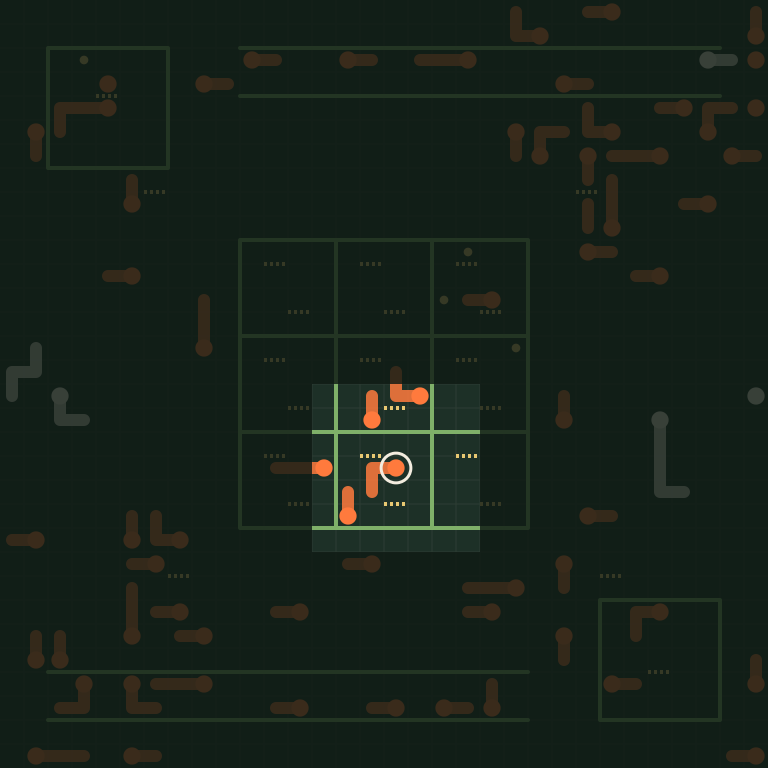

# Reading a replay

> **Editor's note, 28 September 2026.** This post has been rewritten to be shorter and to quote the decoder's current reconstruction code.

In the [wishlist](01-the-wishlist.md), a hex viewer showed us a replay's bot names, scraps of the map and nothing else. Now that the [sampler](07-everyone-elses-games.md) fetches other teams' games, we need to read them. This post builds the decoder: it reads the file, rebuilds the game one event at a time, and works out what any dragon could see at any moment.

## What the bytes are

A replay is a [Cap'n Proto](https://capnproto.org/encoding.html) message. Cap'n Proto lays data out the way a C program holds it in memory: each struct is a block of 8-byte words, plain values at fixed offsets, then pointers to anything variable-sized. That leaves a lot of zero bytes, so the file is *packed*: each word becomes a tag byte, whose bits say which of its eight bytes are non-zero, followed by just those bytes. Here are the first bytes of one of our replays, unpacked by hand:

| Packed bytes | Tag in binary | Unpacked word | What it is |
| --- | --- | --- | --- |
| `11 03 d3` | `00010001` | `03 00 00 00 d3 00 00 00` | The message has four segments, and the first is 211 words long |
| `33 48 07 48 0b` | `00110011` | `48 07 00 00 48 0b 00 00` | The next two segments are 1,864 and 2,888 words long |
| `03 28 04` | `00000011` | `28 04 00 00 00 00 00 00` | The last is 1,064 words long |
| `50 02 05` | `01010000` | `00 00 00 00 02 00 05 00` | The root struct: two words of plain values, then five pointers |

Those five pointers are the map text, the two bot names, the list of events and the result. Replays downloaded from the site are also gzipped, so they start with `1f 8b` instead.

## Where the schema came from

We also need the schema: which struct holds which fields at which offsets. The toolkit doesn't publish one, but `unswbc vscode` installs the official replay viewer, which includes the classes Cap'n Proto generated from the organisers' schema. Every field has a getter that reads a fixed offset. Here's a dragon splitting, tidied up from the minified original:

```js
get parentId()    { return $.getInt32(0, this) }
get childId()     { return $.getInt32(4, this) }
get team()        { return $.getUint16(8, this) }
get childFacing() { return $.getUint16(10, this) }
get parentBody()  { return $.getList(0, e._ParentBody, this) }
get childBody()   { return $.getList(1, e._ChildBody, this) }
```

Writing every class down in Cap'n Proto's schema language gives the whole format, in [replays/viewer/replay.capnp](../replays/viewer/replay.capnp), with nothing guessed from byte patterns. The heart of it is the event list:

```capnp
struct Event {
  union {
    roundStart @0 :RoundStart; turnStart @1 :TurnStart;
    pearlCountdown @2 :PearlCountdown; tileChange @3 :TileChange;
    dragonAction @4 :DragonAction; engineLog @5 :TextEvent;
    dragonLog @6 :TextEvent; dragonIndicator @7 :TextEvent;
    debugDraw @8 :DrawEvent; dragonUpdate @9 :DragonUpdate;
    dragonSplit @10 :DragonSplit; dragonDeath @11 :DragonDeath; sonarPing @12 :SonarPing;
  }
}
```

With the schema, the [pycapnp](https://github.com/capnproto/pycapnp) library does the reading, packing included, and `just decode` counts what's inside. Here's a top-rated game from the sample:


Public replays leave the bot names blank, so the decoder calls the players team A and team B. The game is all there: 403 rounds, almost 20,000 dragon turns, 209 splits and 184 deaths.

## Rebuilding the game

A replay records changes in the order the engine made them, not pictures of the board, so knowing where everything was at round 200 means replaying 200 rounds of changes, as the official viewer does. The decoder's [reconstruction](../replays/viewer/reconstruction.py) applies each event in turn. The interesting one is a move:

```python
elif kind == "dragonUpdate":
    identifier = event["id"]
    dragon = self.dragons[identifier]
    ...
    dragon["body"].insert(0, point(event["head"]))
    dragon["directions"].insert(0, direction)
    while len(dragon["body"]) > 1 and dragon["body"][-1] != point(
        event["tail"]
    ):
        dragon["body"].pop()
        dragon["directions"].pop()
```

An update only says where the head and tail are now, not the whole body. So we add the new head and drop segments from the old tail until it matches. An ordinary move drops one segment and a move that eats a pearl drops none, because the tail stays put, so one rule handles both. The starting board comes from the map text at the top of the replay.

## What one dragon could see

With the board rebuilt, a dragon's view is the 7×7 square around its head, wrapping round the edges of the map:

```python
window = [
    ((head[0] + dx) % self.width, (head[1] + dy) % self.height)
    for dy in range(-3, 4)
    for dx in range(-3, 4)
]
```

Here is round 238 of that game, from a three-segment dragon in the middle of the map:



That lit square is all the dragon's program was given that turn. Most of the enemies were invisible to it.

## A first question

The decoder can already answer questions across many games. The [verdict post](04-better-worse-or-undecided.md) found the pearl-chasing bot losing far more than the plain flood-fill bot, above all to the starters, and left the reason for later. The [ladder](06-a-ladder-of-our-own.md) kept every replay, so we can count how each bot's dragons died across the 66 games between them:


The pearl chaser hits walls nearly three times as often and itself more than three times as often. That says what goes wrong but not why, and for that we need the view from inside the game.

## Next up

[Through one dragon's eyes](09-through-one-dragons-eyes.md): the debug viewer, and what it shows about those deaths.
