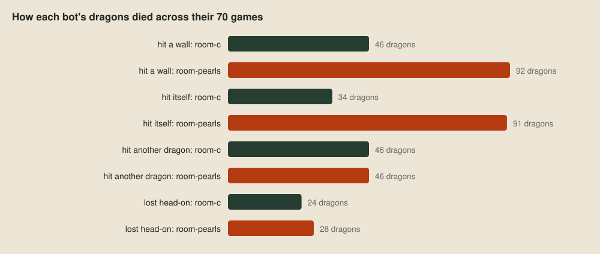

# Reading a replay

> **Editor's note, 29 September 2026.** I've rewritten this post to be shorter, to describe the released decoder, now in Nim with its own Cap'n Proto reader, and to quote the reconstruction the viewer now uses, also in Nim. I decoded a newly sampled replay and counted deaths from the rerun ladder.

In the [wishlist](02-the-wishlist.md), a hex viewer showed us a replay's bot names, scraps of the map and nothing else. Now that the [sampler](08-everyone-elses-games.md) fetches other teams' games, we need to read them. This post builds the decoder: it reads the file, rebuilds the game one event at a time, and works out what any dragon could see at any moment.

## The file format

A replay is a [Cap'n Proto](https://capnproto.org/encoding.html) message. Cap'n Proto lays data out the way a C program holds it in memory: each struct is a block of 8-byte words, plain values at fixed offsets, then pointers to anything variable-sized. That leaves a lot of zero bytes, so the file is *packed*: each word becomes a tag byte, whose bits say which of its eight bytes are non-zero, followed by just those bytes. Here are the first bytes of one of our replays, unpacked by hand:

| Packed bytes | Tag in binary | Unpacked word | What it is |
| --- | --- | --- | --- |
| `11 03 d3` | `00010001` | `03 00 00 00 d3 00 00 00` | The message has four segments, and the first is 211 words long |
| `33 48 07 48 0b` | `00110011` | `48 07 00 00 48 0b 00 00` | The next two segments are 1,864 and 2,888 words long |
| `03 28 04` | `00000011` | `28 04 00 00 00 00 00 00` | The last is 1,064 words long |
| `50 02 05` | `01010000` | `00 00 00 00 02 00 05 00` | The root struct: two words of plain values, then five pointers |

Those five pointers are the map text, the two bot names, the list of events and the result. Replays downloaded from the site are also gzipped, so they start with `1f 8b` instead.

## The schema

We also need the schema: which struct holds which fields at which offsets. The toolkit doesn't publish one, but `unswbc vscode` installs the official replay viewer, which includes the classes Cap'n Proto generated from the organisers' schema. Every field has a getter that reads a fixed offset. Here's a dragon splitting, tidied up from the minified original:

```js
get parentId()    { return $.getInt32(0, this) }
get childId()     { return $.getInt32(4, this) }
get team()        { return $.getUint16(8, this) }
get childFacing() { return $.getUint16(10, this) }
get parentBody()  { return $.getList(0, e._ParentBody, this) }
get childBody()   { return $.getList(1, e._ChildBody, this) }
```

Writing every class down in Cap'n Proto's schema language gives the whole format, in [replays/viewer/replay.capnp](../replays/viewer/replay.capnp), with nothing guessed from byte patterns. The heart of it is the event list:

```capnp
struct Event {
  union {
    roundStart @0 :RoundStart; turnStart @1 :TurnStart;
    pearlCountdown @2 :PearlCountdown; tileChange @3 :TileChange;
    dragonAction @4 :DragonAction; engineLog @5 :TextEvent;
    dragonLog @6 :TextEvent; dragonIndicator @7 :TextEvent;
    debugDraw @8 :DrawEvent; dragonUpdate @9 :DragonUpdate;
    dragonSplit @10 :DragonSplit; dragonDeath @11 :DragonDeath; sonarPing @12 :SonarPing;
  }
}
```

With the schema, reading a replay takes very little code. `just decode` runs `loong-gamedata decode`, which has its own small Cap'n Proto reader in [gamedata/capnp_replay.nim](../gamedata/capnp_replay.nim), with an accessor for each field the schema lays out. Undoing the packing from the table above is one short loop:

```nim
while at < packed.len:
  let tag = packed[at]
  inc at
  for bit in 0 .. 7:
    if (tag and (1'u8 shl bit)) != 0:
      result.add packed[at]
      inc at
    else:
      result.add 0
  if tag == 0:
    let zeros = int(packed[at]) * 8
    inc at
    result.setLen(result.len + zeros)
  elif tag == 0xFF:
    let verbatim = int(packed[at]) * 8
    inc at
    let copyStart = result.len
    result.setLen(copyStart + verbatim)
    if verbatim > 0: copyMem(addr result[copyStart], unsafeAddr packed[at], verbatim)
    at += verbatim
```

Each tag byte says which of the next word's eight bytes are stored, a tag of zero is followed by a count of further all-zero words, and a tag of 0xFF by a count of words stored as they are. The decoder then counts what's inside. Here's a game from the sample:


Public replays leave the bot names blank, so the decoder calls the players team A and team B. The game is all there: 221 rounds, 11,168 dragon turns, 664 splits and 614 deaths.

## Rebuilding the game

A replay records changes in the order the engine made them, not pictures of the board, so knowing where everything was at round 200 means replaying 200 rounds of changes, as the official viewer does. The [reconstruction](../gamedata/board.nim) behind the debug viewer does the same. It reads the replay through the decoder's reader and the schema above, and applies each event in turn. The interesting one is a move:

```nim
proc moveDragon*(board: var ReconstructedBoard, dragon: int32, head, tail: int, facing: char) =
  ## One step: the new head first, then tail cells dropped until the body ends
  ## at `tail`.
  board.unindexDragon(dragon)
  let entry = addr board.dragons[dragon]
  entry.directions[0] = facing
  entry.body.insert(head, 0)
  entry.directions.insert(facing, 0)
  while entry.body.len > 1 and entry.body[^1] != tail:
    entry.body.setLen(entry.body.len - 1)
    entry.directions.setLen(entry.directions.len - 1)
  board.indexDragon(dragon)
```

An update only says where the head and tail are now, not the whole body. So we add the new head and drop segments from the old tail until it matches. An ordinary move drops one segment and a move that eats a pearl drops none, because the tail stays put, so one rule handles both. The starting board comes from the map text at the top of the replay.

## One dragon's window

With the board rebuilt, a dragon's view is the 7×7 square around its head, wrapping round the edges of the map. Cells are numbered row by row, and `floorMod` keeps a negative offset on the board:

```nim
proc cellAt*(board: ReconstructedBoard, x, y: int): int =
  floorMod(y, board.height) * board.width + floorMod(x, board.width)
```

```nim
for dy in -3 .. 3:
  for dx in -3 .. 3: visible.add board.cellAt(x + dx, y + dy)
```

The [observations](../gamedata/observations.nim) that the viewer's recovery feeds back to a bot are built from these cells, exactly as the engine wrote them to it.

There is one gap in site replays downloaded since 27 September: they no longer record pearl countdown events, and every tile's minimum and maximum spawn gaps are zero. The bot still received the live countdown in its window. The planned article *Pearls from the seed* shows how the match seed and the engine's pearl generator recover those hidden timings, including the variants the site serves under familiar map names.

Here is round 238 of another public game, on a 32×32 map, from a three-segment dragon in the middle of it:


That lit square is all the dragon's program was given that turn. Most of the enemies were invisible to it.

## A first question

The decoder can already answer questions across many games. The [verdict post](05-better-worse-or-undecided.md) found the pearl-chasing bot losing to the plain flood-fill bot, and even dropping a game to a starter, and left the reason for later. The [ladder](07-a-ladder-of-our-own.md) kept every replay, so `just deaths` can count how each bot's dragons died across the 70 games between them:


Drawn side by side, the difference is plain:



The pearl chaser's dragons run into walls twice as often and into themselves nearly three times as often, while they meet other dragons about as often as the flood-fill bot's do. That says what goes wrong but not why, and for that we need the view from inside the game.

## Next up

[Through one dragon's eyes](11-through-one-dragons-eyes.md): the debug viewer, and what it shows about those deaths.
