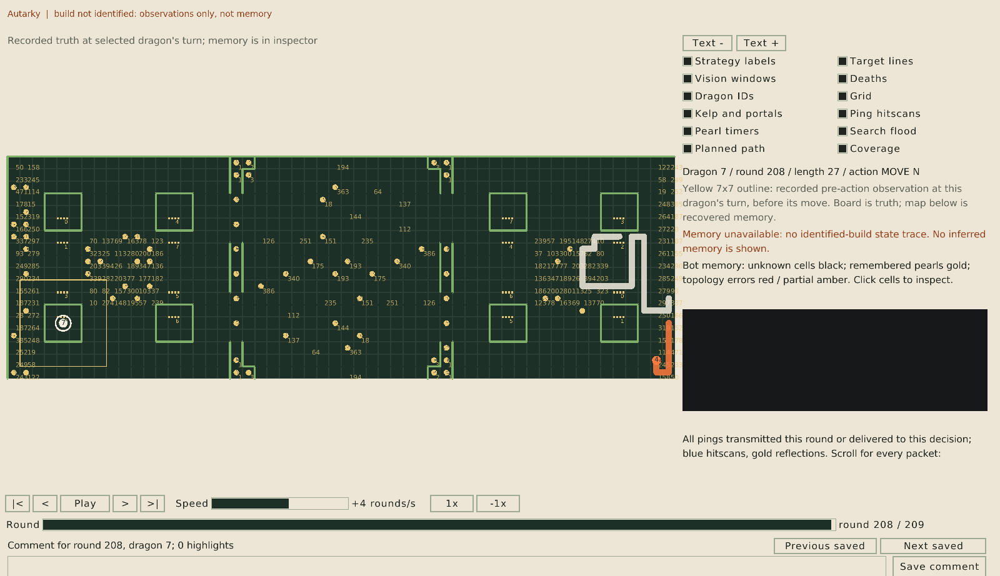

# Through one dragon's eyes

> **Editor's note, 28 September 2026.** I've rewritten this post to be shorter and to quote the viewer's current loader.

When a dragon does something stupid, the official visualiser shows the whole board. But the dragon only saw the 7×7 square around its head, and a move that looks absurd from above can look sensible from inside that square. So the debugging question is never "what was on the board?" but "what could this dragon see?" The seventh tool answers it: a debug viewer that shows a game through one dragon's eyes, written in [Odin](https://odin-lang.org) for the reasons in [The choice](02-the-choice.md) and built on the [decoder](08-reading-a-replay.md).

## From replay to viewer

The decoder's Python side rebuilds the game and exports it as JSON for the Odin display: the map's kelp and portals, the board before every round, and one record for every dragon turn, holding the dragon's window, its indicator text and its action. From `examples/tooling`, `just viewer REPLAY --round 130 --dragon 0` builds the viewer and opens that turn, and `--image board.png` saves the display as a picture instead.

## Loading a game into an arena

Loading is where Odin's context allocator earns its place. The loader creates a fresh arena and hands its allocator to everything that follows, including the JSON parser, which allocates as much as it likes:

```odin
game: Loaded_Game
if virtual.arena_init_growing(&game.arena) != nil {
	return "Could not reserve memory for the export"
}
allocator := virtual.arena_allocator(&game.arena)
data, read_error := os.read_entire_file(path, allocator)
if read_error != nil {
	virtual.arena_destroy(&game.arena)
	return fmt.aprintf("Could not read %s: %v", path, read_error)
}
if unmarshal_error := json.unmarshal(data, &game.export, allocator = allocator);
   unmarshal_error != nil {
	virtual.arena_destroy(&game.arena)
	return fmt.aprintf("Could not parse %s: %v", path, unmarshal_error)
}
```

Every string, slice and map in the game ends up in that one arena, including thousands of 49-tile windows, and opening the next game frees all of it with a single `arena_destroy`. There's no way to leak or double-free one of those small allocations. The full source is in [replays/viewer/](../replays/viewer/main.odin).

## What a bot can tell you

A replay records what a dragon saw and did, but not why. A bot can say why through its indicator, the short text the viewer shows beside the dragon. The example bots use it to name their role and behaviour each turn. Our competition bot goes further: each turn it writes out every behaviour it considered, whether each was eligible, its score and reason, and which one it chose, and our viewer draws that as a tree beside the board. A bad move then leads straight to the decision that caused it.

## Why chasing pearls kills

Back to the question from the last post: why do the pearl chaser's dragons hit walls and themselves about three times as often as the plain flood-fill bot's? Here's one in the viewer, on the 16×16 Colosseum map, just before it dies:



The dragon is 86 segments long on a board of 256 tiles, so most of its body is somewhere its 49-tile window can't see. Its next move went south through the portal edge under its head and landed on its own body on the far side. That's the portal blind spot from [the map generator post](05-maps-nobody-has-seen.md), made far more likely by a body filling a third of the board.

The next one has no portals to blame. The big_empty map has no kelp and no portals, and this dragon had grown to 122 segments:


Its head is wound into a knot of its own body, and almost everything in its window is itself. The flood fill only counts room inside the window, so it has almost nothing to choose between moves with, and the next move ran into its own body.

Across all 66 games the numbers agree. Chasing pearls works, in that dragons get long: the pearl chaser's longest dragon reached a median of 33.5 segments per game, against 13.5 for the flood-fill bot. But its dragons that hit themselves had a median length of 32, against 13.5, and 17 of those 51 were longer than 49 segments, too long to fit in their own window. The flood fill was designed for a short dragon, and chasing pearls takes that assumption away. A bot that grows long needs to know where its own body is outside its window, which is a job for strategy.

## Next up

The last tool on the wishlist is profiling: [where the points go](10-where-the-points-go.md).
