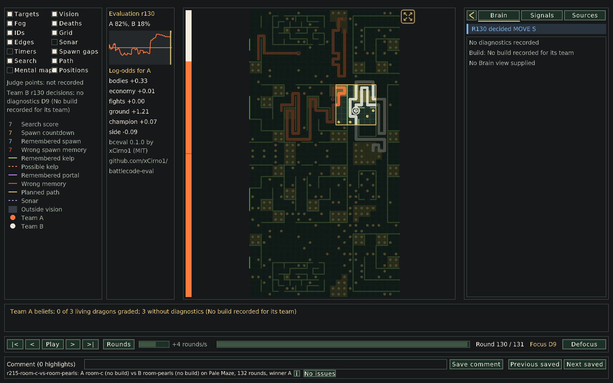
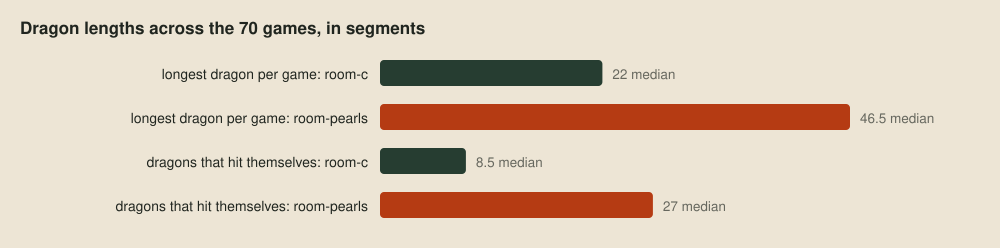

# Through one dragon's eyes

> **Editor's note, 29 September 2026.** I've rewritten this post around the current viewer, which reruns a bot's own build to show why each dragon did what it did, and grades what the bot remembers against the replay. A new example, the showcase bot, emits every kind of record the viewer draws. The long-dragon examples are retaken in the new viewer.

When a dragon does something stupid, the official visualiser shows the whole board. But the dragon only saw the 7×7 square around its head, and a move that looks absurd from above can look sensible from inside that square. So the debugging question is never "what was on the board?" but "what could this dragon see, and what did it make of it?" The seventh tool answers both: a debug viewer that shows a game through one dragon's eyes, written in [Odin](https://odin-lang.org) for the reasons in [The choice](02-the-choice.md) and built on the [decoder](08-reading-a-replay.md).

![The viewer on a showcase game at round 178, focused on dragon 0. The left sidebar has the overlay switches, the dragon's judge points and a chart of the team's decisions. Beside it the Evaluation pane gives team A a 65% chance of winning. The board is zoomed on the dragon, with its 7×7 window outlined in yellow, a route to a pearl, a red line to the nearest enemy head, and outlined cells where it remembers other dragons. The right sidebar's Brain tab shows its four options: Flee and Split ineligible, Eat selected with utility 6, Explore eligible with utility 1. Under the board, the beliefs strip grades what the team's dragons remember, and under that are the playback bar and the comment field.](images/viewer-showcase.png)

## The window

The board in the middle shows the replay's truth at the moment the focused dragon decides, with its window outlined. Everything the dragon couldn't see is shaded, and `f` zooms to the 15×15 cells round its head. The left sidebar holds the overlay switches, the dragon's judge points against the 100M limit across its whole life, and a chart of the team's decisions by round. The right sidebar is the dragon's own view: what it decided and why, the messages it sent and received, and what it remembers.

Playback moves in turns or in rounds. In Turns mode each dragon's turn is a step, and the left and right arrows jump between the focused dragon's own turns, first with the board as it saw it and then with the result of its move. Rounds mode shows each round after every dragon has moved.

Two views read the replay alone. The Evaluation pane gives each side's chance of winning after every round, from [bceval](https://github.com/xCirno1/battlecode-eval) by xCirno1, a logistic model over 23 features of the whole board, such as bodies, pearls eaten, fights and the ground nearer each team. The viewer ports it to Odin. The Spawn gaps overlay tints each cell by how fast pearls come back to it, so the rich ground stands out under everything else.

How the viewer opens a 500-round game in under a second is [its own post](18-game-data-in-columns.md).

## Rebuilt decisions

A replay records what each dragon observed and what it did, but not why. The viewer gets the why from the bot itself. The replay holds every observation a dragon was sent, and a bot is a deterministic program, so running the same build on the same observations gives the same decisions again. This time the bot can explain each one as it makes it.

![In play, bot.wasm has its diagnostics compiled in and switched off, costing one flag check per block. The judge plays the game and writes the replay, with what each dragon observed and did. In the viewer, the same bot.wasm comes from the build registry and is started with LOONG_INSPECT, so its diagnostics run. loong-recover runs it in the judge on each dragon's recorded observations and checks each action, and the viewer draws each turn's records beside the board, hiding a dragon's overlays after its rebuilt action first differs from the replay.](images/viewer-recovery.svg)

The explanations are compiled into the build that plays, but switched off, so in a game each block costs one flag check. The organiser's engine never sends the line that switches them on. Our recovery tool, `loong-recover`, sends it first, then feeds the dragon its recorded observations one turn at a time in the [Zig judge](16-the-machine-inside-the-judge.md). Each rebuilt action is checked against the replay. If one ever differs, that dragon's later turns are marked unreliable and their overlays disappear, since from then on they show some other game.

A bot writes its explanations inside a diagnostic block, which runs only when inspection has switched it on. The Nim helper times itself, too, so the points a block spends are left out of the clock the bot budgets with:

```nim
template diagnosticBlock*(body: untyped) =
  when defined(loongDiagnostics):
    if diagnosticsEnabled != 0:
      if diagnosticDepth == 0:
        let started = rawPoints()
        inc diagnosticDepth
        try:
          body
        finally:
          dec diagnosticDepth
          diagnosticPoints += rawPoints() - started
      else:
        body
```

Each explanation is one JSON record on its own `LOG` line, which the judge lifts out of the bot's output before the engine sees it. The records follow a small [public contract](../replays/viewer/diagnostics.md), and the viewer knows nothing about any strategy. It doesn't know what a role is, or a score formula, or a pearl protocol. It draws what the bot says, in the bot's own words.

## The showcase bot

To show every kind of record, there's a new example: the [showcase bot](../examples/showcase-bot/strategy.nim). Its play is simple on purpose. Each turn it scores four options on one utility scale and takes the best eligible one: flee an enemy head within two cells, eat the nearest reachable pearl, split once it's long enough, or explore wherever leaves the most room. It remembers every cell it has seen and every dragon it has seen or heard of, and it tells its teammates by sonar where its head is and how long it is.

From `examples/tooling`, `just showcase` builds it, plays it against itself on Default and opens the game. `just bot-build` registers each judge build under a GUID, with the hash of every source file and of the WebAssembly, so the viewer reruns exactly the build that played, and `just viewer REPLAY --seat A GUID` names it for a side. In this game all 68 dragons rebuilt, and all 7,941 of their rebuilt turns matched the replay.

## Records on the board

Some records draw on the board itself. Each has its own overlay switch.


The showcase bot draws its route to the pearl it's eating as a path and the pearl as a target, every cell its search reached with the number of moves to it, and a line to the nearest enemy head. Pearls it remembers from earlier rounds become markers. A positions record lists every dragon it knows of: where it last saw it or heard of it, and how many rounds ago. The viewer shades every cell the dragon could have reached since, as far as the bot says it could move.

## Records in the inspector

The rest lay out in the right sidebar.

![Records the inspector lays out. A state tree shows each option with its eligibility, score and reason, and the chosen one opens its children. A state graph places nodes at the bot's own coordinates, fills the active one and labels links with their conditions. A candidate has a score and what it measures, and scores from different objectives are never compared. A table marks rows selected, eligible or ineligible, and a row can open records of its own. A calculation shows the bot's expression, operands and result, and the viewer evaluates nothing. A sonar table joins the sender's meaning with the receiver's reading and outcome, on the ping the replay recorded.](images/gizmo-inspector.svg)

One record fills the Brain tab. The showcase bot sends its options as a tree, each with whether it was eligible, its utility and the reason, and it marks which one it took. The `breakdown` field gives the left sidebar its chart of the team's decisions, here by the dragon's stage of life and then by option:

```nim
var nodes = @[%*{"id": "dragon", "label": "Dragon", "parent": ""}]
for option in options.Option:
  let evaluation = evaluations[option]
  var node = %*{"id": $option, "label": $option, "parent": "dragon",
    "eligible": evaluation.eligible, "reason": options.purpose(option) & ". " & evaluation.reason,
    "active": option == chosen}
  if evaluation.eligible:
    node["score"] = %evaluation.score
    node["objective"] = %"utility"
  nodes.add node
gizmos.emitGizmoJson($ %*{"version": 1, "kind": "state", "layout": "tree",
  "label": "Options", "slot": "brain", "id": "brain", "nodes": nodes,
  "reason": $chosen & " has the highest utility of the eligible options",
  "breakdown": [{"level": "Stage", "value": $stage}, {"level": "Option", "value": $chosen}]})
```

Any record can give a parent, another record or a node of the tree, and clicking a node opens its children underneath. Under Eat, this dragon's calculation shows the utility of 6, then each move it could make, scored by the moves left to the pearl, then the move it made:


The Signals tab starts with sonar. The showcase bot sends one table of what it transmitted and another of what it received, each row with what the value meant to it. The viewer joins both ends on the pings the replay recorded, so a message shows the sender's meaning beside the receiver's reading of it, what the receiver did about it, and its memory of the cells involved before and after. A message that no ping bears out is listed as a fault. Then come the echoes of the dragon's own last pings, and the rest of its records, such as a table of the four first steps and the stage of life it has reached, as a small state graph.


`just decisions` prints the same records as text, dragon by dragon and turn by turn, for reading a whole stretch of a game at once or searching it:


## Graded memory

A bot's mistakes often start in what it believes rather than in what it decides. The viewer can check beliefs, because it has the replay's truth to compare them with. A bot marks a remembered fact with the quantity it claims: which sides of a cell have kelp, whether a pearl is there, the round its next pearl is due, where another dragon is and how long, and which dragon is a team's champion. Every fact carries where it came from and the round it was learned.

The showcase bot keeps its map as one table, one row per cell it has seen. It sends only the rows that changed, and `retain` tells the viewer to keep the rest:

```nim
gizmos.emitGizmoJson($ %*{"version": 1, "kind": "table", "label": "Mental map",
  "slot": "memory", "id": "memory", "retain": true,
  "reason": "Every cell seen, as last seen",
  "columns": ["edges", "edges.source", "edges.round", "pearl", "pearl.source", "pearl.round",
    "spawn", "spawn.source", "spawn.round", "known"],
  "truth_columns": ["edges", "", "", "pearl", "", "", "spawn_due", "", "", ""],
  "rows": rows, "row_cells": rowCells,
  "display_column": 6, "display_overlay": "timers", "display_format": "round_delta",
  "consensus": [
    {"category": "Pearls", "column": 3, "known_column": 9, "minimum": 1, "scope": "cell"},
    {"category": "Spawn rounds", "column": 6, "known_column": 9, "minimum": 1, "scope": "cell"}]})
```

The Mental map overlay turns the board into that memory. Cells the dragon has never seen are black. Remembered kelp is drawn as the dragon believes it, and a cell whose remembered contents the replay contradicts turns red. With Positions on, each dragon it believes in is a ring where it thinks the dragon is, green if the dragon really is among the cells it allowed for and red if not. The Sources tab lists the selected cell's memory with its sources.


The strip under the board does this for the whole team at once. Each box is one belief: how many of the team's living dragons hold it without a single false fact, and what share of all their stated facts are right. Clicking a box opens the belief as a map. Where the bot marks a column for consensus, the map colours each cell by whether the dragons that state it agree:


These numbers show the showcase bot's memory has two simple faults. It keeps a pearl it saw on an earlier round as present, or absent, until it sees that cell again, so the strip counts every pearl eaten or grown out of its sight. It also keeps a spawn round after that round has passed. Neither shows up in how the dragons move, and both are one click away here.

The comment field under the playback bar takes notes. A saved comment carries the round, the dragon and any cells highlighted, so Previous and Next saved take you back to exactly what you were looking at.

## Long dragons

Back to the question from the last post: why do the pearl chaser's dragons hit walls and themselves so much more often than the plain flood-fill bot's? Neither bot writes any diagnostics, so the viewer shows them from the replay alone. Here's one on the bundled Autarky map, as it starts its last turn:


Its head is inside a small walled box that the dragon can only have entered through a portal, and most of its body is back on the other side of the board, far outside its 49-tile window. Its next move went north through the portal edge and landed on its own body on the far side. That's the portal blind spot from [the map generator post](05-maps-nobody-has-seen.md), and 28 of the pearl chaser's 91 self-hits in these games went through a portal the same way.

The next one has no portal to blame. Pale Maze, one of the generated maps, has no portals, and this dragon had grown to 55 segments:



Its head is wound inside a loop of its own body, so most of what its window shows is itself. The flood fill only counts room inside the window, so it has almost nothing to choose between moves with, and the next move ran into its own body.

Across all 70 games the numbers agree. Chasing pearls works, in that dragons get long, and the ones that die on their own bodies are long too:



A third of the pearl chaser's self-hits were dragons longer than 49 segments, too long to fit in their own window. The flood fill was designed for a short dragon, and chasing pearls takes that assumption away. A bot that grows long needs to know where its own body is outside its window, which is a job for strategy.

## Next up

The last tool on the wishlist is profiling: [where the points go](10-where-the-points-go.md).
