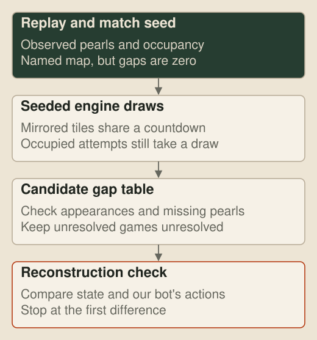

# Pearls from the seed
<!-- draft: 19218185, stage: Building our tooling -->

The replay reader in the last post can rebuild where every dragon was, but a replay downloaded from the competition site no longer records pearl countdown events. Its copy of the map also sets every tile's minimum and maximum spawn gaps to zero. The bot still saw the current countdown in its 7×7 window while it played, yet someone opening the replay later can't tell when an empty spawning tile is due to try again.

There is a second complication. The site serves several maps in variants under the published map name. Their kelp, portals and starting bodies can look identical while their pearl timings differ, and one version of Prisoners Dilemma starts with ten dragons instead of the six in the public file. Loading the named file can therefore rebuild a perfectly plausible game that isn't the game the ladder played.

## Every attempt is deterministic

A match record gives us the missing ingredient: its seed. The engine uses that seed to initialise an `mt19937_64` random-number generator, then draws each countdown from the spawning tile's minimum and maximum gap. It takes a draw for every initial countdown, in the engine's tile order, and another whenever a tile attempts to spawn. An occupied tile still makes its attempt and consumes its draw, even though no pearl appears.

That makes the pearl schedule a deterministic stream. If we know the gap table, the seed fixes every attempted spawn round. The replay then checks the answer because every pearl that actually appears must land on one of those attempts.

The published map is the first candidate. When it explains every spawn, there is nothing more to infer. When it doesn't, `just map-variants` fits another table from several stored games with the same map name. Early appearances narrow each tile's possible gaps. Later appearances rule choices out, while the places where a slow tile must have consumed an unseen draw keep the random stream aligned. A candidate only survives if it explains every observed spawn in every game used to fit it.

## Variants behind familiar names

I ran that check over 40 stored games for each current map on 1 October. Four maps had one repeatable variant beyond the published file. Slithery Fight still had 19 games that neither its public table nor a fitted table explained, so those stay unresolved rather than being forced into a bad fit.

| Published name | Games not explained by the published gaps | Result |
| --- | ---: | --- |
| Prisoners Dilemma | 20 of 40 | One fitted variant, also with four extra starting dragons |
| Queen Of Spades | 14 of 40 | One fitted gap table |
| Devil | 16 of 40 | One fitted gap table |
| Schooltime | 23 of 40 | One fitted gap table |
| Slithery Fight | 19 of 40 | Unresolved |
| Trauma, Default, Trophy, Portals and Autarky | 0 of 40 each | The published table explained all 40 |

Those are aggregate counts from our stored games. The fitted gaps themselves stay out of the article because tournament maps are unseen and a bot shouldn't be taught to identify a familiar layout. The variants are reconstruction evidence, not a strategy input.

## Rebuilding a game

`just regenerate GAME_ID` fetches the site's replay and match seed, chooses the published map or the fitted variant whose attempts explain the observed pearls, and plays our registered build again in the [Zig judge](19-the-machine-inside-the-judge.md). It compares the rebuilt actions, points and result with the record, and reports the first game-state difference if anything diverges.

For a local evaluation the result record already holds the seed, map and exact registered builds, so `just regenerate RESULT_DIR GAME` takes the same route without the ladder lookup. We don't need to keep every replay from a large run. A small sample can stay for browsing, and any other game can be reconstructed from the compact result and the frozen builds that played it.

The [viewer](11-through-one-dragons-eyes.md) uses the recovered countdowns for its Spawn gaps overlay and for grading what a bot remembered. A zero in the downloaded replay no longer has to become a blank patch in the explanation.

## Next up

[Through one dragon's eyes](11-through-one-dragons-eyes.md): rerunning a bot on the observations in a replay, then drawing what it saw, believed and decided.
