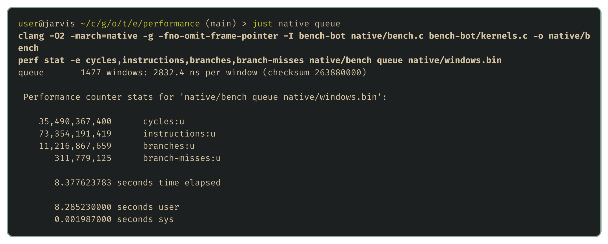

# Where the points go

<!-- draft: 08d1698293, stage: Building our tooling -->

[The choice](02-the-choice.md) measured how many CPU points a whole turn costs in each language. That was enough to pick a language, but it can't tell us what the points are spent on, and once a bot starts searching properly, every point spent on something else is search depth it doesn't get. The last tool on the wishlist is a profiler: something that splits a turn's cost into its parts, and then follows the expensive part down to the individual instructions.

## The price list

The judge doesn't measure time. It gives each dragon 100 million points per turn and charges for everything the bot's WebAssembly does. The toolkit prices a bot the same way the judge does, so its source is the most precise price list there is. `unswbc/metering.py` charges for instructions, and `unswbc/sandbox.py` for talking to the outside world:

| What the bot does | Points |
| --- | ---: |
| Arithmetic, comparisons, constants and local variables | 1 |
| Memory loads and stores, and branches | 2 |
| SIMD instructions, whatever they do | 2 |
| Division and remainder | 3 |
| A direct function call | 4 |
| An indirect call, through a function pointer | 6 |
| Growing memory | 50 |
| Writing output | 2,500,000 per write, plus 4,000 per byte |
| Reading input | 6 per byte |

A few things in that table matter more than the rest. Output is by far the most expensive thing a bot can do, which is why the starter helpers buffer everything and write once per turn. A SIMD instruction costs 2 points, the same as a load, even though it can do the work of up to sixteen scalar instructions, which will matter in the performance stage. And the price depends only on which instructions run, not on how long they take on real hardware.

## A profiler inside the bot

The judge's sandbox has one more property that makes profiling easy. Its clock doesn't follow real time: it advances by one nanosecond for every point the bot spends. So a bot that reads the clock before and after a piece of its own code gets that code's exact cost in points, with no sampling and no estimation.

Reading the clock takes a few lines of C, which our Nim bots can call like any other helper:

```c
uint64_t ClockNanoseconds(void)
{
    struct timespec now;
    clock_gettime(CLOCK_MONOTONIC, &now);
    return (uint64_t)now.tv_sec * 1000000000u + (uint64_t)now.tv_nsec;
}
```

On the Nim side, a small template wraps any block of code and adds its cost to a running total for that part of the turn:

```nim
type Part = enum Input, ReadWindow, ChooseMove, Output
var spent: array[Part, uint64]

template profile(part: Part, body: untyped): untyped =
  let started = clockNanoseconds()
  body
  spent[part] += clockNanoseconds() - started
```

The turn loop wraps each of its steps in `profile`, and at the end of every turn logs the totals and resets them. Because the output fee is only charged when the turn ends, each log line reports the previous turn's output. The profiled copy of The choice's Nim bot is in [examples/performance/profiled-bot](../examples/performance/profiled-bot/strategy.nim), and a [short script](../examples/performance/summarise.py) takes the median of every part over a whole game:


## What the profile says

The bot's own thinking, the move choice with its flood fills, costs about 49,000 points in a typical turn. That's under 2% of the turn, and one two-thousandth of the budget. Almost everything else is overhead.

The biggest item by far is the output. Its 3.04 million points are exactly the 2.5 million fee for writing, plus 4,000 points for each of about 135 bytes. Only 15 of those bytes are the move and the `ENDTURN`. The rest are the profiler's own log line, which costs more than half a million points a turn on its own, far more than the code it measures. Logs are expensive, so a profiling build is something to run, read and throw away, never something to submit.

The second surprise is the input. A turn's input is a little under a kilobyte of text, a median of 961 bytes, so reading it costs about 6,000 points. The other 320,000 are the starter helper turning that text into numbers. Parsing the input costs more than six times as much as the strategy, for every bot that uses the helper as it comes.

So a whole turn costs about 3.4 million points, and 96 million of the budget go unused. That budget is for thinking, and the part of the thinking that grows when a bot searches further ahead is the flood fill. A search two moves deeper does sixteen times as many of them.

## Down to the instructions

Points count WebAssembly instructions, so they tell us how much work a piece of code does but not why. For that, it helps to compile the same code natively and use [perf](https://perf.wiki.kernel.org/), which reads the CPU's own counters. The flood fill from The choice is in [kernels.c](../examples/performance/bench-bot/kernels.c), and a small benchmark runs it over 1,477 windows recorded from real games, checking every answer first:



The benchmark repeats every window 2,000 times, so per window that's about 24,800 instructions, 3,800 branches, and 112 mispredicted branches. The CPU managed about two instructions per cycle, which is modest for a modern core, and the mispredictions are a large part of why. Each one throws away work the CPU had started on the wrong path.

`perf record` samples where those cycles go, and `perf annotate` pins them to individual instructions:


Almost all the time is in the flood fill, as expected, but no single instruction stands out. The cost is spread across arithmetic that turns a tile number back into a row and a column, which is what the `lea` and `add` instructions are doing, and across the jumps that test whether each step stays inside the window and whether the tile has been seen before. There's no hot line to fix. The shape of the code, one tile at a time with a test at every step, is the cost.

That's the finding the performance stage starts from. The judge only counts instructions, so the way to make the flood fill cheaper isn't to shave a line off it but to give it fewer, bigger steps.

## Next up

That completes the wishlist. With the tools in place, the series turns to the part that decides games, starting with [the shape of the problem](11-the-shape-of-the-problem.md).
