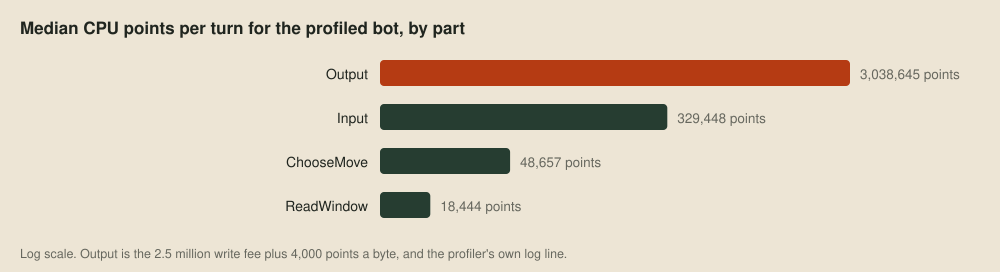
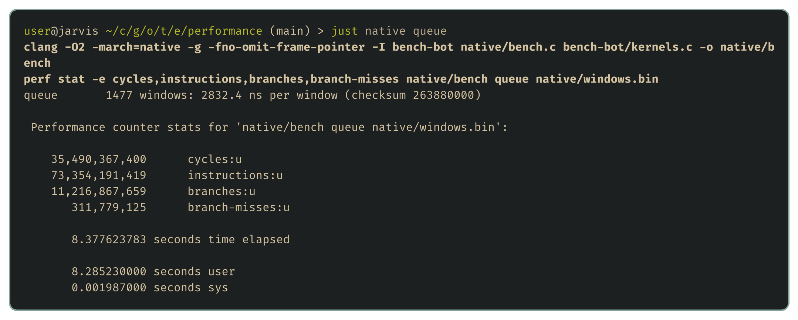

# Where the points go

> **Editor's note, 28 September 2026.** I've rewritten this post to be shorter.

[The choice](02-the-choice.md) measured what a whole turn costs in each language, which was enough to pick one. It can't say what the points are spent on, and once a bot searches properly, every point spent elsewhere is search depth it doesn't get. The last tool on the wishlist splits a turn's cost into its parts, then follows the expensive part down to individual instructions.

## The price list

The judge doesn't measure time. It gives each dragon 100 million points per turn and charges for everything the bot's WebAssembly does. The toolkit prices a bot exactly as the judge does, so its source is the most precise price list there is: `unswbc/metering.py` for instructions and `unswbc/sandbox.py` for input and output.

| What the bot does | Points |
| --- | ---: |
| Arithmetic, comparisons, constants and local variables | 1 |
| Memory loads and stores, and branches | 2 |
| SIMD instructions, whatever they do | 2 |
| Division and remainder | 3 |
| A direct function call | 4 |
| An indirect call, through a function pointer | 6 |
| Growing memory | 50 |
| Writing output | 2,500,000 per write, plus 4,000 per byte |
| Reading input | 6 per byte |

Three things stand out. Output is by far the most expensive thing a bot can do, which is why the starter helpers write once per turn. A SIMD instruction costs the same as a load while doing up to sixteen times the work, which matters in the performance stage. And the price depends only on which instructions run, not how long they take on real hardware.

## A profiler inside the bot

The judge's clock doesn't follow real time: it advances one nanosecond for every point the bot spends. So a bot that reads the clock before and after a piece of its own code gets that code's exact cost, with no sampling. Reading it takes a few lines of C, which the Nim bot calls like any other helper:

```c
uint64_t ClockNanoseconds(void)
{
    struct timespec now;
    clock_gettime(CLOCK_MONOTONIC, &now);
    return (uint64_t)now.tv_sec * 1000000000u + (uint64_t)now.tv_nsec;
}
```

A Nim template wraps any block and adds its cost to a running total for that part of the turn:

```nim
type Part = enum Input, ReadWindow, ChooseMove, Output
var spent: array[Part, uint64]

template profile(part: Part, body: untyped): untyped =
  let started = clockNanoseconds()
  body
  spent[part] += clockNanoseconds() - started
```

The turn loop wraps each step in `profile` and logs the totals at the end of every turn. The profiled bot is in [examples/performance/profiled-bot](../examples/performance/profiled-bot/strategy.nim), and `just profile` in `examples/performance` takes the median of every part over a game:


## What the profile says

The bot's thinking, the move choice with its flood fills, is a tiny slice of the turn, and almost everything else is overhead:



Output is the 2.5 million write fee plus 4,000 points for each of about 135 bytes, and only 15 of those bytes are the move and `ENDTURN`. The rest is the profiler's own log line, which costs more than the code it measures, so a profiling build is for reading, never for submitting.

The second surprise is input. A turn's input is under a kilobyte, which costs about 6,000 points to read, and nearly all the rest of that bar is the starter helper turning the text into numbers. Parsing costs more than the strategy.

So a whole turn costs about 3.4 million points, and 96 million go unused. That budget is for thinking, and the part of the thinking that grows when a bot looks further ahead is the flood fill. Two moves deeper means sixteen times as many.

## Down to the instructions

Points count instructions, so they say how much work code does but not why. For that, compile the same code natively and use [perf](https://perf.wiki.kernel.org/), which reads the CPU's own counters. `just native queue` runs the flood fill from The choice over 1,477 windows recorded from real games, checking every answer first:



Each window is repeated 2,000 times, so per window that's about 24,800 instructions, 3,800 branches and 112 mispredictions. Two instructions per cycle is modest for a modern core, and the mispredictions are a large part of why. `just native-profile` pins the cycles to instructions:


No single instruction stands out. The cost is spread across the arithmetic that turns a tile number back into a row and column, and the jumps that test whether each step stays in the window and whether a tile was seen before. The shape of the code, one tile at a time with a test at every step, is the cost. Since the judge counts instructions, the way to make the flood fill cheaper is fewer, bigger steps, and that's where the performance stage starts.

## Other tools

Beyond the eight tools on the wishlist, the screenshots in these posts lean on a set of everyday command-line tools that replace older Unix ones. If you want the same setup, these are the ones that appear most:

| Tool | In place of | What it does here |
| --- | --- | --- |
| [fish](https://fishshell.com) | bash, zsh | The shell, with a readable scripting syntax and suggestions as you type |
| [just](https://just.systems) | make, as a command runner | Runs every tool in the series as a named recipe from a `justfile` |
| [Nix](https://nixos.org) | installing tools globally | `nix shell nixpkgs#tool` runs any tool without installing it |
| [kitty](https://sw.kovidgoyal.net/kitty/) | a default terminal | The terminal in every capture, fast and scriptable |
| [bat](https://github.com/sharkdp/bat) | cat | Prints files with syntax highlighting and line numbers |
| [ripgrep](https://github.com/BurntSushi/ripgrep) (`rg`) | grep | Searches files and output, fast and with sensible defaults |
| [fd](https://github.com/sharkdp/fd) | find | Finds files by name with a simple syntax |
| [eza](https://github.com/eza-community/eza) | ls | Lists files and trees with colour and icons |
| [glow](https://github.com/charmbracelet/glow) | reading raw Markdown | Renders Markdown in the terminal, so result tables print with proper borders |
| [hexyl](https://github.com/sharkdp/hexyl) | xxd, hexdump | Shows binary files in coloured hex, as in the wishlist's replay dump |
| [zoxide](https://github.com/ajeetdsouza/zoxide) (`z`) | cd | Jumps to directories you use often by a fragment of their name |
| [zellij](https://zellij.dev) | tmux | Splits the terminal into panes that survive a lost connection |
| [btop](https://github.com/aristocratos/btop) | top | Shows CPU, memory and processes while a batch of games runs |
| [dust](https://github.com/bootandy/dust) | du | Shows what's using disk space, as replays pile up |
| [duf](https://github.com/muesli/duf) | df | Shows free space on each disk at a glance |

[Modern Unix](https://github.com/ibraheemdev/modern-unix) keeps a longer list of these alternatives, with screenshots.

## Next up

That completes the wishlist. The series turns to the part that decides games, starting with [the shape of the problem](11-the-shape-of-the-problem.md).
