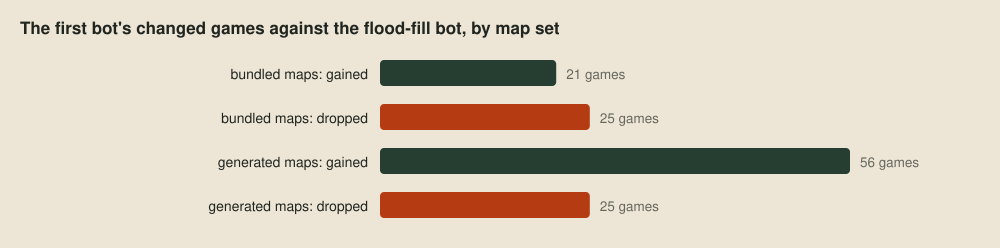
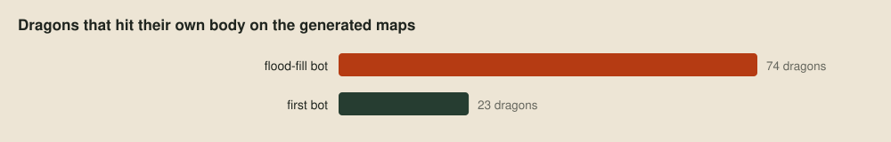

# The shape of the problem

> **Editor's note, 28 September 2026.** I've rewritten this post to be shorter and to match how our bots are built now. The example bots were restructured into a repertoire of behaviour modules, and they play exactly the same games as before, so the results stand.

With the tools in place, the series turns to strategy. Before writing any, it's worth working out what kind of problem this is, because that decides what kind of bot is worth building. The short version is that this game rewards bots that are well organised and easy to change far more than it rewards raw compute or generated code. The rest of this post makes that case, looks at the main ways game AI organises decisions, and shows how I lay out a bot so the organisation itself can change.

## Not a problem to grind

When a game has a fixed simulator and a clear score, it's tempting to throw compute at it: generate thousands of candidate bots, play them against each other for a week, and keep whatever wins. That works when the thing you're optimising against holds still, and in Battlecode very little does. Every team can upload a new bot twelve times an hour, so a bot trained on this week's field is tuned for opponents that won't exist at the tournament. Every tournament map will be new. Even the rules move: until 25 September every match on a map used the same pearl schedule, more than 20 teams had hardcoded those schedules, and when the toolkit started seeding matches randomly all of that tuning stopped working overnight.

I learned this the expensive way. Early on I tuned a bot's decision weights with an evolutionary optimiser, playing each candidate against a fixed set of opponents on two maps. The five best bots it produced then each played a bot that moves at random, and each won only 1 to 3 of its 11 games. They'd learned to beat the opponents they trained against, and not much else.

The opposite temptation is to describe the game to an AI model and ask for a bot. That can produce a decent bot quickly, but every team has the same models, so the ladder fills with bots that look alike, play alike and mostly beat each other at random. The teams at the top will be the ones doing something the obvious bot doesn't.

## Adaptive problems need structure

Put together, this is an adaptive, adversarial problem, played on partial information. Russell and Norvig's *[Artificial Intelligence: A Modern Approach](https://aima.cs.berkeley.edu/4th-ed/pdfs/newchap02.pdf)* has a good vocabulary for it. It's *partially observable*, since a dragon only sees its 7×7 window. It's *multi-agent* in two directions at once, competing with the other team while cooperating with teammates it can't share memory with. And it's *unknown* in the book's sense, because the maps and opponents we'll face at the tournament aren't the ones we can test against now.

Problems like that reward bots we can understand and change quickly. When a dragon does something stupid, we need to see why, fix that one behaviour, and prove with the [verdict](04-better-worse-or-undecided.md) that the fix helped without breaking anything else. That makes the bot's architecture, the way its decisions are organised, the first real strategic choice.

## A menu of architectures

Game AI has settled on a handful of ways to organise an agent's decisions, and real bots often mix them. The free *Game AI Pro* chapter *[Behavior Selection Algorithms](http://www.gameaipro.com/GameAIPro/GameAIPro_Chapter04_Behavior_Selection_Algorithms.pdf)* covers most of them with examples.

| Architecture | How it decides | Strengths | Weaknesses |
| --- | --- | --- | --- |
| **State machine** | The agent is in one state, and transitions move it between states. Hierarchical versions nest states inside states. | Simple, cheap and easy to trace. | Transitions multiply as states are added. |
| **Behaviour tree** | A tree of priorities and sequences, re-evaluated from the root each turn. | Modular and reactive. | Priorities are fixed in the tree's shape. |
| **Utility system** | Every option gets a score, and the best one wins. | Handles trade-offs smoothly. | Scores need tuning, and odd choices can be hard to explain. |
| **Subsumption** | Layers of reactive control, where higher layers override lower ones. | Several behaviours act at once, and reflexes win. | Hard to plan with. |
| **Belief, desire, intention** | Desires compete, and the chosen one becomes an intention held until it's done or impossible. | The agent commits instead of dithering. | Deciding when to drop an intention is subtle. |
| **Goal-oriented planning** | A planner searches for a sequence of actions that reaches a goal. | Finds new combinations of actions. | Replanning costs compute whenever the world changes. |
| **Hierarchical task network** | Tasks break down into subtasks using authored methods. | Plans with the designer's knowledge built in. | The methods take a lot of authoring. |
| **Search** | Minimax or Monte Carlo tree search looks ahead over moves. | Strong with a good model and enough budget. | Hidden information and many agents make the tree huge. |
| **Learned policy** | A trained model maps what the agent sees to an action. | Finds patterns nobody wrote down. | Needs a stable environment and lots of data. |

Choosing one of these and living with it would be a mistake, because we won't know which suits this game until we've tried several. The trick is to write the bot so the architecture can be swapped.

## A repertoire, not a bot

I keep a reference layout that sorts code by what kind of thing it is, the way a textbook would. Here is the whole of it. Most files start life as pseudocode notes on a technique, and the dots mark the ones a bot has needed enough to implement:

![Every file in my reference repertoire, in four folders. data_structures holds sixteen structures from array to tree. decision_architectures holds ten, from behaviour_tree to utility_ai. techniques is sorted by family: caching, constraints, control, dynamic_programming, evaluation, game_theory, inference, learning, optimisation, planning, sampling, search and sorting. games/loong holds agent, htn, utility and world, and a behaviours folder with escape, explore, forage and pursue_enemy. Dots mark the thirteen implemented modules: the behaviour tree, decision context, hierarchical state machine and utility AI, the hierarchical task network planner, and everything in games/loong.](images/kieran-repertoire-wide.svg)

The folders also decide what may depend on what. Data structures, decision architectures and techniques are written generically, over whatever context and action types they're given, and know nothing about this game. Only `games/loong/` does. It holds the world model, movement and the turn loop, a thin adapter for each architecture, and one module per behaviour.

That last part is the heart of it. A behaviour module owns everything about one behaviour: when it's eligible, what it's worth, and how it's carried out. It offers itself to each architecture through a small factory, and a bot is then nothing but assembly, a short list of behaviours handed to an architecture. Here are two of my reference bots, built from the same four behaviours, one choosing by utility and the other planning with a task network:

Nothing in either file knows how a behaviour works, and nothing in a behaviour knows which architecture will pick it. That's what keeps everything loosely coupled. Changing a bot means editing a list. Trying a whole new architecture means writing one generic module, one adapter, and a factory in each behaviour it needs, and from then on every existing behaviour is available to it.

Our competition bot is built the same way on our own repertoire. Its main line chooses behaviours by utility, with a margin that keeps a dragon on its current task until something clearly better turns up. Alongside it, experimental bots assemble the same behaviours under goal-oriented planning, subsumption, and belief, desire and intention, so we can compare architectures on the same footing. Here's what that looks like from the side of one behaviour, our escape, which carries a factory for every architecture that uses it:

![Our escape behaviour, escape.nim, with boxes over each part. whenTrapped is its eligibility: fewer safe single steps than a minimum. execute is its execution: move away from the nearest enemy head, sprinting. Then one factory per architecture: utilityBehaviour builds a utility definition from the eligibility, a fixed score and the execution. SubsumptionLayer builds a layer that takes over the whole intent. BdiDesire builds a desire that interrupts the current intention and resumes it once safe. And goapGoal and goapAction build a survival goal and an escape step for the planner.](images/composition-behaviour.png)

Two more rules keep the pieces honest. Hard constraints, like illegal or fatal moves, are filtered out before anything is scored, so no behaviour's enthusiasm can outweigh a wall. And each behaviour judges moves by its own objective. The alternative, one big weighted score where a dragon's role only changes the weights, is exactly the kind of bot that's hard to explain when it goes wrong.

## The first strategy bot

The example bots in this series are built the same way, on a small public repertoire in [examples/repertoire](../examples/repertoire/games/loong/hsm.nim). The first one uses a hierarchical state machine, entered from the root every turn, so the first behaviour whose guard holds takes the turn:

The whole bot is its assembly, two behaviours handed to the state machine:

Each behaviour is one short module. Roam keeps the most room, exactly as the flood-fill bot did. Evade starts from the same room score and adds four points for every tile between the move and the nearest enemy head, so it will give up a little room to get away, and its factory adds the guard that decides when it applies:

Neither behaviour can pick a fatal step, because movement filters those out first. It drops steps into kelp and bodies, and steps next to an enemy head, since dragons move in turn and a head-on collision kills both. It also drops portals, because vision doesn't reach through them, and only takes one when nothing else is left:

## The first result

To see whether the structure pays off, we test the first bot in place of the flood-fill bot from [The choice](02-the-choice.md), on the 13 bundled maps and the 20 generated ones, over four seeds:

It's a real improvement, if not a large one, and the first bot also beats the starters more often than the flood-fill bot did.

Where the gain comes from is interesting. Splitting the changed games by map set, the two bots are level on the bundled maps, and almost all of the improvement is on the generated ones:

The replays show why. On the generated maps, far fewer of the first bot's dragons ran into their own bodies:

That's the portal blind spot from [the map generator post](05-maps-nobody-has-seen.md), closed by movement refusing to step through portals it can't see past.

It's a modest start, but it's measurably better, and every new behaviour now has an obvious place to go.

## Next up

From here the series adds behaviour one piece at a time, starting with [roles](12-roles.md): giving dragons different jobs, and letting each one work out its job by sonar.
