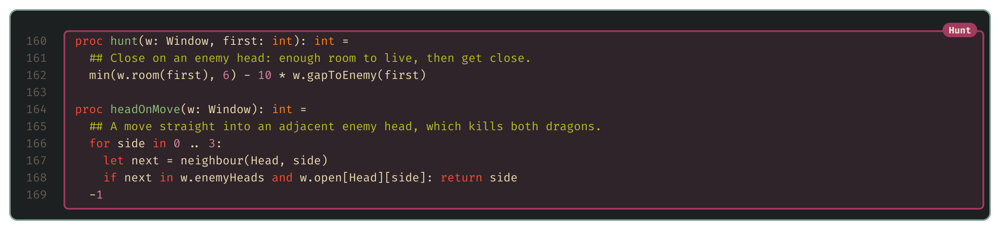
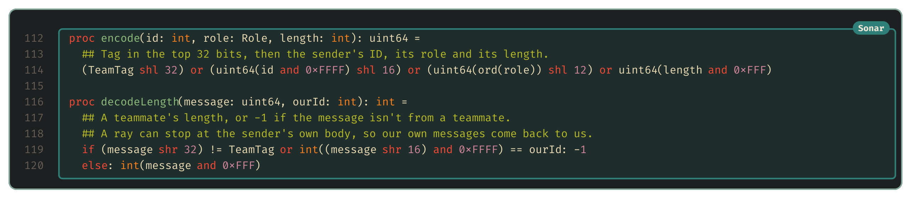

# Roles

<!-- draft: 504c335716, stage: Grand strategy -->

The [first strategy bot](11-the-shape-of-the-problem.md) treats every dragon the same. But dragons on the same team aren't in the same position. One is long and carries the team's chance of winning at round 500. Another is two segments long and not worth much alive. This post uses the architecture from last time to give dragons different roles, so the same program behaves differently depending on who's running it, and uses sonar to let each dragon work out its role.

## Why dragons need different jobs

Two of the game's rules pull our dragons in opposite directions, and that's what makes roles worth having.

The first is how the game ends. If neither team is wiped out, the winner at round 500 is the team with the longest living dragon. So whichever of our dragons is longest is carrying the whole team's result, and it should spend the game growing and staying out of trouble.

The second is what happens in a head-on collision. When two heads meet, both dragons die, however long each of them was. A long dragon has a lot to lose from that, and a dragon with only two or three segments has very little.

A long dragon should avoid enemy heads and a short one should seek them out, so the plan is three roles:

- The **champion** is the team's longest dragon. It plays for length.
- A **kamikaze** is a short dragon, three segments or fewer, with a longer teammate to protect. It hunts enemy heads.
- A **worker** is everyone else. It plays exactly like the first bot.

## One program, three roles

Every dragon runs the same program, and each one is a separate process with its own memory. Nothing tells a dragon it's the champion. It has to work that out from what it knows, and the only way to learn about teammates out of sight is sonar.

Each turn, every dragon announces its length in all four directions. Each dragon remembers the longest teammate it has heard from in the last 12 turns, and picks its role from that:

The role doesn't replace the architecture. It slots in above it and decides which modes a dragon may use. The champion and workers roam and evade like the first bot, and a kamikaze roams until it sees an enemy head, then hunts it. The safety layer stays in charge of every role, with one exception: a hunting kamikaze may step next to an enemy head, because that's the point.

In the code, the new pieces slot in around the first bot's. Sonar gets its own section, there's one more behaviour, and the state machine gains a layer on top:

The state machine is where the hierarchy lives. `chooseRole` picks the outer state, and `chooseMode` then picks a mode from only the ones that role allows. A worker behaves exactly like the first bot, a kamikaze hunts as soon as it sees an enemy head, and `score` gains a third socket for the new behaviour:

Hunt is the one new behaviour. It keeps just enough room to stay alive, then scores a move higher the closer it gets to an enemy head. When the head is right next to it, `headOnMove` skips the scoring and drives straight in:

## Talking by sonar

Sonar is simple, and that simplicity is what makes it tricky to use. A message is a single 64-bit number, sent out as a ray that travels in a straight line until it hits kelp or a dragon segment, and whichever dragon it hits receives the number. The message carries nothing else, not even who sent it or which team they're on, so an enemy in the way hears it just as clearly as a teammate would.

That means a dragon needs some way to tell our messages from everyone else's. So every message we send starts with a fixed team tag, and a dragon ignores anything without it:

The tag stops a dragon from mistaking random enemy traffic for a teammate. It won't stop an opponent who decodes our messages and copies the tag.

Packing and unpacking the message takes a couple of shifts each way. `decodeLength` throws away anything without our tag, and it also throws away our own messages. The reason for that second check comes up in the replays below.

## The first try was worse

Since the champion carries the team's hopes for round 500, the first version played it extra carefully, keeping three tiles away from enemy heads instead of the usual two. Against the first bot, on the bundled and generated maps, that version lost. The chart below shows it, along with every variant I tried while working out why. Each row is the share of the changed games that the variant gained, from the paired verdict in [the statistics post](04-better-worse-or-undecided.md):

When a change comes out worse, the useful thing to do is test its pieces separately, and the verdict tool makes that cheap. Removing the kamikazes didn't help, so they weren't the problem. A control that removed them and gave the champion the first bot's two-tile berth played every one of its 132 games exactly as the first bot did, which showed the sonar messages themselves cost nothing. That left the champion's berth. Keeping three tiles from enemy heads made it too timid to hold its ground, and it also lost 12 games to the weak bots that the first bot won. Narrowing the berth brought the roles bot level with the first bot.

A level result isn't an improvement, and the pairing showed why. Only 7 of the 132 games came out any differently from the first bot's, and counting role labels in the replays explained it: only 1.7% of dragon-turns were kamikaze turns. Short dragons with a longer teammate nearby were rare, so the role hardly ever came into play.

## Making kamikazes

If kamikazes are rare because short dragons are rare, the answer is to make short dragons on purpose. The game already has a way to do that: a dragon can split, turning the end of its body into a new dragon. So now a champion that reaches 10 segments splits off its last three:

The child is a new dragon running a fresh copy of the same program, with no memory. Nothing tells it to be a kamikaze. It hears the champion announce length 10, sees that it's only three segments long, and picks the role itself.

All of this happens in the turn loop. Each turn, the dragon listens, picks its role and reads its window. A long enough champion then splits instead of moving, and everyone announces themselves at the end:

With splitting, the roles bot beat the first bot convincingly: of 132 paired games it changed 43, gaining 39 and dropping 4. But that result mixes two changes: there are more dragons now, and the new ones hunt. To separate them, I tried a version that split in exactly the same way but made its children ordinary workers. That version also beat the first bot, gaining 35 and dropping 8, so having more dragons helps on its own. Then I played the two versions directly against each other, weighting each game by the turns spent as a kamikaze, and the one with kamikazes gained 30 and dropped 12. So the splitting and the kamikaze role each earn their place.

## A bug in the replay

Here's one of those kamikazes at work, on Arena, the turn before it drives into an enemy head and takes it down:

The dragon at the top is the one that just split off that kamikaze. It's still our longest dragon, so it should be the champion, but its indicator says Worker. Working out why took a closer look at how sonar travels. A ray stops at the first dragon segment it reaches, and nothing exempts the sender's own body. Rays also wrap around the edges of the board, so on a small map like Arena, which is 11 tiles across, a ray can travel all the way round and come back to hit the dragon that sent it. This dragon had been 13 segments long before it split, so it heard its own old announcement of 13, concluded that some teammate was longer than its current 10, and demoted itself for the 12 turns that message stayed in its memory.

The fix is to put the sender's ID in each message and ignore our own, which is the `ourId` check in `decodeLength` above. The fixed version beat the one before it, gaining 26 changed games and dropping 14, and it's the version in [examples/roles-bot](../examples/roles-bot/strategy.nim):

## Friendly fire

The replays showed one more problem. Head-on collisions kill teammates as well as enemies, but the safety layer only keeps clear of enemy heads. Once splitting fills the board with our own dragons, they start running into each other. In the version that split at length 10, there were 382 head-on collisions between two of our own dragons, against 78 with the enemy.

The obvious fix is to give friendly heads the same berth as enemy ones. Surprisingly, that came out undecided against the version without it, and leaned the wrong way: it gained 19 changed games and dropped 29, and lost 5 games to the weak bots that the version without it won. So it isn't an improvement. Finding out why will need a closer look at the games themselves.

## Next up

[Tactics](13-tactics.md): once a dragon knows its role, how to carry it out well, starting with a question from the competition Discord about coiling the champion and feeding it.
