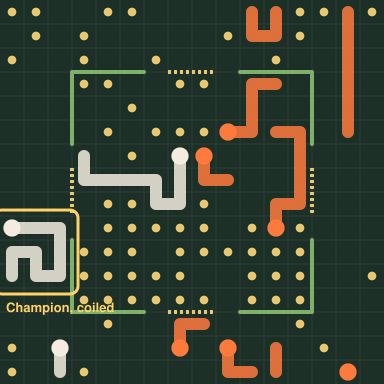
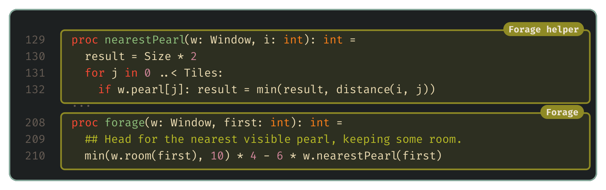

# Tactics

The earlier posts built the tools and gave the bot a structure and some roles, and this one is about carrying those roles out well. It isn't the last word on either. Through the competition I'll keep publishing more strategy and tactics ideas as short follow-ups, numbered after the post they build on: 12b, 12c and so on after [roles](12-roles.md), and 13b, 13c after this one. Each takes a well-known idea, builds it into the example bots and puts it through the same verdict, so that every team following along starts from a higher floor. First, though, a note on how much of this I'm going to share.

## A note on secret sauce

I'm competing in this tournament too, so I can't walk through every strategy I'm working on without handing it to everyone else. What I can do is share the questions that shaped my own thinking. None of them have obvious answers.

- Which of your dragons would it hurt most to lose, and does your plan survive losing it?
- How much of your 100 million points a turn do you actually use, and what would the rest buy?
- What does your bot do differently when it's winning than when it's losing?

It's also worth reading how winners of other Battlecode competitions thought about the problem. The games differ, but the thinking carries over.

- The MIT Battlecode 2025 champions, Just Woke Up, [wrote up their approach](https://battlecode.org/assets/files/postmortem-2025-just-woke-up.pdf). They built their units around explicit state machines, and designed compact, typed messages for sharing locations. They also compared every version across many maps and studied their losses against a range of opponents.
- The MIT Battlecode 2026 runners-up, Generalized Stroke's Theorem, [cover navigation, communication and close-quarters fighting](https://battlecode.org/assets/files/postmortem-2026-generalized-strokes-theorem.pdf). Their report puts more weight on watching replays and experimenting with the big picture than on shaving instructions off the code.
- The Cambridge Battlecode 2026 novice champion, Austen Wayne, [explains how his bot remembered what it had seen](https://github.com/AustenWayne/battlecode-bot/blob/main/Cambridge_Battlecode_Postmortem.pdf) and planned routes over that memory. He's candid that he spent too long on his economy and not enough on attack and defence.

## From strategy to tactics

The last two posts were about strategy, which is deciding what each dragon is for. Giving one dragon the job of staying long for round 500 and another the job of hunting enemy heads is a strategic choice. So is anything else that shapes the plan for the whole team.

Tactics is the other half. Once a dragon knows its job, tactics is about doing that job precisely and efficiently. The question changes from "who should be the champion?" to "given I'm the champion right now, how do I do that well?" Two bots with the same strategy can play very differently depending on how well each one carries it out.

## A question from Discord

A good tactical question came up on the competition Discord recently:

> Does anyone have any ideas for mimicking the self-coil + self sacrificing mini to feed the big one? As seen by the number 1 on the leaderboard?
>
> — Dearest You [IU]

That's two tactics working together. The big dragon, the champion, curls up tight against its own body. And smaller dragons deliberately die next to it to feed it.

The second one is less strange than it sounds. When a dragon dies, every other segment of its body turns into a pearl. So a mini that has grown by eating pearls elsewhere can pass about half its length on to the champion by dying where the champion can eat the remains. Since the longest dragon decides the game at round 500, funnelling the team's length into one dragon makes sense.

Let's try building both. Each one fits into the roles bot's structure as new behaviours, so the frame stays as it was. The champion gains a Coil mode, and the workers become feeders, with a Forage mode for finding food and a Deliver mode for the sacrifice:

The code follows the same shape. The behaviours section grows three new procs, and the state machine grows a socket for each:

The only other change to the state machine is which modes each role may use. `chooseMode` now lets a safe champion coil and sends a feeder foraging, and Deliver only switches on in a build with `-d:deliver`:

## Coiling

The reason to coil is that a long dragon stretched across the board is an easy target. Every segment is somewhere an enemy can cut in front of it, and the further it roams the more of them it meets. A champion curled up in a tight knot keeps most of its body out of reach, and it stays in one place, which matters if teammates are going to bring food to it. So in the tactics bot, when a champion has no enemy head within three tiles, it switches to a new **Coil** mode.

Getting a dragon to curl up turns out to need only one simple preference: it should like moving onto tiles that touch its own body. Each of our own segments next to a candidate tile adds to that move's score, and a dragon that keeps choosing to hug itself this way naturally winds into a spiral.

Left unchecked, that preference would have the dragon curl so tightly that it walls itself in and dies on its own body. So hugging only counts while the move still leaves at least 10 tiles of room, measured with the same flood fill the bot already uses for safety. And since a coiled champion still needs to grow, it always takes a pearl that's right next to it.

In code, that's a small helper that counts our own segments around a tile, and a behaviour that puts the three preferences together. A pearl beside the head is worth 100, each touching segment is worth 20 while there's room to spare, and the room itself breaks ties:

Here's a champion from one of the test games, nine segments packed into a three-by-three square:

On its own, coiling didn't clearly change the result. Of the 132 paired games against the roles bot, 76 came out exactly the same, and in the rest the coiling bot gained 31 and dropped 25, weighted by how much of each game the champion spent coiled. That's undecided. It isn't surprising, because a champion that stays put only pays off if something is bringing it food, and that's the other half of the idea.

## Feeding the champion

To bring the champion food, the roles bot's workers became **feeders**. A feeder goes looking for pearls, and once it has grown to six segments, it travels back to the champion and deliberately drives into the champion's body. When a dragon runs into another dragon's body, only the one that moved dies, so the champion comes to no harm, and half the feeder's segments turn into pearls right beside it.

Foraging is the simpler of the two behaviours. It keeps a reasonable amount of room and heads for the nearest pearl it can see:

Delivering has two parts. While the champion is far away, `deliver` scores each move by how far it heads in the champion's direction. Once the champion's head is within two tiles and one of its segments is right beside the feeder, `deliveryMove` skips the scoring and drives into it:

For that to work, a feeder has to know where the champion is, and the champion is usually far out of sight. The roles bot's sonar message only carried each dragon's length, so it needed to carry a position as well. To make room in the 64 bits, the team tag shrank to 16 bits, and every dragon now includes where its head is. A feeder remembers the position of the longest teammate it has heard from, and heads there when it's ready to deliver.

Here's how each version did against the roles bot, weighted by the turns its new behaviours were active:

Every version with the sacrifice in it came out worse. To find out which part was hurting, I tested the pieces separately, the same way as in the roles post. Feeders that only foraged were fine, so the damage came from the sacrifice itself. My first guess was that feeders were dying against the champion's tail, far from its head, so the champion never came back for the pearls. So one version only sacrificed when the champion's head was within two tiles. That made no difference: 24 changed games gained and 41 dropped, against 25 and 39 without the restriction.

So whatever the number one team is doing, it's more careful than this. Perhaps their feeders sacrifice only when the champion is short of food. Or perhaps the champion is positioned to collect the pearls, not the feeder. It's a good open question, and I'd love to hear from anyone who cracks it.

What came closest to working was putting together the two pieces that hadn't hurt: feeders that forage but never sacrifice, alongside a champion that coils. Each piece was undecided on its own. Together, on four seeds, they gained 80 changed games against the roles bot and dropped 45, weighted by the turns spent coiling or foraging. Random signs do that well less than half a percent of the time, so head to head the combination is clearly better.

## What the weak bots found

Head to head isn't the whole verdict, though. The tactics bot also played the two starter bots on the same maps and seeds as the roles bot, and it lost three games to them that the roles bot won, while winning back only one. So the verdict is undecided:

Three games out of hundreds sounds like bad luck, but a bot this much stronger than a starter shouldn't lose to one at all, so each is worth a look. Two were on the same generated map, 40 tiles square, and both went to round 500. The starter wandered, ate what it bumped into and grew, while our coiled champion sat in its knot waiting for food that feeders brought too slowly on a board that big, and lost on length. The third was on a small 16×10 map, where both our dragons died in head-on collisions in round 22.

Those two failures are exactly the kind of thing a head-to-head test between two versions of our own bot can't show, because the roles bot never coils and the starters never hunt. The coil is a good idea on a crowded board and a bad one on an empty one. The code is in [examples/tactics-bot](../examples/tactics-bot/strategy.nim), with the sacrifice behind a `-d:deliver` switch for anyone who wants to try making it work, and teaching the champion when not to coil is the obvious next step.

## Every version on one ladder

Each verdict in the last three posts compared a new version with the one before it. The [ladder](06-a-ladder-of-our-own.md) can check that the chain of improvements adds up, and that nothing went round in a circle along the way. Here are the saved versions from the flood-fill bot onwards, with the rejected pearl chaser and the C starter for reference, over the same 33 maps:

The ratings line up in the order the versions were saved, and every version has a winning record against every version before it, so the verdicts weren't going round in a circle. The gaps also say something the verdicts couldn't. The roles bot's jump over the first bot, nearly 200 points, is the biggest step among the strategy bots. The tactics bot's lead over the roles bot is real but small: 34.5 games to 31.5 here, on a single seed, which fits a change that matters in some games and not others.

## Next up

We started with tools that tell us whether an idea works, used them to give the bot a structure and then roles, and in this post made the champion better at its job. More strategy and tactics ideas will follow as 12b, 13b and onwards. Next in the main series is the mechanic all of this rests on: [sonar](14-sonar.md), and what else it could be used for.
