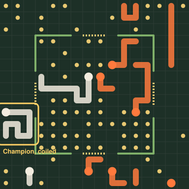
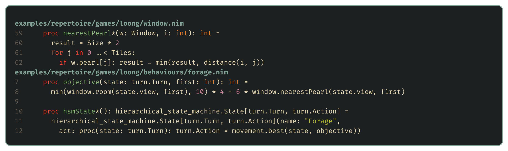

# Tactics

> **Editor's note, 28 September 2026.** This post has been rewritten to be shorter and to show the tactics bot as it's now built, from behaviour modules in a shared repertoire. It plays exactly the same games as before, so the results stand.

Strategy decides what each dragon is for, and [roles](12-roles.md) made that choice: one dragon stays long for round 500, others hunt enemy heads. Tactics is doing the job well once a dragon has it. The question changes from "who should be the champion?" to "I'm the champion, so how do I do it well?"

## A note on secret sauce

I'm competing too, so I can't walk through everything I'm working on. I can share the questions that shaped my thinking, none of which have obvious answers:

- Which of your dragons would it hurt most to lose, and does your plan survive losing it?
- How much of your 100 million points a turn do you use, and what would the rest buy?
- What does your bot do differently when it's winning than when it's losing?

Winners of other Battlecode competitions have written up their thinking, and it carries over. The MIT 2025 champions, Just Woke Up, [built units around explicit state machines](https://battlecode.org/assets/files/postmortem-2025-just-woke-up.pdf) with compact typed messages, and compared every version across many maps. The MIT 2026 runners-up, Generalized Stroke's Theorem, [put watching replays ahead of shaving instructions](https://battlecode.org/assets/files/postmortem-2026-generalized-strokes-theorem.pdf). And the Cambridge 2026 novice champion, Austen Wayne, [explains how his bot remembered what it had seen](https://github.com/AustenWayne/battlecode-bot/blob/main/Cambridge_Battlecode_Postmortem.pdf) and planned routes over that memory.

## A question from Discord

A good tactical question came up on the competition Discord:

> Does anyone have any ideas for mimicking the self-coil + self sacrificing mini to feed the big one? As seen by the number 1 on the leaderboard?
>
> — Dearest You [IU]

That's two tactics together. The champion curls up tight against its own body, and smaller dragons die next to it to feed it. When a dragon dies, every other segment of its body becomes a pearl, so a mini that grew elsewhere can pass about half its length to the champion by dying where the champion can eat the remains.

Both fit the roles bot as new behaviour modules, so nothing else changes. The champion gains Coil, and workers become feeders with Forage, plus an optional Deliver for the sacrifice:

The assembly is the roles bot's with two lines changed:

Across the three example bots, most of the repertoire is shared, and each new bot adds a few modules:

## Coiling

A long dragon stretched across the board is an easy target, since every segment is somewhere an enemy can cut in. Curled into a knot, most of its body is out of reach, and it stays in one place, which matters if teammates are bringing it food. So a champion with no enemy head within three tiles coils.

Curling up needs one preference: like steps that touch your own body. A dragon that keeps hugging itself winds into a spiral:

Left unchecked, that would wall the dragon in, so hugging only counts while the step leaves at least 10 tiles of room. A pearl beside the head is always worth taking, since a coiled champion still needs to grow:

Here's a champion from a test game, nine segments packed into a three-by-three square:

On its own, coiling was undecided against the roles bot: 31 changed games gained and 25 dropped, weighted by the turns spent coiled. A champion that stays put only pays off if something brings it food.

## Feeding the champion

A feeder looks for pearls, keeping reasonable room:

Delivering has two parts. While the champion is far away, the objective scores each step by how far it heads towards where the champion was last heard from. Once the champion's head is within two tiles and one of its segments is beside the feeder, a reflex drives into it. Only the dragon that moves dies in a body collision, so the champion is unharmed:

That needs the champion's position, which is usually out of sight, so sonar messages now carry each dragon's head. To make room in 64 bits, the team tag shrinks to 16:

Each version against the roles bot, weighted by the turns its new behaviours ran:

Every version with the sacrifice came out worse. Feeders that only foraged were fine, so the damage came from the sacrifice itself. Restricting it to within two tiles of the champion's head made no difference, 24 to 41 against 25 to 39. Whatever the number one team does, it's more careful than this. Perhaps feeders sacrifice only when the champion is short of food, or the champion positions itself to collect. I'd love to hear from anyone who cracks it.

The closest to working was the two pieces that hadn't hurt: a coiling champion with feeders that forage but never sacrifice. On four seeds they gained 80 changed games against the roles bot and dropped 45, which random signs match less than half a percent of the time.

## What the weak bots found

Against the starter bots, though, the tactics bot lost three games the roles bot won and won back one, so the overall verdict is undecided:

A bot this much stronger than a starter shouldn't lose to one at all. Two losses were on the same 40-tile generated map, both at round 500: the starter wandered and grew while our coiled champion waited for food that came too slowly on a board that big. The third was on a small 16×10 map, where both our dragons died head-on in round 22. Coiling suits a crowded board and not an empty one, and teaching the champion when not to coil is the obvious next step. The code is in [examples/tactics-bot](../examples/tactics-bot/strategy.nim). To try the sacrifice, add `deliver.hsmState(atLength = 6, memoryTurns = 12)` before `forage` in the feeder's list.

## Every version on one ladder

The [ladder](06-a-ladder-of-our-own.md) checks that the chain of verdicts adds up and nothing went round in a circle. Here are the saved versions from the flood-fill bot on, with the rejected pearl chaser and the C starter for reference:

The ratings line up in the order the versions were saved, and each has a winning record against every earlier one. The roles bot's jump of nearly 200 points over the first bot is the largest step. The tactics bot's lead over the roles bot is real but small, 34.5 games to 31.5, which fits a change that matters in some games and not others.

## Next up

Next is the mechanic all of this rests on: [sonar](14-sonar.md), and what else it could be used for.
