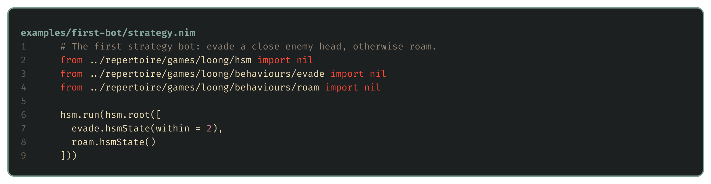

# The shape of the problem

> **Editor's note, 2 October 2026.** This post now follows the competition bot's 1 October hierarchy: a role, tasks within that role, and a state machine inside each task. The first example bot and its 29 September measurements remain below, so the route from a small reactive bot to that design is visible.

With the tools in place, the series turns to strategy. Before writing any, it's worth working out what kind of problem this is, because that decides what kind of bot is worth building. Maps and opponents keep changing, and when a dragon makes a bad choice we need to understand it well enough to change the right piece. That makes the organisation of the bot part of the problem.

## Changing maps and opponents

When a game has a fixed simulator and a clear score, it's tempting to throw compute at it: generate thousands of candidate bots, play them against each other for a week, and keep whatever wins. That works when the thing you're optimising against holds still, and in Battlecode very little does. Every team can upload a new bot twelve times an hour, so a bot trained on this week's field is tuned for opponents that won't exist at the tournament. Every tournament map will be new. Even the rules move: until 25 September every match on a map used the same pearl schedule, more than 20 teams had hardcoded those schedules, and when the toolkit started seeding matches randomly all of that tuning stopped working overnight.

I learned this the expensive way. Early on I tuned a bot's decision weights with an evolutionary optimiser, playing each candidate against a fixed set of opponents on two maps. The five best bots it produced then each played a bot that moves at random, and each won only 1 to 3 of its 11 games. They'd learned to beat the opponents they trained against, and not much else.

The opposite temptation is to describe the game to an AI model and ask for a bot. That can produce a decent bot quickly, but every team has the same models, so the ladder fills with bots that look alike, play alike and mostly beat each other at random. The teams at the top will be the ones doing something the obvious bot doesn't.

## Adaptive problems need structure

Put together, this is an adaptive, adversarial problem, played on partial information. Russell and Norvig's *[Artificial Intelligence: A Modern Approach](https://aima.cs.berkeley.edu/4th-ed/pdfs/newchap02.pdf)* has a good vocabulary for it. It's *partially observable*, since a dragon only sees its 7×7 window. It's *multi-agent* in two directions at once, competing with the other team while cooperating with teammates it can't share memory with. The movement rules are known, while unseen parts of the map are hidden state. The other teams' policies are the part that keeps changing.

Problems like that reward bots we can understand and change quickly. When a dragon does something stupid, we need to see what it knew, which choices it considered, and why it picked that one. We review those decisions in the [viewer](11-through-one-dragons-eyes.md). The [verdict](05-better-worse-or-undecided.md) measures results over games, while assessing whether an individual decision was sound requires reviewing it in the viewer. That makes the bot's architecture, the way its decisions are organised, the first real strategic choice.

## A menu of architectures

Game AI has settled on a handful of ways to organise an agent's decisions, and real bots often mix them. The free *Game AI Pro* chapter *[Behavior Selection Algorithms](http://www.gameaipro.com/GameAIPro/GameAIPro_Chapter04_Behavior_Selection_Algorithms.pdf)* covers most of them with examples.

| Architecture | How it decides | Strengths | Weaknesses |
| --- | --- | --- | --- |
| **State machine** | The agent is in one state, and transitions move it between states. Hierarchical versions nest states inside states, as in Harel's [statecharts](https://doi.org/10.1016/0167-6423(87)90035-9) (1987) and chapter 5 of Millington and Funge's *Artificial Intelligence for Games* (2nd edition, 2009). | Simple, cheap and easy to trace. | Transitions multiply as states are added. |
| **Behaviour tree** | A tree of priorities and sequences, re-evaluated from the root each turn, as in Colledanchise and Ögren's [Behavior Trees in Robotics and AI](https://arxiv.org/abs/1709.00084) (2018). | Modular and reactive. | Priorities are fixed in the tree's shape. |
| **Utility system** | Every option gets a score, and the best one wins, as in Dave Mark's *Behavioral Mathematics for Game AI* (2009) and his GDC lectures of 2013 and 2015. | Handles trade-offs smoothly. | Scores need tuning, and odd choices can be hard to explain. |
| **Subsumption** | Layers of reactive control, where higher layers override lower ones, from Brooks's [A robust layered control system for a mobile robot](https://doi.org/10.1109/JRA.1986.1087032) (1986). | Several behaviours act at once, and reflexes win. | Hard to plan with. |
| **Belief, desire, intention** | Desires compete, and the chosen one becomes an intention held until it's done or impossible, as in Rao and Georgeff's *BDI agents: from theory to practice* (1995). | The agent commits instead of dithering. | Deciding when to drop an intention is subtle. |
| **Goal-oriented planning** | A planner searches for a sequence of actions that reaches a goal, as in Orkin's *Three States and a Plan: The A.I. of F.E.A.R.* (2006). | Finds new combinations of actions. | Replanning costs compute whenever the world changes. |
| **Hierarchical task network** | Tasks break down into subtasks using authored methods, as in Erol, Hendler and Nau's *HTN planning: complexity and expressivity* (1994). | Plans with the designer's knowledge built in. | The methods take a lot of authoring. |
| **Search** | Minimax, with Knuth and Moore's [alpha-beta pruning](https://doi.org/10.1016/0004-3702(75)90019-3) (1975), or [Monte Carlo tree search](https://doi.org/10.1109/TCIAIG.2012.2186810) (Browne and colleagues' survey, 2012) looks ahead over moves. | Strong with a good model and enough budget. | Hidden information and many agents make the tree huge. |
| **Learned policy** | A trained model maps what the agent sees to an action, as in Sutton and Barto's [Reinforcement Learning: An Introduction](http://incompleteideas.net/book/the-book-2nd.html) (2nd edition, 2018). | Finds patterns nobody wrote down. | Needs a stable environment and lots of data. |

These methods can also work at different levels of one bot. A utility score can choose a task whose steps are run by a state machine. Keeping those levels separate lets us change how a choice is made without rewriting what the chosen behaviour does.

## The repertoire

I keep a reference layout that sorts code by what kind of thing it is, the way a textbook would. This is the catalogue used for the early reference bots. Most files started as pseudocode notes on a technique, and the dots mark the ones those bots needed enough to implement:

![Every file in my reference repertoire, in four folders. data_structures holds sixteen structures from array to tree. decision_architectures holds ten, from behaviour_tree to utility_ai. techniques is sorted by family: caching, constraints, control, dynamic_programming, evaluation, game_theory, inference, learning, optimisation, planning, sampling, search and sorting. games/loong holds agent, htn, utility and world, and a behaviours folder with escape, explore, forage and pursue_enemy. Dots mark the thirteen implemented modules: the behaviour tree, decision context, hierarchical state machine and utility AI, the hierarchical task network planner, and everything in games/loong.](images/kieran-repertoire-wide.svg)

The folders also decide what may depend on what. Data structures, decision architectures and techniques are written generically, over whatever context and action types they're given, and know nothing about this game. Only `games/loong/` does. It holds the world model, movement and the turn loop, a thin adapter for each architecture, and one module per behaviour.

That last part is the heart of it. A behaviour module owns everything about one behaviour: when it's eligible, what it's worth, and how it's carried out. It offers itself to each architecture through a small factory, and a bot is then nothing but assembly, a short list of behaviours handed to an architecture. Here are two of my reference bots, built from the same four behaviours, one choosing by utility and the other planning with a task network:

Nothing in either file knows how a behaviour works, and nothing in a behaviour knows which architecture will pick it. That's what keeps everything loosely coupled. Changing a bot means editing a list. Trying a whole new architecture means writing one generic module, one adapter, and a factory in each behaviour it needs, and from then on every existing behaviour is available to it.

## Roles, tasks and states

The textbook competition bot's 1 October design assembles that repertoire into a hierarchy. At the top, a role has an objective and a need: what it exists to achieve, and how many dragons are needed to achieve it. A scout exists to discover the map. As unexplored sectors disappear, the need for scouts falls, and once the map is known the role has finished its job. A champion exists to become the longest dragon, while guards protect it and an assassin pursues the enemy's champion.

Each dragon makes its assignment from what it knows, including the facts teammates send over sonar. There's no central controller with the whole board in memory. A role can be held for a while so that a momentary change in the dragon's view doesn't send it straight into a different job.

Within a role, tasks are the ways of serving that objective. A task is a behaviour together with its target, so collecting one pearl and collecting a different pearl are two task choices. The role supplies the duties it can use, and a utility selector compares eligible tasks. It keeps the current one until another clears a switching margin, which stops a dragon changing its mind every time two scores trade places.

Inside a task, a hierarchical state machine runs the work. Approaching a target and acting on it can be different phases of the same task. That implementation selects among ordered, guarded child states. It doesn't carry a table of explicit transitions between every pair of states:

| Control | On the next turn |
| --- | --- |
| Reactive state | Choose again from the ordered guards |
| Committed state | Keep its place until it completes or becomes unavailable |
| Urgent interrupt | Take the turn while retaining the interrupted task's phase |

The last choice is movement. The active behaviour supplies its own objective, and movement checks which actions are safe before comparing them by that objective. If no safe action exists it has to use a fallback. This is separate from the scores that chose the role and task: a high task score doesn't make a dangerous step safe.

This gives a failing decision a home. Was the dragon in the wrong role? Did it choose the wrong target? Did its approach phase take a bad route? We can inspect and change that level. [Roles](15-roles.md) develops the objectives, and [Planning to play](26-planning-to-play.md) walks through the full turn loop, memory and messaging. [Three lines](14-three-lines.md) explains how the assemblies and their library versions stay reproducible.

## The first strategy bot

The example bots in this series are built the same way, on a small public repertoire in [examples/repertoire](../examples/repertoire/games/loong/hsm.nim). The first one uses a hierarchical state machine, entered from the root every turn, so the first behaviour whose guard holds takes the turn:

The whole bot is its assembly, two behaviours handed to the state machine:

Each behaviour is one short module. Roam keeps the most room, exactly as the flood-fill bot did. Evade starts from the same room score and adds four points for every tile between the move and the nearest enemy head, so it will give up a little room to get away, and its factory adds the guard that decides when it applies:

Both behaviours use movement's safety checks. It drops steps into kelp and bodies, and steps next to an enemy head, since dragons move in turn and a head-on collision kills both. It also drops portals, because vision doesn't reach through them. If no safe step remains, the fallback relaxes those checks and can enter a dangerous tile:

## The first result

To see whether the structure pays off, we test the first bot against the flood-fill bot from [The choice](03-the-choice.md), on toolkit 1.2.2's 15 bundled maps and the 20 generated ones. From `examples/tooling`, `just first-bot` builds the bot from Nim to C and runs the [verdict](05-better-worse-or-undecided.md) on it:

| Candidate | Opponent | W–D–L | Elo (95% interval) | Decision | Games used |
| --- | --- | --- | --- | --- | --- |
| `first-bot` | `room-c` | 17–2–21 | −35 (−151 to +73) | not better | 40, decided at 40 (cap 155) |

It isn't better. After 40 games the first bot had won 17 and lost 21, and the test crossed its lower line. The interval runs from −151 to +73 Elo, so the first bot could be a little worse or a little better, but it isn't the +70 gain the test was built to find. It won all ten of its upset games against the starter.

The result files also count deaths. These are useful places to start looking for games to review:

The first bot records fewer self-collisions and collisions with other dragons in this sample, and its longest dragon ends at 41.5 segments on average against 38.0. Those numbers don't establish better survival decisions: the bots may encounter different dangers, and a successful attack can itself cost a dragon. We need the replays to tell them apart.

Although the run completed 72 games against the flood-fill bot before stopping, the sequential decision above used only the first 40. Across the completed games, the first bot won 30, with 18 wins by elimination, and lost 30, with 18 losses decided on length at round 500. The length losses give us a concrete question to take to the viewer: what stopped it growing?

Here's one of those length losses in the viewer, the last round of a game on the bundled Portals map:

Very little grew on this board, and it isn't for lack of food. Nearly every pearl sits in one of those small walled boxes, which a dragon can only enter through a portal. Neither bot has a food-seeking objective, and both avoid unseen portals while another move is available. The flood-fill bot's only dragon ends 4 segments long and the first bot's three end 3 each. Surviving with more dragons doesn't count for anything at round 500, only the longest one does, which is a job for [the roles](15-roles.md).

So the first bot is a structure more than a clear improvement, and [the ladder at the end of the tactics post](16-tactics.md#every-version-on-one-ladder) puts it only a little ahead of the flood-fill bot. Every new behaviour now has an obvious place to go.

## Next up

[Three lines](14-three-lines.md): why the textbook bot develops beside a free-form foil and a learned line, and how their versions stay reproducible.
