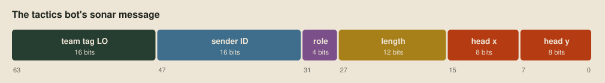
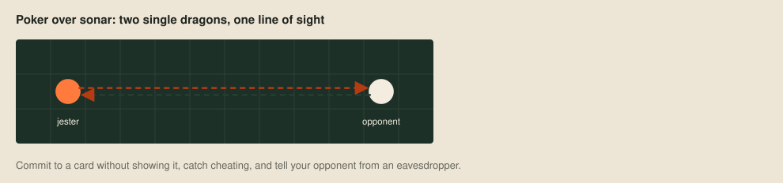

# Sonar

Most Battlecode seasons are built around one unusual mechanic, and the strongest teams exploit it better than anyone else. In 2026 it's sonar. It's the only way dragons can talk, the only way they learn anything beyond their 7×7 window, and every message is as audible to the enemy as to a teammate.

[Roles](12-roles.md) used sonar to announce a dragon's length, and [Tactics](13-tactics.md) added its position. This post is a notebook of what else the rules allow, with the working out left to you.

## Rays and echoes

Each turn, after it acts, a dragon may send up to four 64-bit values, one in each direction. Each becomes a ray that travels in a straight line, wraps round the board's edges, passes through portals, and stops at the first kelp wall or living dragon segment it meets, the sender's own body included. A ray that finds nothing within the board's width plus its height is lost. The ray opposite the dragon's facing starts from its tail and points away from the body.

Whoever a ray hits receives its value next turn, with no sender or team attached. With `PROTOCOL 3` switched on, the sender also learns next turn how many of its rays hit each of five things: kelp, an allied body, an allied head, an enemy body or an enemy head, totalled over all its rays.

Two of those details have already bitten us. The wrap-around made the roles bot hear its own messages, and the missing sender is why we needed a team tag.

## Encoding

Sixty-four bits holds a team tag, an ID, a role, a length and a position, which is what the tactics bot sends, but every bit spent on one field is taken from another. A message also doesn't have to fit in one ray. A dragon can send four values a turn, over as many turns as it likes, so larger facts can be split up and reassembled, as long as every piece reaches the same listener.

## Decoding

An enemy in the way receives our messages just as a teammate would, and we receive theirs. A team tag stops random traffic being mistaken for a teammate's, but it hides nothing. Anything a bot sends should be something it doesn't mind the other team reading.

## Fingerprinting

A message's shape can identify its sender even when its content can't be read. A team whose messages always look alike is recognisable from them, and whatever other teams' messages give away about them, ours give away about us.

## Echolocation

The echo counts are the only information from beyond the window that no teammate has to send. A hit means something out of sight lies in that direction. Because the counts are totals over all four rays, turning them into a direction takes some thought.

## Misinformation

Nothing in the game stops a dragon sending a message in another team's format. A bot that believes everything it hears can be misled, and checking a message against what the dragon can see for itself is the simplest defence.

## Poker

My favourite sonar idea so far came from the competition Discord: a jester bot that drops to a single dragon, lines up with an enemy, spins in a circle and plays poker over the line between them.

It's a joke, but it describes sonar well: a channel between two programs that don't trust each other and can't see each other's cards. Poker over sonar needs what a serious protocol needs, a way to commit to a card without revealing it, a way to catch cheating, and a way to tell whether a message came from your opponent or from someone listening in.

## Next up

That ends the ideas stages. The last stage is performance, making a bot's thinking cheaper so it can afford more of it, starting with [counting room faster](15-counting-room-faster.md).
