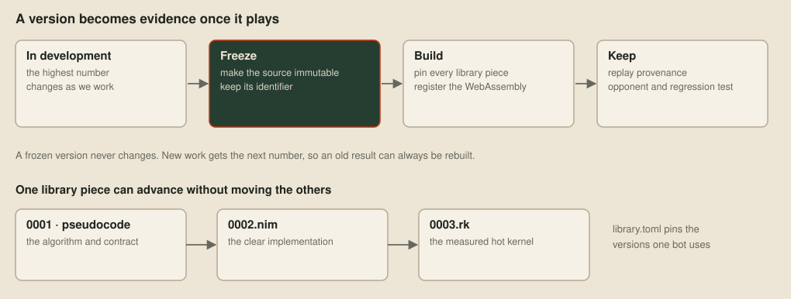
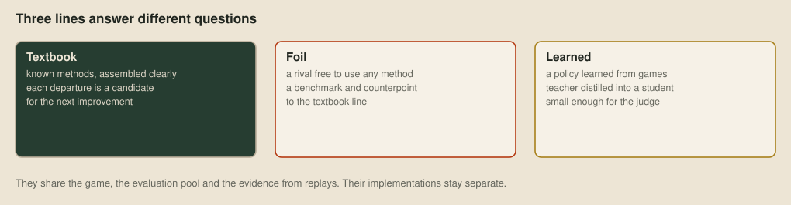

# Three lines

> **Editor's note, 2 October 2026.** I've rewritten this post to begin with how a bot is assembled. The distinction between a bot version, its pinned library pieces and the shared runtime has to be clear before the three development lines make sense.

Before comparing our textbook, foil and learned bots, it helps to define what one bot actually is. The source tree is a catalogue, not an execution diagram. A numbered directory under `main/` holds one bot's assembly. The libraries hold pieces that assemblies may select. The runtime is the common boundary with the judge.

```text
bots/
  common/
    lib/                 # pieces used by more than one line
    runtime/             # the judge-facing runtime
  textbook/
    lib/                 # the textbook line's pieces
    main/NNNN/           # one numbered bot assembly
  foil/
    main/NNNN/           # one numbered foil bot
  rl/
    lib/                 # the learned line's pieces
    main/NNNN/           # one numbered learned bot assembly
```

A Nim assembly usually contains only `strategy.nim` and `library.toml`. The strategy says which behaviours and decision architecture make this bot. The manifest says which exact implementations those imports mean. A self-contained bot, such as one written directly in C, needs neither file.


## Versioned pieces

Each reusable library piece has numbered source versions. Its clearest form may begin as pseudocode, move into Nim when a bot uses it, and gain a Rake version when measurements show that a hot loop belongs in a vector kernel. Those are new versions of one piece, rather than silent rewrites of the source an older bot used.

Here is a shortened manifest. The path on the left is the stable path `strategy.nim` imports. The path on the right chooses one numbered implementation from either the line's own library or the common library:

```toml
mount = "repertoire"

[files]
"decision_architectures/utility_ai.nim" = "textbook/lib/decision_architectures/utility_ai/0004.nim"
"techniques/cryptography/speck.nim" = "common/lib/techniques/cryptography/speck/0001.nim"
```

Before compilation, the build materialises the numbered bot directory and every file named by `library.toml` into a content-addressed source tree. The selected pieces appear under the manifest's `mount`, so the strategy sees one ordinary `repertoire/` even though its contents came from several catalogues. This generated tree is build input, not another place where source is maintained.

The shared runtime is added separately. It supplies the entry point and judge integration, while the strategy and its pinned pieces decide how a dragon thinks. The build snapshots all three inputs, records their hashes and compiler settings, and registers the resulting WebAssembly. Sharing a runtime therefore does not force the lines to share an outer decision loop.

## Frozen versions



A line's highest numbered version is the one being developed. When it reaches a point worth evaluating, we freeze that directory, register its build and begin work under the next number. A frozen version never changes, and neither do the numbered library pieces it pins.

This gives an old result a precise identity. An identifier such as `textbook-main-NNNN` names the assembly. Its manifest names every selected library file, and the registered build names the runtime, compiler settings and WebAssembly that actually played. Later edits elsewhere in `bots/` cannot quietly alter that evidence.

Keeping old versions costs some space, but deleting them would discard useful opponents and the exact program behind a replay. They become baselines in the [ladder of our own](07-a-ladder-of-our-own.md), regression cases and provenance for the viewer. The number records when a version was made, not whether it was better. The games say what happened.

## Why three lines

With that machinery in view, a *line* has a simple meaning: a sequence of numbered bot assemblies, plus any library catalogue particular to that approach. We develop three because one approach cannot answer every useful question at once.



| Line | The question it keeps asking |
| --- | --- |
| Textbook | What established method should this layer use? |
| Foil | What can beat the current bots, by any method? |
| Learned | What policy can the games teach, within the judge's limits? |

### Textbook

The textbook line stays close to standard computer-science methods. Its library is arranged by data structures, decision architectures, techniques and Loong-specific adapters. A behaviour owns one purpose, the circumstances in which it applies and the action it proposes. A version's `strategy.nim` assembles those behaviours and their parameters into an architecture.

That gives the line a direction for improvement. Whenever its implementation departs from the method it is meant to follow, the departure becomes something to inspect. When an idea looks novel while the bot is still making ordinary mistakes, I first look for the established method it approximates.

### Foil

The foil is a rival and counterpoint. It can use whatever method seems likely to work, with no duty to resemble the textbook design or use its library. We play it against the textbook line, read the surprising games in the viewer and carry general lessons between them.

The implementations remain separate even when one teaches the other something. Otherwise a comparison would quietly become a bot playing another version of itself, and we would lose the different set of mistakes that makes the foil useful.

### Learned

The learned line turns games into a policy. A large teacher can use more computation while training, then a smaller student learns its choices and fits inside the judge's time and memory limits. Its assembly pins the network code, observation format, search and other pieces that turn the trained parameters into moves. [Learning to play](27-learning-to-play.md) follows that pipeline from self-play through distillation.

The lines share the judge runtime, build registry, generated maps, evaluation pool and replay viewer. Those are common ways to build and inspect a bot, not a common strategy. Each line remains free to assemble a different turn loop, architecture and collection of behaviours while its results stay comparable on the same terms.

## Next up

[Roles](15-roles.md): giving dragons different jobs, and letting each one work out its role from the same local program.
