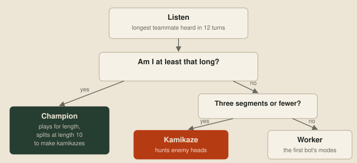
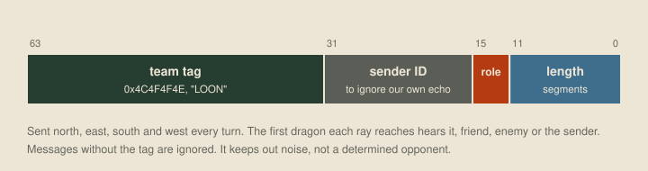
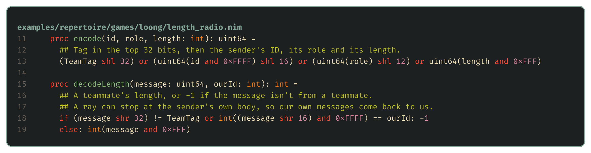
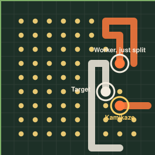
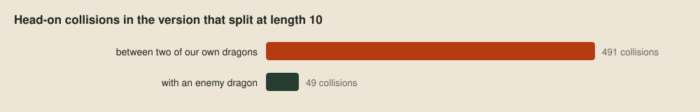

# Roles

> **Editor's note, 28 September 2026.** The roles bot is now assembled from behaviour modules. Its tests below use the sequential verdict, toolkit 1.2.2 and the new generated maps.

The [first strategy bot](13-the-shape-of-the-problem.md) treats every dragon the same. But dragons on the same team aren't in the same position. One is long and carries the team's chance of winning at round 500, and another is two segments long and not worth much alive. This post gives dragons different roles, so the same program behaves differently depending on who's running it, and uses sonar to let each dragon work out its own role.

## Different jobs

Two of the game's rules pull our dragons in opposite directions, and that's what makes roles worth having. If neither team is wiped out, the winner at round 500 is the team with the longest living dragon, so whichever of our dragons is longest carries the whole team's result. And when two heads meet, both dragons die, however long each of them was:

So a long dragon should avoid enemy heads and a short one should seek them out, and the plan is three roles:

- The **champion** is the team's longest dragon. It plays for length.
- A **kamikaze** is a short dragon, three segments or fewer, with a longer teammate to protect. It hunts enemy heads.
- A **worker** is everyone else, and plays exactly like the first bot.

## One program, three roles

Every dragon runs the same program as a separate process with its own memory, and nothing tells a dragon it's the champion. It has to work that out for itself. Robot soccer players in Stone and Veloso's [locker-room agreement](https://doi.org/10.1016/S0004-3702(99)00025-9) (1999) settle their roles the same way, from rules agreed before the game and what they learn of the team during it, and the plays of Browning and colleagues' [STP](https://doi.org/10.1243/095965105X9470) (2005) assign robots to roles as a team. The only way to learn about teammates out of sight is sonar. So each turn every dragon announces its length, and each one remembers the longest teammate it has heard from in the last 12 turns and picks its role from that:

The role doesn't replace the first bot's state machine. It adds a layer on top, which makes it hierarchical in Harel's sense ([statecharts](https://doi.org/10.1016/0167-6423(87)90035-9), 1987): each role is a parent state with a guard, and its children are the behaviours that role is allowed to use. The champion also gets a reflex, a check that runs before its children and can take the turn for itself, which we'll need further down:

![The roles bot's structure. Each turn the dragon listens to sonar and reads its window. The state machine enters a role from its length and the longest teammate heard. The available behaviours depend on the role: Split, Evade and Roam for the champion, Hunt and Roam for a kamikaze, and Evade and Roam for a worker. The state machine selects the first behaviour whose guard holds. Split and Hunt's strike act as reflexes. Movement drops deadly steps, only Hunt may step next to an enemy head, and the best remaining step by the objective is taken. The dragon moves or splits, then announces its team tag, ID, role and length.](images/roles-architecture.svg)

Because behaviours are modules, the roles bot is still just an assembly. The same `evade` and `roam` modules the first bot used now appear under more than one role, alongside a new `hunt` behaviour for kamikazes and the sonar protocol:

The roles themselves are three tiny factories, each a guard on a parent state:

Hunt is the one new behaviour. It keeps just enough room to stay alive, then scores a move higher the closer it gets to an enemy head. When the head is right next to it, its reflex skips the scoring and drives straight in. It's also the only behaviour movement allows to step next to an enemy head, because that's the point:

## Talking by sonar

Sonar is simple, and that simplicity is what makes it tricky. A message is a single 64-bit number, sent out as a ray that travels in a straight line until it hits kelp or a dragon segment, and whichever dragon it hits receives the number. It carries nothing else, not even who sent it or which team they're on, so an enemy in the way hears it just as clearly as a teammate would. That means a dragon needs a way to tell our messages from everyone else's, so every message we send starts with a fixed team tag, and a dragon ignores anything without it:

The tag stops a dragon mistaking random enemy traffic for a teammate. It won't stop an opponent who decodes our messages and copies it. Packing and unpacking take a couple of shifts each way, and decoding also throws away our own messages, for a reason the replays turned up below:

## The champion's berth

Since the champion carries the team's hopes for round 500, the first version played it extra carefully, keeping three tiles from enemy heads instead of the usual two. Against the first bot it won 17, drew 3 and lost 21 before the [verdict](05-better-worse-or-undecided.md) stopped at not better, with an interval from −148 to +73 Elo.

A result like that is about the settings as much as the idea, so the first question was whether the roles machinery itself cost anything. A control that gave every dragon the first bot's behaviour, with the sonar still running and the champion keeping the usual two-tile berth, split its games with the first bot 36–37, and every pair of games on the same map and seed went to whichever bot had the same side. That's what two bots that make identical moves do, so listening and announcing cost nothing. That left the berth, a single number: keeping three tiles from enemy heads made the champion too timid to hold its ground. At two tiles, the roles bot came out level with the first bot, +14 Elo after 128 games with an interval from −47 to +75.

Level isn't better, though, and counting role labels in the replays explained why: only 5.3% of its dragon-turns were kamikaze turns. Short dragons with a longer teammate nearby were rare, so the role hardly ever came into play.

## Making kamikazes

If kamikazes are rare because short dragons are rare, the answer is to make short dragons on purpose. A dragon can split, turning the end of its body into a new dragon, so now a champion that reaches 10 segments splits off its last three. That's the champion's reflex from the assembly above:

The child is a new dragon running a fresh copy of the program, with no memory. Nothing tells it to be a kamikaze. It hears the champion announce length 10, sees that it's only three segments long, and picks the role itself.

With splitting, the roles bot beat the first bot convincingly, +257 Elo after only 27 games, as the verdict below shows. But splitting brings two things at once: more dragons, and new ones that hunt. A version that split in exactly the same way but made its children ordinary workers did just as well against the first bot. Played directly against each other, the two ran to the verdict's cap of 155 games, 83–4–68 to the kamikazes, with no material difference. So it's the extra dragons that do most of the work. Whether a short child should hunt or forage is a question for tuning later, and the kamikaze stays, since trading a three-segment child for an enemy head that might otherwise win at round 500 is a sound idea.

## A bug in the replay

Here's one of those kamikazes on Arena, the turn before it drives into an enemy head and takes it down:

The dragon at the top has just split off that kamikaze. It's still our longest dragon, so it should be the champion, but its indicator says Worker. Working out why took a closer look at how sonar travels. A ray stops at the first dragon segment it reaches, and nothing exempts the sender's own body. Rays also wrap around the edges of the board, so on a small map like Arena, 11 tiles across, a ray can travel all the way round and hit the dragon that sent it. This one had been 13 segments long before it split, so it heard its own old announcement of 13, concluded some teammate was longer than its current 10, and demoted itself for the 12 turns that message stayed in its memory.

The fix is to put the sender's ID in each message and ignore our own, which is the check in `decodeLength` above. Played directly against the version before it, the fixed version won 76 games, drew 5 and lost 49 before the verdict called it better, at +73 Elo with an interval from +14 to +137. It's the one in [examples/roles-bot](../examples/roles-bot/strategy.nim), and `just roles` builds it and runs the verdict against the first bot:

| Candidate | Opponent | W–D–L | Elo (95% interval) | Decision | Games used |
| --- | --- | --- | --- | --- | --- |
| `roles-bot` | `first-bot` | 21–2–4 | +257 (+122 to +558) | better | 27, decided at 27 (cap 155) |

It took 27 games to be sure, and the roles bot won all ten of its upset games against the starter.

## Friendly fire

The replays showed one more problem. Head-on collisions kill teammates as well as enemies, but movement only keeps clear of enemy heads, and once splitting fills the board with our own dragons, they start running into each other. In the version that split at length 10, playing the first bot, nine in ten head-on collisions were between two of our own dragons:

The obvious fix is to give friendly heads the same berth as enemy ones. Surprisingly, that made things worse. Against the version without it, it won 2, drew 3 and lost 9 before the verdict stopped at not better, with an Elo interval that ends at −16, and it lost 2 of its 10 upset games to the starter. Finding out why will need a closer look at the games themselves.

## Next up

[Tactics](16-tactics.md): once a dragon knows its role, how to carry it out well, starting with a question from the competition Discord about coiling the champion and feeding it.
