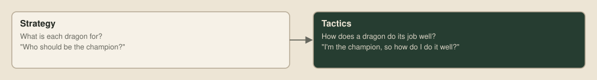

# Tactics

> **Editor's note, 28 September 2026.** The sacrifice is back in. A behaviour with a sound reason stays, and its numbers get tuned once the rest of the bot settles. The tests below use toolkit 1.2.2 and the new generated maps.

The last two posts were about strategy, which is deciding what each dragon is for. Giving one dragon the job of staying long for round 500 and another the job of hunting enemy heads is a strategic choice. Tactics is the other half: once a dragon knows its job, doing that job precisely and efficiently. The question changes from "who should be the champion?" to "given I'm the champion right now, how do I do it well?" Two bots with the same strategy can play very differently depending on how well each carries it out.

## A note on secret sauce

I'm competing in this tournament too, so I can't walk through every idea I'm working on without handing it to everyone else. What I can share are the questions that shaped my own thinking, none of which have obvious answers:

- Which of your dragons would it hurt most to lose, and does your plan survive losing it?
- How much of your 100 million points a turn do you actually use, and what would the rest buy?
- What does your bot do differently when it's winning than when it's losing?

It's also worth reading how winners of other Battlecode competitions thought about the problem, because the thinking carries over even where the games differ:

| Team | Result | What their write-up is good on |
| --- | --- | --- |
| Just Woke Up | MIT 2025 champions | [Units built around explicit state machines](https://battlecode.org/assets/files/postmortem-2025-just-woke-up.pdf), compact typed messages, and every version compared across many maps |
| Generalized Stroke's Theorem | MIT 2026 runners-up | [Watching replays](https://battlecode.org/assets/files/postmortem-2026-generalized-strokes-theorem.pdf) and experimenting with the big picture, ahead of shaving instructions |
| Austen Wayne | Cambridge 2026 novice champion | [Remembering what the bot had seen](https://github.com/AustenWayne/battlecode-bot/blob/main/Cambridge_Battlecode_Postmortem.pdf) and planning routes over that memory, and candid that he spent too long on his economy |

## A question from Discord

A good tactical question came up on the competition Discord recently:

> Does anyone have any ideas for mimicking the self-coil + self sacrificing mini to feed the big one? As seen by the number 1 on the leaderboard?
>
> — Dearest You [IU]

That's two tactics working together. The champion curls up tight against its own body, and smaller dragons deliberately die next to it to feed it. The second is less strange than it sounds. When a dragon dies, every other segment of its body turns into a pearl, so a mini that has grown by eating elsewhere can pass about half its length to the champion by dying where the champion can eat the remains. Since the longest dragon decides the game at round 500, funnelling the team's length into one dragon makes sense.

Let's try building both. Each one fits into the roles bot as new behaviour modules, so nothing else changes. The champion gains Coil, and the workers become feeders, with Forage for finding food and Deliver for the sacrifice:

The assembly is the roles bot's with the champion's and feeders' lists changed, and `indicate = 2` makes each dragon's indicator show its behaviour as well as its role:

Across the three example bots, most of the repertoire is shared, and each new bot only adds a few modules:

## Coiling

The reason to coil is that a long dragon stretched across the board is an easy target. Every segment is somewhere an enemy can cut in, and the further it roams, the more of them it meets. Curled into a tight knot, most of its body is out of reach, and it stays in one place, which matters if teammates are going to bring it food. So a champion with no enemy head within three tiles coils.

Getting a dragon to curl up needs only one simple preference: it should like moving onto tiles that touch its own body. A dragon that keeps choosing to hug itself naturally winds into a spiral:

Left unchecked, that preference would have the dragon curl so tightly that it walls itself in, so hugging only counts while the move still leaves at least 10 tiles of room. And since a coiled champion still needs to grow, a pearl right next to its head is always worth taking:

Here's a champion from one of the test games, nine segments packed into a three-by-three square:

A champion that stays put only pays off if something brings it food, and that's the other half of the idea.

## Feeding the champion

A feeder goes looking for pearls, keeping a reasonable amount of room, and heads for the nearest one it can see:

Once it has grown to six segments, Deliver takes over. While the champion is far away, its objective scores each move by how far it heads towards where the champion was last heard from. Once the champion's head is within two tiles and one of its segments is right beside the feeder, a reflex skips the scoring and drives into it. When a dragon runs into another dragon's body, only the one that moved dies, so the champion comes to no harm, and half the feeder's segments turn into pearls right beside it:

For that to work, a feeder has to know where the champion is, and the champion is usually far out of sight. The roles bot's sonar only carried each dragon's length, so the message needed a position too. To make room in the 64 bits, the team tag shrank to 16 bits, and every dragon now includes where its head is:

## Numbers to tune later

The sacrifice has three numbers in it: a feeder starts delivering once it's six segments long, only while it has heard the champion within the last 12 turns, and it only drives in when the champion's head is within two tiles. All three are first guesses. In my first tests, versions with the sacrifice lost more often to the roles bot than versions without it, and my first idea about why, feeders dying against the champion's tail far from its head, made no difference when I tried it. That's a question about those numbers, and about where the champion waits to collect, so the tactics bot carries the sacrifice and the numbers wait until the rest of the bot has settled.

Whatever the number one team is doing, it's more careful than this. Perhaps their feeders only sacrifice when the champion is short of food, or perhaps the champion positions itself to collect. It's a good open question, and I'd love to hear from anyone who cracks it.

## The verdict

`just tactics` builds the tactics bot, the coiling champion with feeders that forage and deliver, and runs the verdict against the roles bot:

The recorded verdict and ladder below used toolkit 1.2.2. The recipes use the installed official engine by default, so repeating them under a newer toolkit tests a different game. Keep the original engine version when reproducing these figures. The newly released [CPU and CUDA references](https://github.com/overyonder/the-loong-game/blob/ca25234/harness/zig_judge/reference/README.md) implement SDK 1.2.7. Reproducing the older figures requires the original 1.2.2 ruleset.

| Candidate | Opponent | W–D–L | Elo (95% interval) | Decision | Games used |
| --- | --- | --- | --- | --- | --- |
| `tactics-bot` | `roles-bot` | 8–1–14 | −93 (−273 to +47) | not better | 23, decided at 23 (cap 155) |

After 23 games it had won 8 and lost 14, so the test crossed its lower line and rejected a +70 Elo improvement. It won all ten of its upset games against the starter, so whatever it gives away, it doesn't make the bot beatable by a bot that doesn't try. With the sacrifice's numbers still first guesses, that's roughly what to expect, and it's where the tuning will start. The code is in [examples/tactics-bot](../examples/tactics-bot/strategy.nim), and the sacrifice's three numbers are the obvious place to start experimenting.

## Every version on one ladder

Each verdict in the last three posts compared a new version with the one before it. [Three lines](14-three-lines.md#frozen-versions) explains why those numbered snapshots never change. The [ladder](07-a-ladder-of-our-own.md) can then check that the chain of improvements adds up and that nothing went round in a circle. Here are the saved versions from the flood-fill bot onwards, with the pearl chaser and the C starter for reference, over 1,050 games on the same 35 maps, played with `just ladder-all`. Each head-to-head column is the points the row's bot scored against that bot, out of 70:

| Bot | Rating | Won | Drawn | Lost | vs roles-bot | vs tactics-bot | vs first-bot | vs room-c | vs room-pearls | vs starter-c |
| --- | ---: | ---: | ---: | ---: | ---: | ---: | ---: | ---: | ---: | ---: |
| roles-bot | 1762 | 274 | 6 | 70 | | 37.5 | 55 | 53 | 61.5 | 70 |
| tactics-bot | 1750 | 270 | 4 | 76 | 32.5 | | 51.5 | 54.5 | 63.5 | 70 |
| first-bot | 1569 | 192 | 6 | 152 | 15 | 18.5 | | 42 | 51.5 | 68 |
| room-c | 1539 | 179 | 5 | 166 | 17 | 15.5 | 28 | | 52 | 69 |
| room-pearls | 1356 | 106 | 3 | 241 | 8.5 | 6.5 | 18.5 | 18 | | 56 |
| starter-c | 1024 | 17 | 0 | 333 | 0 | 0 | 2 | 1 | 14 | |

Nothing went round in a circle: every bot has a winning record against every bot rated below it. The ladder also puts the verdicts in perspective. The roles bot's jump over the first bot is the biggest step among the strategy bots, as its verdict found. The first bot beat the flood-fill bot 42–28 here, about +70 Elo, near the top of its verdict's interval, so that step was real but smaller than the verdict looks for. And the tactics bot, with the sacrifice at its first-guess numbers, finishes level with the roles bot, 32.5–37.5 between them, a gap well inside what luck produces over 70 games. Coiling and feeding haven't paid for themselves yet, and the sacrifice's numbers are the first place to look.

## Next up

Next in the series is the mechanic all of this rests on: [sonar](17-sonar.md), and what else it could be used for.
