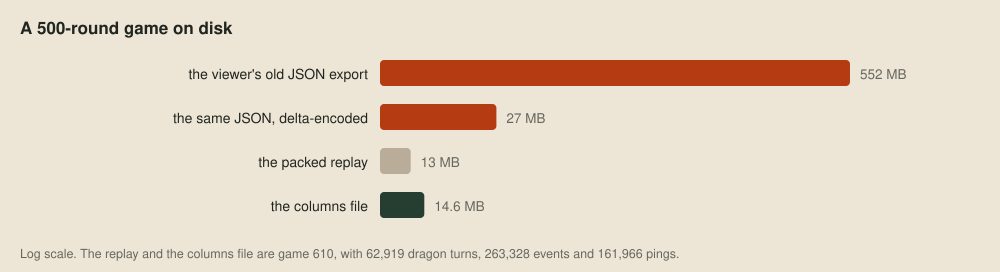
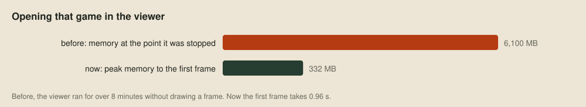
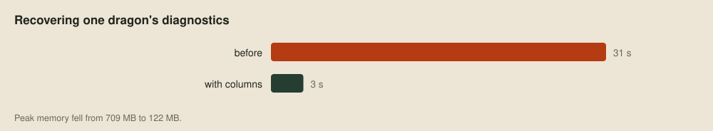

# Game data in columns

> **Editor's note, 29 September 2026.** The viewer and its recovery are now released in the public repository, so the code quoted here links to it. I've corrected how recovered decisions reach the viewer: they stream into memory rather than landing in a file.

The [debug viewer](09-through-one-dragons-eyes.md) started life reading a JSON export of each game, and that was fine for short games. Then we opened a 500-round game, and the viewer sat there for over eight minutes, reaching 6 GB of memory, without ever drawing a frame. The export for a game that long was 552 MB, or 27 MB once we delta-encoded it, and all of it had to be parsed into objects before anything could be drawn.



So all our game data now goes in one binary format, which we call Loong columns. The packed replay from the judge is still the smallest thing on disk, but it's a Cap'n Proto message that has to be walked event by event, as in [Reading a replay](08-reading-a-replay.md). A columns file costs about the same space and needs no parsing at all: a reader maps it into memory and uses the numbers where they lie.

## Columns

Almost everything in a game is a long table: every event on the board, every dragon turn, every sonar ping. And almost every question we ask reads one field down a whole table, such as every turn's CPU points or every event's kind. So each field is stored as one contiguous array of fixed-size numbers, and a file is a header, those arrays, and a directory saying where each one is.


Here's the start of a real one, game 610, through [hexyl](https://github.com/sharkdp/hexyl). The first 64 bytes are the header, and the second dump is the first entry in the directory at the end of the file:


The header says this is version 1 of the container, with 57 columns, a directory 14,565,856 bytes in, and a total length that lets a reader catch a truncated file. The kind, `game`, says what the file holds. The directory entry says the column `spawn.cell` holds 1,938 u32 values starting at byte 64, straight after the header. There are ten value types, the signed and unsigned integers from 8 to 64 bits plus `f32` and `f64`, and every column starts on an 8-byte boundary, so any of them can be read as a typed array without copying.

## Reading in place

That makes the reader short. This is [the viewer's](../replays/viewer/columns.odin), in [Odin](https://odin-lang.org). It maps the file, checks the header, and indexes the directory by name:

```odin columns.odin
open_columns_file :: proc(path: string, allocator := context.allocator) -> (file: Columns_File, ok: bool) {
	data, error := virtual.map_file_from_path(path, {.Read})
	if error != nil || len(data) < COLUMNS_HEADER_BYTES || string(data[:8]) != "LOONGCOL" {return}
	version := (^u32le)(&data[8])^
	count := int((^u32le)(&data[12])^)
	directory := int((^u64le)(&data[16])^)
	length := int((^u64le)(&data[24])^)
	if version != 1 || length != len(data) || directory + count * COLUMNS_DIRECTORY_BYTES > len(data) {
		virtual.unmap_file(data)
		return
	}
	file.data = data
	file.kind = trim_name(data[32:64])
	file.entries = make(map[string]Column_Entry, count, allocator)
	for index in 0 ..< count {
		at := directory + index * COLUMNS_DIRECTORY_BYTES
		file.entries[trim_name(data[at:at + COLUMNS_NAME_BYTES])] = {
			value_type = data[at + 48],
			count      = int((^u64le)(&data[at + 56])^),
			offset     = int((^u64le)(&data[at + 64])^),
		}
	}
	return file, true
}
```

A column is then a slice straight into the mapping. The caller says what type it expects, and gets nothing back if the file disagrees:

```odin columns.odin
column_values :: proc(file: ^Columns_File, name: string, $T: typeid) -> []T {
	entry, found := file.entries[name]
	if !found || entry.value_type != column_type_code(T) {return nil}
	return ([^]T)(&file.data[entry.offset])[:entry.count]
}
```

Loading a game in the viewer is now a list of lines like `view.turn_points = column_values(file, "turn.points", u64)`. On game 610, opening the file and reading its directory takes 0.10 ms, summing every turn's points another 0.10 ms, and counting events by kind 1.4 ms. The operating system only reads the pages a question touches, so a file's size costs nothing until you use it. Our Nim tools read the same way through `memfiles`.

## Tables, lists and gaps

Names carry the structure. A column called `turn.points` belongs to the table `turn`, and every plain column in a table has one value per row. A column that points at rows of another table is a u32 row index named after it. A value that varies in length per row, like a dragon's body, becomes two columns: every row's values end to end, and a `#` column of where each row starts.

![The list column start.body holds the first three starting dragons of game 610 end to end: cells 1390 to 1387, 1402 to 1405, then 1712, 1713, 1714 and 1771, out of 40 cells. start.body# holds 0, 4, 8, 12, out of 11 starts. Row i is body[start[i] ..< start[i + 1]], head first, and a cell is y × width + x, so dragon 0's head, 1390 on this 57-wide map, is at (22, 24).](images/gamedata-list.svg)

Strings are lists of UTF-8 bytes, so a bot's name or a turn's log lines are just another list. A value that can be missing, such as the CPU points of a game played outside the judge's sandbox, gets a companion `turn.points?` column of 1s and 0s, and columns that are always present don't pay for one. Enums are small integers whose names live in a string list called `enum.<name>`.

## Boards aren't stored

The JSON export stored the board before every round. A game file stores only the events, in replay order, as a kind and four integers:

| Kind | Event | a | b | c | d |
| ---: | --- | --- | --- | --- | --- |
| 1 | round start | round | | | |
| 2 | turn start | dragon | | | |
| 3 | pearl countdown | cell | countdown | | |
| 4 | tile change | cell | has pearl | | |
| 5 | dragon moved | dragon | new head cell | tail cell after | facing |
| 6 | dragon split | parent | child | child team | row of `split` |
| 7 | dragon death | dragon | reason | | |

Each round and each turn records the row of its starting event, so the viewer jumps to any turn by applying events forward from the nearest board it already has. In game 610 that's 263,328 events in five columns, 4.5 MB in all. Pings and turns take most of the rest.



A game that never finished loading now draws its first frame in under a second. The same change went into our bots' decision records, which the viewer regenerates one dragon at a time by [re-running the bot](09-through-one-dragons-eyes.md) on what that dragon observed. The recovery now rebuilds those observations as a columns file of their own, and streams each turn's records to the viewer, which keeps them as the bot wrote them and parses them only for the turn on screen:



## Writing and merging

Our converter, [gamedata/gamedata.nim](../gamedata/gamedata.nim), turns a replay into a game file in 0.37 s with a peak of 100 MB, and `loong-gamedata REPLAY` writes one beside any replay. It builds each column in memory, writes the header, the columns and the directory to a `.partial` file beside the destination, and renames it into place. A reader never sees half a file, and nothing ever changes a file once it's written.

The format isn't only for the viewer. Each game the harness plays also gets a small `result` file, one row per game and one per side, with how it ended and each side's economy: pearls eaten, splits, deaths by cause, peak points and how much of the map its heads covered. When a run ends, its games merge into one file of the same kind, table by table, with list starts and row indices shifted past the rows before them.

New columns can appear without breaking anything, because readers look columns up by name and ignore the ones they don't know. Removing a column or changing its meaning raises the version that each kind records in its own `meta.version` column, so an old reader can refuse a file instead of misreading it. The whole format, both kinds included, is written up in [gamedata/format.md](../gamedata/format.md).

## Next up

That's the last of the performance posts for now. The final post in the series, after the tournament, is about the team of agents that runs all of this with me.
