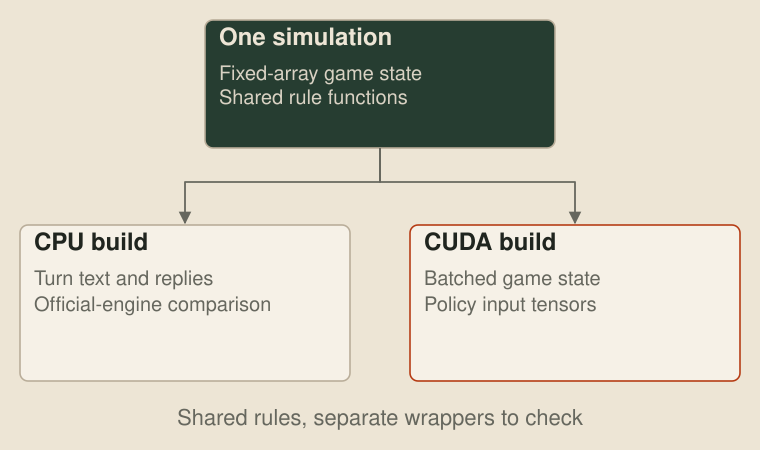
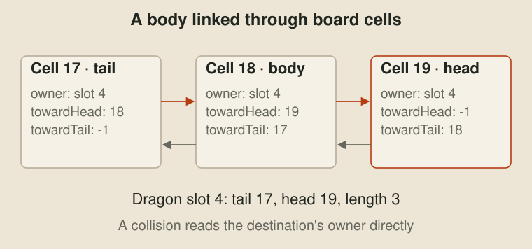
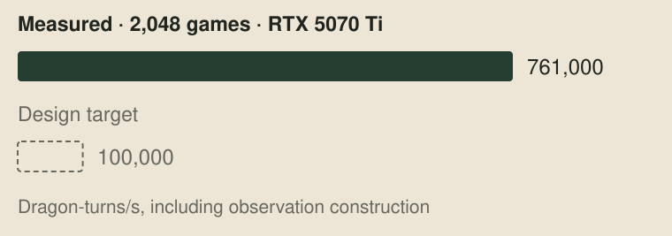

# An engine on the GPU

> For the later rule change, see [Slay the Queen](31-slay-the-queen.md).

[Our judge](19-the-machine-inside-the-judge.md) plays a game about four times faster than the toolkit, but it still runs the organisers' engine in WebAssembly and asks each bot for its next move. That is what we want when checking a submission. For training a learned bot, I wanted thousands of games feeding one network on the graphics card, without sending every dragon's turn through a CPU sandbox first.

So I ported the organisers' C++ engine to fixed arrays, compiled the same simulation for the CPU and CUDA, and checked it against the official engine before training in it. With 2,048 games on an RTX 5070 Ti, the port processed 761,000 dragon-turns a second, including making the observations. This post is about that engine. [Learning to play](27-learning-to-play.md) covers the network that uses it.



## Fixed arrays

The [organisers' engine](https://github.com/unswcpmsoc/unswbc/tree/main/engine) already gives us the rules in C++. The work is making its state suitable for a batch of GPU games while preserving the order in which those rules run. I kept map loading and text parsing on the host, then put the changing game state in one fixed-size record per game. A map template can be copied into a game and seeded without constructing a tree of heap allocations.

The board is at most 64 by 64, so a cell fits in a signed 16-bit index, with `-1` for no cell. Arrays indexed by `y * width + x` hold pearls, spawn countdowns and the dragon occupying each tile. Dragons live in 128 reusable slots, and the turn queue has room for 512 entries. Those bounds are part of the port: an overflow is recorded, and a game that reaches one cannot count as an agreeing check.

Here are the body fields from the released [CPU reference](../harness/zig_judge/reference/engine.h), with the other game fields omitted:

```cpp
uint8_t  pearl[MAX_CELLS];
int32_t  countdown[MAX_CELLS];
int16_t  occupant[MAX_CELLS];
int16_t  towardHead[MAX_CELLS], towardTail[MAX_CELLS];
Dragon   dragon[MAX_SLOTS];
```

A dragon's body is a linked list through the board. Every occupied cell says which slot owns it, which cell is nearer the head and which is nearer the tail. The dragon record keeps the head, tail and length instead of a separate array of body segments. Finding a collision is one indexed read of `occupant`, and removing the tail follows one link. A portal can join cells that are far apart on the board without changing the representation.



Removing a tail looks like this, from the same reference:

```cpp
LE void PopTail(Game& g, Dragon& d)
{
    int const tail = d.tail;
    int const next = g.towardHead[tail];
    g.occupant[tail] = -1;
    g.towardHead[tail] = -1;
    d.tail = static_cast<int16_t>(next);
    g.towardTail[next] = -1;
    d.length--;
}
```

Splitting takes more work, because the child takes the rear segments in reverse order. The links along that part of the body reverse, their owner becomes the child's slot, and the old tail becomes its head. A slot can later be reused, so the turn queue also keeps the dragon's ID. Otherwise an entry for a dead dragon could accidentally run the new occupant of its slot.

## One simulation, two targets

The rule functions compile for both machines. Under CUDA they have `__host__ __device__` on them, so the compiler produces a CPU and a GPU version of the same function. The CPU build adds a text interface that the judge can call. The GPU build wraps the functions in kernels that work through a batch. NVIDIA's [CUDA C++ guide](https://docs.nvidia.com/cuda/cuda-programming-guide/02-basics/intro-to-cuda-cpp.html#device-and-host-functions) describes those qualifiers.

Keeping the rules in one source removes a second port that could drift away from the first. It doesn't make the GPU build correct by itself. Its wrapper still decides which game and dragon a thread touches, where an observation is written and when the next kernel may read it, so those are checked separately.

| Part | CPU build | GPU build |
| --- | --- | --- |
| Map loading | Parses a map into fixed arrays | Receives the loaded templates |
| Simulation | Advances one game to its next decision | Advances a batch of independent games |
| Observation | Writes the turn block as text | Writes the policy's input tensors |
| Action | Parses a text reply | Decodes the policy's packed action |
| Rules | Shared C++ functions | The same functions compiled for CUDA |

## Games in parallel

Dragons in one game cannot all move together. A move changes the board the next dragon sees, a death changes the turn queue, and a split adds a child that can act later that round. Parallelising those decisions would change the game. Independent games have no such dependency, so that is where the parallelism goes.

CUDA groups threads into blocks, whose threads can cooperate through shared memory and synchronisation. Our observation kernel gives each game one block of 128 threads. Thread 0 advances the game to its next decision, then the block shares the work of remembering the view and writing the observation. In the action kernel, each game gets one thread to apply its chosen action. This follows CUDA's [block model](https://docs.nvidia.com/cuda/cuda-programming-guide/01-introduction/programming-model.html#thread-blocks-and-grids), while keeping each game's decisions ordered.


The batch doesn't mean every game is on the same round, or that the same team is acting in every row. It means each live row supplies its next decision. The policy gets an observation and an acting-dragon identity for that row, and its recurrent memory follows that dragon. A finished row can be reset with another map and seed without restarting the other games.

## Staying on the card

Running the simulation on the GPU would save less if every turn came back as text. The network already wants tensors, so the batch writes its observations into PyTorch's device buffers and reads its actions from device buffers too. Python drives the loop through a small C interface. It passes pointers to the tensors and the current CUDA stream, leaving the large arrays where they are.


The kernels use the same stream as the policy. A CUDA [stream runs its operations in order](https://docs.nvidia.com/cuda/cuda-programming-guide/02-basics/asynchronous-execution.html#cuda-streams), so observation writing finishes before the policy reads it, and the policy finishes writing actions before the engine applies them. The host still reads small pieces of control information and training statistics. The useful saving is avoiding a round trip for the whole observation and action payload at every decision.

The engine knows the full board, but the policy must only receive what a dragon could know. Its remembered observation is built from the dragon's view and permitted sonar messages. The privileged state used by the training critic has a separate output. Checking that boundary matters as much as checking movement: a network trained with an unseen enemy position in its input could appear to play well and fail as soon as it entered the judge.

## The same games

I used the official engine as the reference. In the judge's [lockstep mode](19-the-machine-inside-the-judge.md#two-engines-the-same-replies), both engines start from the same map and seed, and each turn's observation block is compared byte for byte. The checker chooses a deterministic reply from the block and gives that same reply to both. The first different observation stops the game there, rather than leaving us to search a whole replay for where it diverged.

This is differential testing, as in McKeeman's [Differential Testing for Software](https://www.cs.tufts.edu/comp/150FP/archive/bill-mckeeman/DifferentailTesting.pdf) (1998): comparable implementations receive the same generated inputs, and a disagreement supplies a case to investigate. Here the official engine is the reference, while the port is the implementation we're changing.


Odd seeds use reckless replies, including bad splits and rejected moves. Even seeds use more careful replies, so the games last long enough to reach later rounds. That distinction is important: a million games that die immediately would say little about pearl spawning or the round limit. The seed also has to reproduce the random generator's draws in the same order, including pearl attempts that fail because their tile is occupied, as [Pearls from the seed](10-pearls-from-the-seed.md) explains.

On 30 September, against toolkit 1.2.2, the check ran 100,000 games across all 122 maps in our evaluation pool. It compared 126,645,678 dragon turns, with no differences and no skipped games. Of those games, 8,534 reached round 500. That is evidence along those action sequences, rather than proof of every possible game or equality of internal state that never appeared in an observation.

| Check | Recorded result |
| --- | --- |
| Official engine against CPU port | 100,000 games, 126,645,678 turns, no differences or skips |
| GPU against CPU port | 1,024 games, the same acting dragon at each decision and the same final results |
| GPU observation against text encoding | 512 games, 19,716 turns, no differing observations |

The last check takes the CPU port's text turn block, runs it through the encoder a served policy uses, and compares the resulting inputs with those the GPU wrote directly. It checks the observation, scalar inputs, sonar inbox and action mask. CPU and GPU agreeing on the winner would miss an observation that had been transposed, or a remembered cell that had been forgotten.

The [released CPU reference](../harness/zig_judge/README.md#lockstep) lets a reader run the official-engine comparison without a graphics card. The CUDA batch and training code remain private. The code excerpts above come from the CPU reference.

## 761,000 dragon-turns a second

The recorded throughput is 761,000 dragon-turns a second with 2,048 games on one RTX 5070 Ti, including observation construction. A dragon-turn is one dragon being observed and acted on. It is smaller than a round, which can contain many dragons, and very different from a complete game. The target I set for this engine was 100,000 dragon-turns a second.



That number doesn't include running the teacher network or updating its weights. It measures the environment's capacity to supply decisions. It also isn't a speedup over the judge timings in the previous post, which included WebAssembly bots, startup and replay output. Training adds policy inference, rollout storage and optimisation, and its end-to-end samples per second have to be measured with all of those running.

The GPU engine gives us the environment for that loop. The judge remains where we check a bot's actions and its competition budget, using the official engine. To evaluate many compiled bots rather than train one policy, we still want CPU games spread across workers, which is the next post.

## Next up

[Games in the cloud](21-games-in-the-cloud.md): running big batches of games on AWS Spot workers, and how every run ends on its own.

<!-- namecard -->
