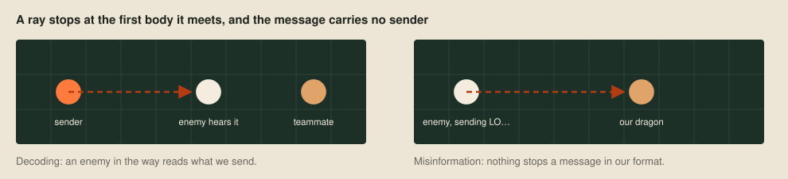
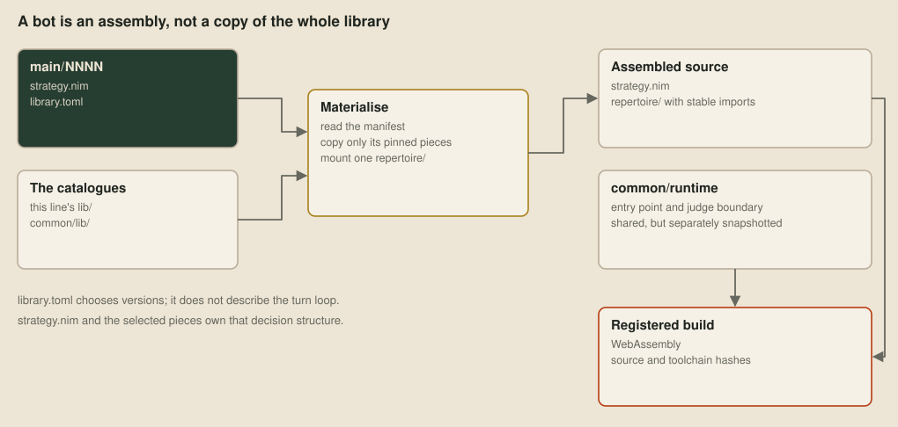

# A tour of our bot

I had planned to finish this series with the bot we would take to the Grand Final: the planning design and the learned policy, finally working together. Then the rules changed. The design we were assembling was still in progress, and the version now in development uses a different architecture. So this is a tour of where we got to before the rewrite, while the reasons for building it this way are still worth explaining.

> This article describes the pre-Queen design, including an unfinished integration experiment. It is being released because that design has been superseded. [Slay the Queen](29-slay-the-queen.md) explains the rule change.

[Planning to play](26-planning-to-play.md) followed textbook-main-0025 through its five layers. [Learning to play](27-learning-to-play.md) described the teacher, student and training pipeline. Here I bring the pieces together around the last frozen planning version, textbook-main-0026, and the student-mover experiment beside it. The planning version added guards at both ends of the champion and a dedicated assassin. Its ordinary movement still came from search. The student hook was left unset.

## Team roles

Under the original rules, eliminating the other team won immediately. If both teams survived 500 rounds, the longest dragon decided the winner, with total team length breaking a tie. That gave the team a reason to collect food widely, then concentrate enough of it in one body without letting that body die.

The champion was whichever dragon was best placed to serve that purpose, usually the longest. It wasn't a permanent identity assigned at birth. Early on, splitting made more mouths to collect food and more eyes to discover the board. Later, the champion stayed whole, smaller dragons protected it, and some could feed it by dying nearby and leaving pearls. A second long dragon could grow elsewhere as an understudy.

The apparent wastefulness of sacrificing a small dragon made sense only against that scoring rule. Its remaining length could become food for the body that decided the result. Equally, trading a short head for a long enemy head could help, provided we had enough dragons left. A team down to its last dragon couldn't afford the same trade. These were conditions in behaviours, rather than permission for every dragon to charge at every enemy.

There was no central program directing the team. Each dragon ran its own copy of the bot, saw the 7×7 window around its head, and heard whatever sonar reached its body. The game supplied some exact public quantities, including team size, but it didn't supply the locations of every teammate. Seven dragons could run the same assignment and still disagree because they had heard different things.

## One dragon's turn

The ordinary bot kept facts, inferred what might now be true, assigned a role, and chose a task from that role's repertoire. The task's acting state then called movement with its target and preferences. Movement searched and ranked the options. Once an action was chosen, the radio fitted messages to its four sonar rays.

This is the code's flow. The intended five-layer drawing had a cleaner handoff, where a task produced an intent and a separate tactical stage turned it into an action. We hadn't reached that separation. Each behaviour called movement itself, with choices about sprinting, trading heads, paying length, moving away from a target and avoiding cells. Some actions bypassed movement entirely.

That distinction matters when reading an architectural diagram. A box labelled “tactical search” can make every action look as though it was compared in the same search. Rescue splits, feeding deaths and probing an unknown portal weren't. The diagram above gives them their own path to the action.

## Facts, guesses and old news

The memory held one record per board cell. Edges could be unknown, open, kelp or a portal, with a landing when resolved. Pearls and spawn timers had their own source and round. Occupants were recorded as last seen. The same store held sightings, teammate statuses, tasks, path claims and deaths.

Sight and a message didn't have equal authority. Seeing a tile rewrote it. A teammate's map report filled sides on cells we had never described by sight, and a pearl or timer report replaced an older one. A body turning into pearls could tell us a dragon had died, withdrawing its status and claims. A later status could overturn that death inference.

| Question | What the bot retained | What it inferred |
| --- | --- | --- |
| Can I cross this edge? | Seen sides, portal links and sonar echoes | Passability on unseen edges, including evidence from map symmetry |
| Will there be food when I arrive? | Pearls, countdowns and observed reset gaps | Spawn attempts and the chance a pearl survives until arrival |
| Where is that dragon? | Its last head, heading, length bound and report round | A distribution over possible heads and headings, and a chance it is alive |
| Can my teammate get there first? | Its visible head or reported status | Distance and likely presence, with uncertainty kept in the query |
| Will this body still block the route? | Visible segments and their place behind a head | When those cells could clear if the dragon keeps moving |

The belief converted the store into answers each turn. Geometry used a Dirichlet prior over edge kinds and evidence for possible map symmetries. Pearls combined a renewal process for attempts with a two-state model for present or absent food. Dragons used a chance of being alive and a histogram over head cell and heading. An empty visible cell ruled out a head just as a sighting located one.

These were approximations to recursive Bayes filtering, the framework in Thrun, Burgard and Fox's *Probabilistic Robotics* (2005). They were bounded too: at most 300 states for one tracked dragon and 3,000 across the filters. Some predictions stopped when the turn's budget ran short and caught up later. The bot couldn't afford an exact joint distribution over everyone's bodies, intentions and messages.

The distance field added a practical wrinkle. A tail cell blocked now might be open when we reached it, so walks counted when visible segments would clear. The belief also raised an enemy's length lower bound from its observed head trail. Seeing four segments in a window didn't mean the enemy was four long. A body covering a head position from many rounds ago could show that it was longer.

## Agreement over four narrow rays

The radio had four 64-bit values to work with. Each ray stopped at the first body it met, which could be an enemy or our own. We couldn't broadcast to everyone, and the echo didn't name the receiver. The radio asked the belief who was likely to hear each ray, then chose records that would be useful to that reader.

Ambient traffic included our status and task, sightings, deaths, map edges, pearls and portal links. Urgent traffic came from the behaviour that needed it: the champion's right of way, a feed order, a coil's request for a door guard, or a guard reporting the ground outside the champion's sight. The turn loop also reported a newly split child's body, since teammates otherwise had to discover it for themselves.

The protocol packed ten record kinds into frames, using short codes for small numbers. A send-round field and trailing zero check helped reject noise after deciphering. We used SPECK64/128, from [Beaulieu and colleagues](https://eprint.iacr.org/2013/404), to obscure the records. This wasn't authenticated messaging: the format check and plausibility checks were still necessary, and encryption didn't make a report true.

Two kinds of reservation helped dragons avoid competing with their own team. A cell-targeted task could claim its cell for eight rounds, renewed while the task continued. Other dragons yielded unless the owner was sufficiently unlikely to be as near. A champion could claim its immediate route or coil region as right of way, and the give-way interrupt moved a teammate out of it. The ordinary task claim and the champion's path claim were different records with different rules.

The resemblance to Stone and Veloso's [locker-room agreement](https://www.cs.utexas.edu/~pstone/Papers/99aij/teamwork.html) is useful: agents arrive with common rules and communicate enough to apply them. A stale task could survive on a teammate's side after its owner had stopped doing it. An unseen longer teammate could leave two dragons believing they were champion. The model had to allow for those gaps.

## Roles narrowed the choices

The role allocator filled slots in order: champion, understudy when wanted, rearguard, vanguard, assassin, scouts, then harvesters. It used the team each dragon knew, discarding the least certainly placed members if that picture exceeded the exact team size. Length favoured champions and the assassin. Proximity favoured the guards. Short dragons were cheaper scouts to risk.

A role was normally held for twenty rounds, with a continuation bonus in its suitability. Invalidity or an unfilled one-place role could end that commitment sooner. The late-game rule allowing a short champion required a picture of the whole team. Otherwise a short dragon that hadn't heard of anyone longer would appoint itself.

The role decided which behaviours could compete. It didn't itself choose a direction. The champion grew, coiled, recruited a missing rearguard and split when expansion was wanted. The assassin pursued the enemy champion instead of spending its body on lesser enemies. The vanguard could forage or fight while keeping station ahead. The rearguard followed the tail and reported what the champion couldn't see.

| Family | Behaviours in the frozen assembly | Why they existed |
| --- | --- | --- |
| Collect and discover | forage, explore, scavenge, farm, race, probePortal | Find food, use fast spawners, reach contested pearls and learn unknown ground |
| Grow and protect | championGrow, understudyGrow, coil, door, vanguard, rearguard | Keep the decisive bodies growing, give them room and watch both ends |
| Expand | expandSplit, standoffSplit, recruitRearguard | Add useful dragons, leave a survivor after a head trade, or supply a missing tail guard |
| Fight | contest, hunt, strike, tailStrike, portalBlock, assassinate | Reduce enemy options or trade when the target justified the cost |
| Transfer and finish | feed, endgame | Concentrate length near the finish and preserve or overtake the lead |

That was twenty-three assembled behaviours, plus the give-way, rescue and evade interrupts. The earlier planning article describes the twenty-behaviour version, before the escort became separate guards and the assassin and recruitment behaviour were added. `unassigned` remained a wire value and an assembly case, although the allocator assigned a role before task selection.

## From a role to an action

A task was a behaviour bound to a target, which could be a cell, an enemy dragon or no explicit target. Each allowed behaviour supplied eligible candidates and a score. Most used a food-like scale: a pearl worth 80 divided by one plus the time to reach it. The champion's growth used 120. Other choices, such as expansion and endgame retreat, used fixed scores once their conditions held.

The current pair stayed selected unless another beat it by more than 2. Changing the pair reset the behaviour's phase machine. Within a behaviour, phases were checked in priority order each turn. The coil checked escape before leave, follow and approach. The assassin checked strike, prepare, stalk and locate. Nine behaviours had phases, and fourteen acted directly.

The generic state-machine library supported guarded transitions, but this assembly declared none. Its compounds were reactive lists: the first eligible child that produced an action won. An interrupt left the task's phase machine unticked, which preserved some history, unless selection changed the task meanwhile. This was a departure from [Harel's statecharts](https://www.weizmann.ac.il/math/harel/sites/math.harel/files/users/user50/Statecharts.pdf).

For a concrete example, consider a harvester with food nearby and an enemy approaching. Its role can offer forage, race, hunt or strike, depending on the targets and conditions. A high forage score doesn't authorise walking into danger. When forage executes, movement can prefer a safer landing even if it goes away from the food. If there is no ordinary action, the task can yield. If rescue can save a trapped body by splitting, that interrupt gets the turn before the task does. This example follows the assembly's control flow.

## Movement forecasts

Movement first worked out legal single steps. Then it assessed exits, threats, room, cycles, sealed teammates and survival. Eleven safety classes ordered those assessments before the caller's utility broke ties. A pearl couldn't buy its way past a worse hard safety class, but the safety classification could itself be wrong because it used an approximate local model.

The survival search looked ahead up to the dragon's length plus two, capped at twenty-four moves and 512 expansions. Sprints used a beam at most 64 wide, with up to three steps under the original one-free-step rules. A nearby duel could search four plies with alpha-beta pruning and an 8,192-expansion cap, provided the opponent's whole body was visible. Routing used Dijkstra's algorithm with Dial's bucket queue, charging uncertain edges more than known ones.

The local search kept other bodies frozen except for the opponent in the duel. It didn't play a whole team reply, and the duel treated the opposition through a paranoid reduction rather than modelling independent utility for every enemy. Splits and deaths were outside its searched action set. ProbePortal could deliberately enter an unresolved portal that ordinary movement refused. Those limits were part of what we wanted to improve.

The 100-million-point limit also shaped the design. Counted work estimated the cost of filters, routes and searches from units such as cells and expanded nodes. Optional assessment started below 60 million and stopped at 75 million counted points. The actual judge clock supplied emergency brakes, stopping optional work at 90 million and required searches at 92 million. If the policy couldn't run, movement supplied a fallback. A partly explored search had to leave enough time to send an action.

## Student integration

The teacher and critic belonged to training, as [Learning to play](27-learning-to-play.md) describes. Neither ran inside the submitted planning dragon. The small student was the possible runtime component. The question was which decision to give it without losing the strategic structure we could inspect.

We had built one concrete experiment, textbook-test-0091-student-mover. It kept the planning roles, tasks and reactive phases, but asked the student for a move before the planning world model ran. The movement hook returned that move or sprint instead of doing its ordinary search. Splits, deliberate deaths, orders and claims remained planning decisions. If the student proposed a split, the adapter used its move-head alternative instead.

![Ordinary planning and the implemented student-mover experiment, kept separate. The frozen flagship uses classical movement with no student hook. The test variant runs a student on its own encoding and recurrent memory, then substitutes its move or sprint where the task calls movement. The planning structure still owns splits, deliberate deaths and messages. The experiment does not feed the selected planning task into the student or run its reply through the classical safety ranking. A task-conditioned or learned-evaluation hybrid remained unfinished.](images/tour-integration.svg)

The experiment reserved 40 million points per turn for the network, leaving less for the planning work. The assembly recorded that reservation as its network allowance. The adapter kept its own remembered map and recurrent state. It didn't decode the planning team's sonar, whose protocol differed from the learned bot's, and it didn't receive the planning task as a goal.

That made the experiment easy to connect and awkward to call a finished combination. A task could say “approach this pearl” while the substituted network chose a move for its own reasons. The delegated action bypassed the classical movement assessment, so the planning safety classes weren't a shield around it. The hook's presence showed that a student could be plugged into the runtime. Task-conditioned cooperation and play quality remained unevaluated.

The broader integration was still work to do: define what a planning decision asked of the learned component, make their observations and commitments compatible, and review the resulting choices. A learned evaluator for search was another possible integration point, rather than something the frozen bot already used. Distilling a teacher into a student, following [Rusu and colleagues](https://arxiv.org/abs/1511.06295), solved the runtime-size problem. Those interfaces remained unfinished.

## Decision inspection

The bot was assembled from a small strategy file and pinned library versions. A frozen version kept those pins, so a later library improvement couldn't silently change the bot behind an old replay. Generic techniques such as the histogram filter, utility selector and state machine lived apart from Loong-specific behaviours. Nim assembled them, and Rake supplied the bit-plane flood kernel used by the distance walks.

Diagnostics exposed the decision at each level: role suitability and exclusions, task candidates and scores, phases considered, movement assessments and the chosen action. Memory records were reflected into the viewer rather than maintained as a second handwritten list. Role colours and icons showed what a dragon was for, while body patterns distinguished collecting, fighting, guarding, splitting and endgame work.

That made the useful review question quite specific. Had the dragon misunderstood an enemy's length? Had two dragons claimed the same food from different information? Was the task reasonable but its move unsafe, or had an interrupt displaced it? [Through one dragon's eyes](11-through-one-dragons-eyes.md) describes the viewer that lets us ask those questions with the dragon's window and memory, rather than the omniscient board. A rating or a death count couldn't answer them.

## Implementation status

| Piece | State before the rewrite |
| --- | --- |
| Sourced memory, approximate belief and sonar protocol | Implemented in the frozen planning bot |
| Role assignment, twenty-three behaviours, reactive phases and bounded movement search | Implemented, with the departures described above |
| Teacher, critic, student and distillation | A separate learned line, described in Post 27 |
| Student supplying movement inside the planning structure | An implemented test variant, with separate memory and no task-conditioned interface |
| Learned evaluation inside the planner | An integration idea, not used by the frozen flagship |
| Finished combined holdout and final evaluation | Unfinished when this design was superseded |

I would have liked this last table to end differently. But a useful tour should say which connections existed. The strongest reason for keeping the planning design readable was that we could find a bad decision and follow it back to its source. The strongest reason for adding learning was that our handwritten estimates and local search left plenty of decisions we didn't know how to price well. We hadn't finished bringing those reasons together.

The new rules changed what the team had to preserve and how its bodies could move. The new bot is being developed with a different architecture. This article leaves the old design at that boundary, including the unfinished parts, rather than describing it as the bot we will eventually submit.

## Sources and further reading

The implementation account follows frozen textbook-main-0026's strategy and library pins, and textbook-test-0091-student-mover's adapter. The competitive source and weights remain private. The figures show that implementation and identify the unfinished integration explicitly. Posts [26](26-planning-to-play.md) and [27](27-learning-to-play.md) contain the detailed planning and learning bibliographies, including the learning approaches we considered and did not use.

| Reference | What it contributed here |
| --- | --- |
| Russell and Norvig, [Artificial Intelligence: A Modern Approach, chapter 2](https://aima.cs.berkeley.edu/4th-ed/pdfs/newchap02.pdf), 4th edition, 2020 | The model-based, utility-based agent framing |
| Thrun, Burgard and Fox, *Probabilistic Robotics*, 2005 | Recursive belief updates and histogram filtering |
| Stone and Veloso, [Task Decomposition, Dynamic Role Assignment, and Low-Bandwidth Communication for Real-Time Strategic Teamwork](https://www.cs.utexas.edu/~pstone/Papers/99aij/teamwork.html), 1999 | Common team agreements and dynamic roles with limited communication |
| Browning et al., [STP: Skills, Tactics, and Plays](https://doi.org/10.1243/095965105X9470), 2005 | Separating team organisation from an agent's execution |
| Mark, *Behavioral Mathematics for Game AI*, 2009 | Utility selection, with our single-formula scoring a departure from response-curve considerations |
| Harel, [Statecharts: A Visual Formalism for Complex Systems](https://www.weizmann.ac.il/math/harel/sites/math.harel/files/users/user50/Statecharts.pdf), 1987 | Hierarchical state machines, with our reactive fall-through assembly a departure |
| Smith, [The Contract Net Protocol](https://doi.org/10.1109/TC.1980.1675516), 1980, and Gray and Cheriton, [Leases](https://doi.org/10.1145/74850.74870), 1989 | The allocation and expiry ideas behind task claims, without a full bidding protocol |
| Beaulieu et al., [The SIMON and SPECK Families of Lightweight Block Ciphers](https://eprint.iacr.org/2013/404), 2013 | The sonar frame cipher |
| Rusu et al., [Policy Distillation](https://arxiv.org/abs/1511.06295), 2016 | Transferring a large teacher's policy to a smaller runtime student |

Next: [Slay the Queen](29-slay-the-queen.md).
